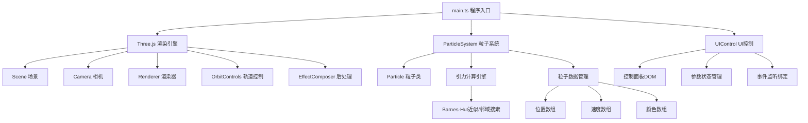

## 1. 架构设计



## 2. 技术描述

- **前端框架**：TypeScript + Three.js + Vite
- **3D引擎**：three@0.160.x，@types/three
- **构建工具**：Vite@5.x
- **类型系统**：TypeScript严格模式
- **后处理**：three/addons/postprocessing/EffectComposer + UnrealBloomPass
- **交互控制**：three/addons/controls/OrbitControls
- **无后端**，纯前端应用

## 3. 目录结构

```
.
├── package.json
├── vite.config.js
├── tsconfig.json
├── index.html
└── src/
    ├── main.ts          # 程序入口
    ├── particleSystem.ts # 粒子系统核心
    └── uiControl.ts     # UI控制模块
```

## 4. 核心模块定义

### 4.1 Particle 接口

```typescript
interface Particle {
  id: number;
  position: THREE.Vector3;
  velocity: THREE.Vector3;
  mass: number;
  trail: THREE.Vector3[]; // 最近5帧位置
}
```

### 4.2 ParticleSystem 类

```typescript
class ParticleSystem {
  particles: Particle[];
  geometry: THREE.BufferGeometry;
  material: THREE.PointsMaterial;
  points: THREE.Points;
  
  constructor(count: number, scene: THREE.Scene);
  update(gravityStrength: number, deltaTime: number): void;
  rebuild(count: number): void;
  setParticleSize(scale: number): void;
  getFocusedParticleSpeed(raycaster: THREE.Raycaster): number | null;
}
```

### 4.3 UIControl 类

```typescript
class UIControl {
  gravityStrength: number;
  particleSize: number;
  particleCount: number;
  showTrails: boolean;
  bloomEnabled: boolean;
  
  constructor(container: HTMLElement);
  onGravityChange(callback: (value: number) => void): void;
  onParticleSizeChange(callback: (value: number) => void): void;
  onParticleCountChange(callback: (value: number) => void): void;
  onTrailModeChange(callback: (enabled: boolean) => void): void;
  onBloomChange(callback: (enabled: boolean) => void): void;
  updateSpeedDisplay(speed: number | null): void;
}
```

## 5. 性能优化策略

1. **引力计算优化**：使用空间网格划分，仅计算局部邻居交互，复杂度从O(n²)降至O(n)
2. **BufferGeometry复用**：直接更新TypedArray，避免频繁GC
3. **帧时间控制**：使用deltaTime归一化物理更新，保证不同帧率下物理一致
4. **粒子复用**：数量变更时仅扩展/收缩数组，避免完全重建
5. **后处理条件启用**：Bloom效果可开关，低端设备可关闭提升性能
6. **TypedArray批量更新**：使用Float32Array存储位置、颜色数据，单次draw call
