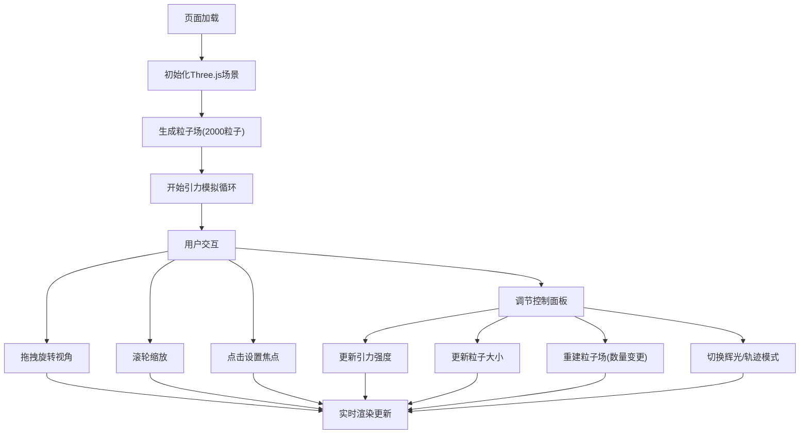

## 1. 产品概述

星系粒子系统动态演化交互可视化应用，让用户直观感受引力作用下粒子集群的聚散过程。通过三维粒子场模拟牛顿引力，提供丰富的交互控制和参数调节能力。

- 主要用途：物理模拟可视化、科学教育、艺术展示
- 目标用户：物理爱好者、学生、设计师、科普工作者
- 产品价值：将抽象的引力作用转化为直观可见的动态视觉效果

## 2. 核心功能

### 2.1 功能模块

1. **三维粒子场渲染**：2000+粒子实时渲染，渐变色彩，辉光效果
2. **引力物理模拟**：牛顿引力计算，粒子位置/速度更新，Barnes-Hut近似优化
3. **交互控制系统**：鼠标拖拽旋转、滚轮缩放、点击切换焦点
4. **参数控制面板**：引力强度、粒子大小、粒子数量调节
5. **显示模式切换**：光滑圆点 / 短线条轨迹两种模式

### 2.3 页面详情

| 页面名称 | 模块名称 | 功能描述 |
|-----------|-------------|---------------------|
| 主页面 | 3D粒子场 | 全屏Three.js渲染，深空渐变背景，粒子动态演化 |
| 主页面 | 控制面板 | 悬浮右上角，毛玻璃效果，参数调节滑块和开关 |
| 主页面 | 速度标签 | 固定左下角，显示当前焦点粒子的速度标量值 |

## 3. 核心流程

用户进入页面 → 自动初始化粒子场并开始引力模拟 → 拖拽鼠标旋转视角 / 滚轮缩放 → 点击粒子设置为焦点 → 调节控制面板参数 → 切换显示模式 → 实时观察粒子演化效果

## 4. 用户界面设计

### 4.1 设计风格

- **主色调**：深空渐变背景 #0a0a2e → #1a1a3e
- **粒子色彩**：中心暖色(橙黄#ffaa00)到边缘冷色(蓝紫#4444ff)的渐变
- **控制面板**：毛玻璃效果(backdrop-filter: blur(20px))，半透明白色(rgba(255,255,255,0.1))
- **交互元素**：悬停动效0.3s平滑过渡，滑块和按钮有微妙的发光反馈
- **字体**：现代无衬线字体，适合科技感展示

### 4.2 页面设计概述

| 页面名称 | 模块名称 | UI元素 |
|-----------|-------------|-------------|
| 主页面 | 3D场景 | 全屏Canvas，深空渐变，粒子辉光，Bloom后处理 |
| 主页面 | 控制面板 | 毛玻璃卡片，滑块控件，下拉选择，开关按钮，悬浮右上角 |
| 主页面 | 速度标签 | 半透明卡片，固定左下角，显示数值和单位 |

### 4.3 响应式

- 桌面端：控制面板完全展开悬浮右上角
- 移动端(<768px)：控制面板折叠为悬浮按钮，点击展开
- 所有交互响应时间 ≤ 200ms

### 4.4 3D场景设计

- **环境**：深空渐变背景，无外部光源，粒子自发光
- **光照**：粒子使用PointsMaterial自发光，配合Bloom后处理产生辉光
- **相机**：PerspectiveCamera，初始距离适中，OrbitControls控制
- **后处理**：EffectComposer + UnrealBloomPass实现辉光效果
- **性能**：2000粒子稳定60FPS，参数切换延迟 ≤ 500ms
