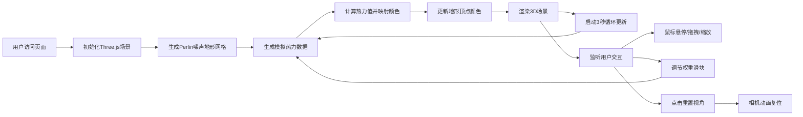

## 1. 产品概述

智慧城市管理3D地形热力图可视化应用，通过Three.js和D3.js实现交互式3D地形热力图，直观展示不同区域的实时人口密度与交通流量，帮助管理者快速识别拥堵点和制定资源调度方案。

- 核心价值：将抽象的城市数据转化为直观可交互的3D视觉呈现，提升城市管理决策效率
- 目标用户：城市管理部门、交通调度中心、智慧城市运营团队

## 2. 核心功能

### 2.1 功能模块
1. **3D地形渲染模块**：基于Perlin噪声生成50x50网格的自然起伏地形，半透明线框增强科技感
2. **热力数据模拟模块**：随机生成人口密度与交通流量数据，归一化后加权计算热力值并映射颜色
3. **动态更新模块**：每3秒更新热力数据，0.5秒平滑颜色过渡动画
4. **鼠标交互模块**：悬停高亮凸起、数据详情显示、拖拽缩放视角控制
5. **控制面板模块**：权重滑块调节、重置视角按钮、移动端折叠适配

### 2.2 页面详情

| 页面名称 | 模块名称 | 功能描述 |
|---------|---------|---------|
| 主页面 | 3D场景渲染 | 全屏显示50x50网格3D地形，根据热力值动态着色 |
| 主页面 | 热力数据展示 | 人口密度0-1000人/平方公里、交通流量0-500车次/小时，加权映射蓝→黄→红色渐变 |
| 主页面 | 悬停交互 | 鼠标悬停网格凸起0.5单位，显示半透明光标圆环，左上角显示详细数据 |
| 主页面 | 控制面板 | 右上角磨砂玻璃面板，密度权重滑块、流量权重滑块、重置视角按钮 |
| 主页面 | 视角控制 | OrbitControls实现拖拽旋转、滚轮缩放，重置视角1秒平滑动画 |

## 3. 核心流程

用户进入页面 → 初始化Three.js场景 → 生成Perlin噪声地形 → 生成初始热力数据 → 地形顶点着色 → 启动动态更新循环（每3秒刷新数据）
→ 用户交互：
  - 拖拽/缩放：OrbitControls调整视角
  - 悬停：网格凸起+显示数据详情
  - 调节滑块：实时更新权重，重新计算热力值
  - 重置按钮：相机平滑回到初始位置



## 4. 用户界面设计

### 4.1 设计风格
- **主色调**：深色科技蓝主题，主色#0a0e27，辅色#1a2a6c，高亮色#00d4ff
- **热力渐变**：低→中→高：蓝色(#0066ff)→青色(#00ffff)→黄色(#ffff00)→红色(#ff0000)
- **地形网格**：半透明线框，颜色#4466aa
- **控制面板**：磨砂玻璃效果(backdrop-filter: blur(10px))，圆角矩形，半透明背景
- **动效**：悬停凸起ease-out缓动，颜色切换linear插值，视角重置1秒平滑动画

### 4.2 页面设计概述

| 页面名称 | 模块名称 | UI元素 |
|---------|---------|--------|
| 主页面 | 3D场景 | 全屏深色背景，50x50半透明线框网格地形，动态热力颜色着色 |
| 主页面 | 悬停提示 | 左上角半透明数据卡片，显示坐标、人口密度、交通流量、热力值 |
| 主页面 | 控制面板 | 右上角固定面板，两个滑块(0-1范围)，一个重置按钮，高亮色点缀 |
| 主页面 | 光标效果 | 悬停时半透明圆环跟随，网格单元凸起高亮 |

### 4.3 响应式设计
- **桌面端**(≥768px)：控制面板完全展开显示
- **移动端**(<768px)：控制面板折叠为图标按钮，点击展开/收起
- **窗口自适应**：监听resize事件，实时更新相机宽高比和渲染器尺寸

### 4.4 3D场景设计
- **环境**：纯深色背景(#0a0e27)，无HDRI，突出地形本身
- **光照**：AmbientLight环境光(0xffffff, 0.4) + DirectionalLight平行光(0xffffff, 0.8)，45度角照射
- **相机**：PerspectiveCamera，初始位置(30, 40, 50)，看向场景中心(0, 0, 0)，fov=60
- **网格参数**：51x51顶点(50x50单元)，平面尺寸50x50单位，Y轴高度范围0-8单位
- **后处理**：无复杂后处理，使用MeshBasicMaterial保证性能
- **性能优化**：仅更新颜色属性不重建几何体，顶点数≤2601，每帧≤16ms

## 5. 文件结构与调用关系

```
├── package.json
├── vite.config.js
├── tsconfig.json
├── index.html
└── src/
    ├── main.ts          # 入口：初始化场景→调用数据生成→传给热力图模块→更新场景
    ├── terrain.ts       # 地形：接收热力数据→更新顶点颜色→通知渲染更新
    ├── heatmap.ts       # 热力：main调用→计算颜色映射→传给terrain
    └── interaction.ts   # 交互：鼠标悬停/拖拽/缩放，HTML叠加层数据展示
```

**数据流向**：
main.ts → heatmap.ts(updateData) → 计算热力值 → terrain.ts(updateColors) → 更新顶点颜色 → 渲染场景
