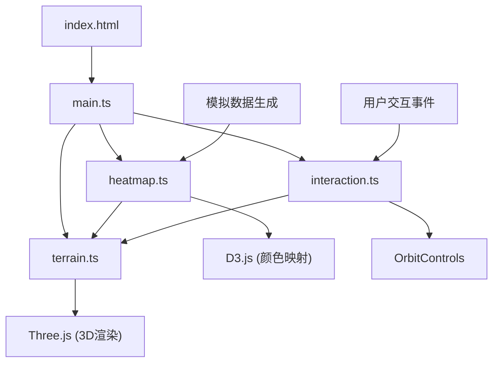
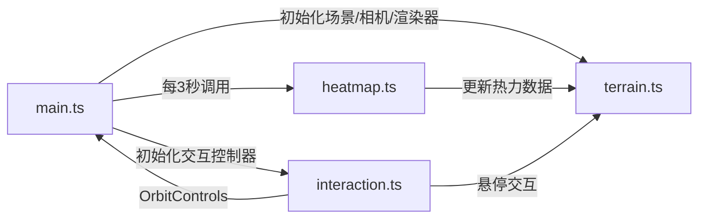

## 1. 架构设计



## 2. 技术描述

- **前端框架**：Vite + TypeScript + Three.js + D3.js

| 依赖库 | 版本 | 用途 |
|-------|------|------|
| three | ^0.160.0 | 3D渲染引擎 |
| d3 | ^7.8.5 | 数据可视化、颜色渐变、数据插值 |
| typescript | ^5.3.0 | 类型安全 |
| vite | ^5.0.0 | 构建工具 |

- **构建配置**：vite.config.js，入口文件index.html
- **类型配置**：tsconfig.json，严格模式，target ES2020，moduleResolution bundler

## 3. 核心模块职责与调用关系

### 3.1 模块依赖图



### 3.2 数据流向图

```mermaid
graph TD
    A[生成模拟数据] --> B[归一化处理
    B --> C[加权计算热力值]
    C --> D[D3颜色映射]
    D --> E[更新地形顶点颜色]
    E --> F[渲染器更新渲染]
```

## 4. 数据结构定义

### 4.1 热力数据类型

```typescript
// 单个网格单元数据
interface GridCellData {
  x: number;           // 网格X坐标 (0-49)
  z: number;           // 网格Z坐标 (0-49)
  density: number;      // 人口密度 (0-1000)
  traffic: number;  // 交通流量 (0-500)
  heatValue: number;  // 计算后的热力值 (0-1)
  color: string;     // 映射后的颜色
}

// 权重配置
interface WeightConfig {
  density: number;  // 密度权重 (0-1)
  traffic: number;  // 流量权重 (0-1)
}
```

### 4.2 核心类/函数API

| 模块 | 函数/类 | 参数 | 返回值 | 说明 |
|------|---------|------|--------|------|
| terrain.ts | `createTerrain()` | `scene: THREE.Scene` | `{ mesh: THREE.Mesh, geometry: THREE.PlaneGeometry` | 创建地形网格，使用Perlin噪声生成高度 |
| terrain.ts | `updateVertexColors()` | `heatData: GridCellData[][], animate?: boolean | `void` | 更新顶点颜色，支持平滑动画 |
| terrain.ts | `highlightCell()` | `cellX: number, cellZ: number` | `void` | 悬停时网格凸起 |
| terrain.ts | `resetHighlight()` | - | `void` | 恢复网格高度 |
| heatmap.ts | `generateHeatData()` | `config: WeightConfig` | `GridCellData[][]` | 生成50x50热力数据 |
| heatmap.ts | `updateData()` | `config: WeightConfig` | `GridCellData[][]` | 重新生成并返回新数据 |
| heatmap.ts | `heatToColor()` | `value: number` | `THREE.Color` | 热力值转颜色 |
| interaction.ts | `setupInteraction()` | `camera, renderer, terrainMesh, updateCallback` | `{ controls: OrbitControls }` | 设置所有交互事件 |
| interaction.ts | `onCellHover()` | `event` | `void` | 鼠标悬停处理 |
| main.ts | `animate()` | - | `void` | 动画循环，每帧更新 |
| main.ts | `resetCamera()` | - | `void` | 重置相机到初始位置 |

## 5. 性能约束实现

| 约束项 | 实现方案 |
|-------|---------|
| 每帧渲染时间≤16ms | 使用MeshBasicMaterial，避免复杂光照计算 |
| 顶点数≤2601 | 51x51顶点平面几何体，不做细分 |
| 仅更新颜色属性 | 使用BufferGeometry，更新color属性数组，不重建几何体 |
| 颜色平滑过渡 | 使用D3.interpolateRgb在0.5秒内线性插值 |
| 悬停凸起动画 | TWEEN或手动ease-out缓动更新顶点Y坐标 |

## 6. 交互事件定义

| 事件名称 | 触发时机 | 处理模块 | 说明 |
|---------|---------|---------|------|
| mousemove | 鼠标移动 | interaction.ts | Raycaster检测悬停网格，更新高亮和数据面板 |
| mouseleave | 鼠标移出画布 | interaction.ts | 重置高亮，隐藏数据面板 |
| resize | 窗口大小变化 | main.ts | 更新相机宽高比和渲染器尺寸 |
| input | 滑块值变化 | main.ts | 更新权重配置，触发数据重新计算 |
| click | 重置按钮点击 | main.ts | 启动相机动画复位 |

## 7. 颜色渐变实现

```typescript
// D3颜色比例尺定义
const colorScale = d3.scaleLinear<string>()
  .domain([0, 0.33, 0.66, 1])
  .range(['#0066ff', '#00ffff', '#ffff00', '#ff0000'])
  .interpolate(d3.interpolateRgb);
```

## 8. Perlin噪声实现

使用简化版Perlin噪声函数生成自然地形高度：

```typescript
// 伪代码示意
function noise2D(x: number, z: number): number {
  // 2D Perlin噪声实现，返回0-1范围值
}

// 地形高度计算
height = noise2D(x * 0.1, z * 0.1) * 8
```
