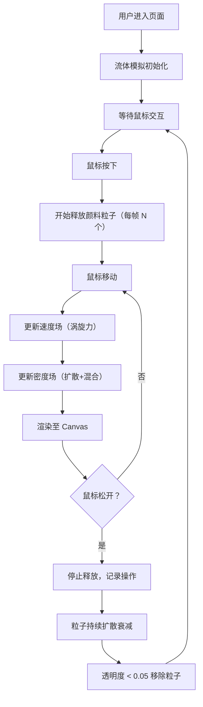

## 1. 产品概述

基于 Canvas 的交互式流体扩散与色彩混合模拟 Web 应用。用户通过鼠标在二维画布上释放颜料，观察流体力学效果下的颜料扩散、涡旋与色彩混合。目标是创造具有艺术表现力和科学仿真感的创作工具，面向数字艺术家、设计师和流体模拟爱好者。

## 2. 核心功能

### 2.1 功能模块

1. **画布流体模拟层**：基于 Navier-Stokes 风格的密度场与速度场更新，驱动颜料粒子运动
2. **颜料释放交互层**：鼠标按下/拖拽释放连续颜料轨迹，每帧释放 20 个粒子（可调）
3. **色彩管理面板**：10 种预定义颜色 + 自定义拾色器，支持颜色动态添加
4. **参数控制面板**：粘度、涡旋强度、扩散速度滑块 + 清除/保存功能
5. **操作记录显示**：左上角实时显示最近 5 条颜料释放记录

### 2.2 页面详情

| 页面名称 | 模块名称 | 功能描述 |
|-----------|-------------|---------------------|
| 主画布页 | 流体模拟画布 | 800x600px 初始尺寸，响应式适配，Canvas 渲染流体粒子 |
| 主画布页 | 左侧颜色面板 | 5x2 网格色块，40x40px，圆角 6px，选中高亮，拾色器自定义 |
| 主画布页 | 右侧控制面板 | 粘度/涡旋/扩散滑块，清除画布、保存快照按钮 |
| 主画布页 | 操作记录层 | 左上角显示最近 5 条颜料释放记录（低帧率刷新） |

## 3. 核心流程

用户移动鼠标至画布 → 鼠标按下开始释放颜料 → 拖拽形成连续轨迹 → 鼠标松开停止释放 → 颜料粒子在流体场中自然扩散混合 → 可调整参数观察不同效果或保存/清空画布

## 4. 用户界面设计

### 4.1 设计风格

- **主色调**：深色科技风，背景渐变 `#1A1A2E` → `#16213E`（深蓝灰到暗紫）
- **点缀色**：天蓝 `#3498DB`（滑块、交互元素），朱红 `#E74C3C`（清除按钮），翠绿 `#2ECC71`（保存按钮）
- **按钮样式**：圆角 8px，按下时 0.95 倍缩放（0.1s ease 过渡）
- **字体**：系统无衬线字体 `-apple-system, sans-serif`，主白色 `#FFFFFF`
- **画布底色**：`rgba(0,0,0,0.4)`（40% 透明纯黑，保证浅色颜料可见）

### 4.2 页面设计概览

| 模块名称 | UI 元素 |
|-----------|----------|
| 画布区域 | 居中 Canvas，四周 20px 留白，无边框 |
| 左侧颜色面板 | 5x2 网格色块，40x40px，圆角 6px，边框 `#666`，选中时白色 2px 光环，下方拾色器 |
| 右侧控制面板 | 固定定位，宽 220px，半透明毛玻璃 `rgba(255,255,255,0.1)`，顶部圆角 12px，内边距 20px |
| 滑块样式 | 轨道高 4px，颜色 `#444`，滑块圆形直径 16px，颜色 `#3498DB`，悬停 `#2980B9` |
| 操作记录 | 左上角，字号 12px，`#FFFFFF80`，monospace 字体 |

### 4.3 响应式

桌面端优先设计，Canvas 响应式适配窗口大小，保持四周 20px 留白。控制面板固定定位不随画布缩放。

## 5. 性能要求

- 模拟帧率 ≥ 30fps
- 每 30 帧统计并以 `console.warn` 输出实际 FPS
- FPS 连续低于 25 时自动将粒子释放数量降至 70%
