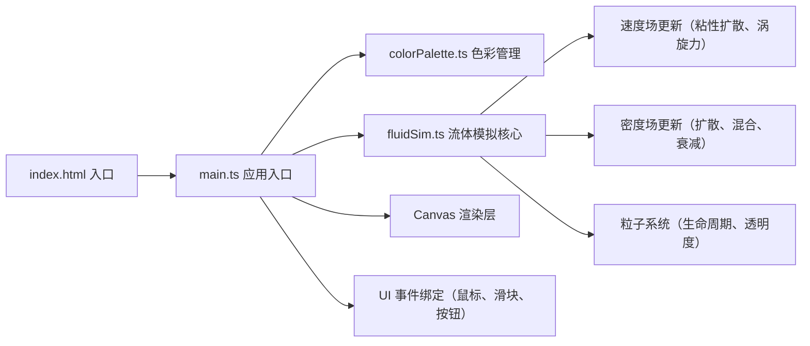

## 1. 架构设计

纯前端单页应用，无后端。采用原生 TypeScript + Vite 构建，不使用 React/Vue 等框架，直接操作 Canvas API。



## 2. 技术说明

- **前端框架**：无框架，原生 TypeScript + HTML5 Canvas API
- **构建工具**：Vite 5.x
- **TypeScript**：严格模式，target ES2020
- **初始化方式**：手动创建项目结构（用户指定文件结构，不使用脚手架模板）

## 3. 文件结构

```
.
├── package.json          # 依赖：typescript, vite；脚本：npm run dev
├── index.html            # 入口页面，深色渐变背景
├── vite.config.js        # Vite 配置，端口 3000
├── tsconfig.json         # TS 配置，严格模式，ES2020
└── src/
    ├── main.ts           # 入口：Canvas 初始化、UI 控件、事件绑定
    ├── fluidSim.ts       # 流体模拟类：密度场、速度场、Navier-Stokes 扩散
    └── colorPalette.ts   # 色彩管理：预定义配色、点击释放逻辑
```

## 4. 核心数据结构与算法

### 4.1 流体模拟（fluidSim.ts）

```typescript
interface Particle {
  x: number;
  y: number;
  vx: number;
  vy: number;
  r: number;        // 红色 0-255
  g: number;        // 绿色 0-255
  b: number;        // 蓝色 0-255
  alpha: number;    // 透明度 0-1
  life: number;     // 剩余生命
}

class FluidSimulator {
  width: number;
  height: number;
  particles: Particle[];
  velocityX: Float32Array;  // 速度场 X 分量
  velocityY: Float32Array;  // 速度场 Y 分量
  densityR: Float32Array;   // 密度场 R
  densityG: Float32Array;   // 密度场 G
  densityB: Float32Array;   // 密度场 B

  addParticles(x: number, y: number, count: number, color: string): void
  addVelocity(x: number, y: number, dx: number, dy: number, radius: number): void
  step(viscosity: number, diffusion: number, dt: number): void
  render(ctx: CanvasRenderingContext2D): void
}
```

### 4.2 色彩管理（colorPalette.ts）

```typescript
interface ColorSwatch {
  name: string;
  hex: string;
  r: number;
  g: number;
  b: number;
}

class ColorPalette {
  colors: ColorSwatch[];
  selectedIndex: number;

  selectColor(index: number): void;
  addCustomColor(hex: string): void;
  getSelectedColor(): ColorSwatch;
}
```

### 4.3 关键算法

1. **速度场扩散**：使用 Jacobi 迭代求解粘性扩散方程
2. **密度场扩散**：类似速度场的扩散 + 平流（Advection）操作
3. **色彩混合**：两色相遇按比例线性插值 RGB 分量
4. **粒子运动**：`v += velocityField * dt + brownian(v)`, `x += v * dt`
5. **透明度衰减**：每帧 `alpha *= 0.997`，低于 0.05 移除

## 5. 性能监控

```typescript
let frameCount = 0;
let lastFpsTime = performance.now();
let lowFpsStreak = 0;
let baseParticleCount = 20;
let currentParticleCount = 20;

function onFrame() {
  frameCount++;
  if (frameCount % 30 === 0) {
    const now = performance.now();
    const fps = (30 * 1000) / (now - lastFpsTime);
    console.warn(`FPS: ${fps.toFixed(1)}`);
    if (fps < 25) {
      lowFpsStreak++;
      if (lowFpsStreak >= 2) {
        currentParticleCount = Math.floor(baseParticleCount * 0.7);
      }
    } else {
      lowFpsStreak = 0;
      currentParticleCount = baseParticleCount;
    }
    lastFpsTime = now;
  }
}
```
