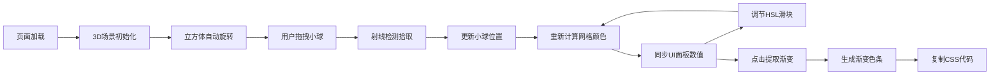

## 1. 产品概述

3D交互式色彩立方体配色探索应用，帮助数字设计师在三维空间中直观探索和调配品牌色彩组合。通过拖拽可交互的色彩小球、调节HSL参数，实时观察颜色在立方体中的渐变效果，并支持一键提取渐变配色方案。

- **核心价值**：将抽象的色彩理论转化为可视化的3D交互体验，提升配色效率和创意灵感
- **目标用户**：UI/UX设计师、品牌设计师、前端开发者

## 2. 核心功能

### 2.1 用户角色
| 角色 | 注册方式 | 核心权限 |
|------|----------|----------|
| 设计师用户 | 无需注册，直接使用 | 完整的3D色彩探索、参数调节、渐变提取功能 |

### 2.2 功能模块
1. **3D色彩立方体场景**：半透明线框立方体，三层嵌套结构（外层端点色、中层渐变网格、内层可拖拽小球）
2. **交互式色彩小球**：三颗可拖拽小球（主色、辅色、强调色），支持鼠标拾取和拖拽
3. **右侧控制面板**：颜色预览、名称编辑、十六进制值显示、HSL滑块调节
4. **渐变提取功能**：基于三色的三线性插值渐变，生成渐变色条和CSS代码
5. **视角控制**：OrbitControls轨道控制，支持旋转、缩放、自动旋转

### 2.3 页面详情
| 页面名称 | 模块名称 | 功能描述 |
|----------|----------|----------|
| 主页面 | 3D场景区域 | 渲染色彩立方体、小球、光晕效果，支持拖拽交互和视角控制 |
| 主页面 | 右侧控制面板 | 颜色信息展示、HSL滑块调节、渐变提取按钮、渐变色条预览 |
| 主页面 | 响应式布局 | 桌面端左右分栏，移动端底部折叠面板 |

## 3. 核心流程

用户打开应用 → 3D场景自动渲染并缓慢自转 → 用户拖拽小球调整颜色位置 → 实时更新面板数值和网格颜色 → 用户通过滑块精确调节HSL → 点击"提取渐变"按钮 → 生成渐变色条 → 复制CSS渐变代码

## 4. 用户界面设计

### 4.1 设计风格
- **主题色调**：深色主题，背景从#1A1A2E到#16213E的垂直渐变
- **交互色彩**：主色#FF3366、辅色#33CCFF、强调色#FFD700、功能按钮#FF6B35
- **控件风格**：柔和圆角设计，磨砂玻璃质感面板（半透明+模糊背景）
- **动效风格**：GSAP平滑过渡动画，微交互反馈（小球放大、滑块高亮、按钮水波纹）

### 4.2 页面设计概述
| 页面名称 | 模块名称 | UI元素 |
|----------|----------|--------|
| 主页面 | 3D场景区域 | 半透明线框立方体、三层网格、彩色小球、底部径向光晕 |
| 主页面 | 右侧控制面板 | 颜色行（预览块+名称+色值）、HSL滑块组、渐变提取按钮、渐变色条 |
| 主页面 | 响应式适配 | 断点1024px，移动端底部可折叠横条 |

### 4.3 响应式
- **桌面端**（>1024px）：左侧75% 3D区域，右侧280px固定面板
- **移动端**（≤1024px）：3D区域全屏，底部80px横条面板，点击展开
- 触控优化：小球拖拽支持触摸事件

### 4.4 3D场景指引
- **环境与氛围**：深色太空感背景，底部白色径向光晕营造悬浮感
- **光照设置**：环境光+半球光，确保颜色显示准确，无过强阴影
- **相机设置**：透视相机，FOV 60°，初始距离约15单位，近平面0.1，远平面1000
- **构图与焦点**：立方体居中，三颗小球作为视觉焦点，线框提供空间参考
- **交互与动画**：自动缓慢自转（0.5°/秒绕Y轴），OrbitControls可控，拖拽小球时的缩放动效
- **后处理效果**：无需复杂后处理，保持颜色准确性，可加轻微抗锯齿
- **性能预算**：顶点数控制在2万以内，GSAP动画帧率≥50FPS，颜色更新≤16ms
