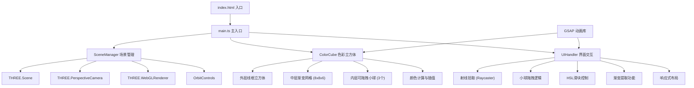

## 1. 架构设计



## 2. 技术栈说明

- **前端框架**：原生 TypeScript + Three.js（按用户要求，不使用React/Vue）
- **构建工具**：Vite 5.x
- **3D引擎**：Three.js 最新版
- **类型支持**：@types/three
- **动画库**：GSAP 最新版
- **编程语言**：TypeScript（严格模式，target ES2020）

## 3. 文件结构与职责

```
auto101/
├── index.html                      # 入口HTML页面
├── package.json                    # 项目依赖与脚本
├── vite.config.js                  # Vite构建配置
├── tsconfig.json                   # TypeScript配置
└── src/
    ├── main.ts                     # 主入口，初始化场景与组件
    ├── ColorCube.ts                # 色彩立方体类（三层结构、颜色计算）
    ├── SceneManager.ts             # Three.js场景管理器
    └── ui/
        └── UIHandler.ts            # UI交互处理器（拖拽、滑块、渐变）
```

### 模块调用关系与数据流向

| 文件 | 职责 | 调用关系 |
|------|------|----------|
| `main.ts` | 应用入口，初始化所有模块，启动动画循环 | SceneManager → ColorCube → UIHandler |
| `SceneManager.ts` | 管理Three.js场景、相机、渲染器、控制器 | 被 main.ts 调用 |
| `ColorCube.ts` | 构建立方体三层结构，计算颜色，处理小球拖拽 | 被 main.ts 和 UIHandler 调用 |
| `UIHandler.ts` | 处理DOM交互、射线拾取、滑块控制、渐变提取 | 调用 ColorCube 方法，监听Canvas事件 |

**数据流向**：
1. 用户交互（鼠标/触摸/滑块）→ UIHandler 事件监听
2. UIHandler → 射线检测/参数计算 → 调用 ColorCube 方法
3. ColorCube → 更新3D对象属性 → 触发颜色重新计算
4. ColorCube → 回调/事件 → UIHandler 更新DOM显示
5. 动画循环（main.ts）→ 每帧调用 renderer.render

## 4. 核心数据结构

### 4.1 颜色小球数据
```typescript
interface SphereData {
  index: number;
  name: string;
  color: THREE.Color;
  position: THREE.Vector3;
  mesh: THREE.Mesh;
}
```

### 4.2 网格单元数据
```typescript
interface GridCell {
  position: THREE.Vector3;
  baseColor: THREE.Color;
  mesh: THREE.Mesh;
}
```

### 4.3 渐变数据
```typescript
interface GradientData {
  colors: string[];
  cssCode: string;
  stops: { position: number; color: string }[];
}
```

## 5. 性能优化策略

1. **几何体复用**：所有网格方块共享同一个 BoxGeometry，小球共享同一个 SphereGeometry
2. **材质批量更新**：使用 GSAP 的 tween 批量更新颜色，避免逐帧创建对象
3. **射线检测优化**：仅对可拖拽小球进行射线检测，忽略网格
4. **降级策略**：低端设备可减少网格密度（8x8x6 → 6x6x4）
5. **节流处理**：滑块事件适当节流，确保颜色更新在16ms内完成
6. **BufferGeometry**：优先使用 BufferGeometry 减少内存开销

## 6. 关键算法

### 6.1 三线性颜色插值
基于立方体坐标（x, y, z ∈ [-4, 4]）的三线性插值，将三颗小球的颜色在立方体内进行混合。

### 6.2 小球位置约束
使用 `THREE.Vector3.clamp()` 将小球坐标限制在 ±4 单位范围内，确保始终在立方体内。

### 6.3 射线与平面交点
拖拽时使用射线与立方体中心平面（面向相机）求交，计算小球新位置。

### 6.4 渐变生成算法
在主色→辅色→强调色之间进行多段插值，生成平滑的水平渐变色带。
