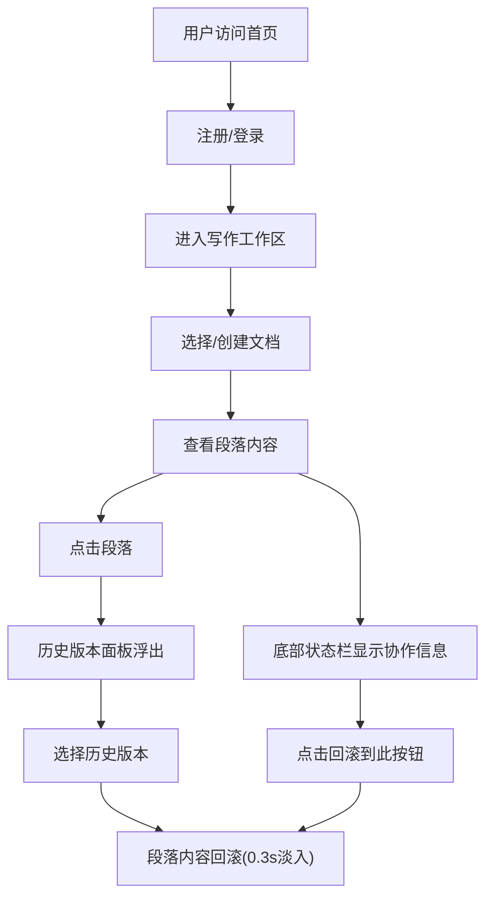

## 1. 产品概述

VersionFast 是一款面向写作者（小说作者、编剧、创意写作小组）的在线团队协作写作与版本回滚平台。它让多人实时在同一文档上协同创作，每位作者的段落以不同颜色高亮区分，并支持像 Git 一样的版本可视化浏览与一键回滚，但操作更简单、界面更文艺。

- 核心价值：降低多人协作写作的版本管理门槛，提供直观的段落级版本历史与回滚能力
- 目标用户：小说写作团队、编剧组、创意写作课程小组等需要多人共创内容的群体

## 2. 核心功能

### 2.1 用户角色

| 角色 | 注册方式 | 核心权限 |
|------|----------|----------|
| 写作者 | 用户名注册/登录 | 创建文档、编辑段落、查看版本历史、回滚段落 |

### 2.2 功能模块

1. **登录页**：用户注册/登录入口，简洁文艺风格
2. **写作工作区**：左侧文档列表 + 右侧编辑区 + 底部协作状态栏，核心创作与版本管理界面

### 2.3 页面详情

| 页面名称 | 模块名称 | 功能描述 |
|----------|----------|----------|
| 登录页 | 注册/登录表单 | 用户名输入，支持注册与登录切换，提交后进入工作区 |
| 写作工作区 | 文档列表侧栏 | 展示所有文档条目（标题、最后编辑时间、合作者头像缩略图），点击切换文档 |
| 写作工作区 | 段落编辑区 | 等宽字体编辑区，段落间浅棕色虚线分隔，每段左侧彩色竖条标识作者，点击段落选中 |
| 写作工作区 | 历史版本侧边栏 | 点击段落后右侧浮出半透明毛玻璃面板，展示该段落全部历史版本，点击版本项回滚段落文本 |
| 写作工作区 | 协作状态栏 | 底部栏显示在线人数（发光圆点）、最近保存时间、"回滚到此"按钮 |

## 3. 核心流程

用户注册/登录后进入写作工作区，在左侧选择或创建文档，右侧编辑区以段落为单位展示内容，每段左侧彩色竖条标识作者身份。用户点击某段落后，右侧浮出历史版本面板，可浏览该段落所有历史版本（含时间戳、作者、颜色标签），点击任一版本即可将段落内容回滚至该版本，切换时有 0.3 秒淡入动画。底部状态栏实时显示协作状态，"回滚到此"按钮提供快捷回滚操作。

## 4. 用户界面设计

### 4.1 设计风格

- **主色**：羊皮纸色 `#F5E6C8`
- **辅色**：深棕色 `#5C4033`
- **强调色**：樱桃红 `#D9455F`
- **背景纹理**：CSS 重复小点图案模拟纸质纹理
- **字体**：正文使用 Source Code Pro（等宽），标题使用衬线体
- **布局**：左右两栏响应式（大屏左栏 280px，右栏自适应；小屏左栏收为汉堡菜单）
- **按钮风格**：圆角 20px，樱桃红主按钮，悬停变亮，点击有缩放弹回反馈
- **动画**：段落切换与版本回滚 0.3s 淡入淡出，按钮点击 0.2s 缩放弹回

### 4.2 页面设计概览

| 页面名称 | 模块名称 | UI 元素 |
|----------|----------|----------|
| 登录页 | 注册/登录表单 | 居中卡片式表单，羊皮纸背景，深棕文字，樱桃红按钮 |
| 写作工作区 | 文档列表侧栏 | 左侧 280px 固定宽度，文档条目列表（标题+时间+头像），深棕装饰线 |
| 写作工作区 | 段落编辑区 | Source Code Pro 字体，段落间浅棕虚线，左侧彩色竖条（6色柔和色板），可点击选中 |
| 写作工作区 | 历史版本面板 | 右侧 280px 半透明白色毛玻璃面板，圆角 12px，版本列表（时间戳+作者+颜色标签） |
| 写作工作区 | 协作状态栏 | 底部固定栏，发光圆点在线指示，保存时间，樱桃红回滚按钮 |

### 4.3 响应式设计

- 桌面端（≥768px）：左栏 280px 固定 + 右栏自适应两栏布局
- 移动端（<768px）：左栏收起为汉堡菜单，点击弹出覆盖式侧栏
- 历史版本面板在移动端从底部滑出

### 4.4 段落作者色板

预设 6 种柔和色板，按作者自动分配：
- `#E8A87C`（暖杏）
- `#85CDCA`（薄荷绿）
- `#D5A6BD`（玫瑰粉）
- `#C3B1E1`（薰衣草紫）
- `#A8D8EA`（天空蓝）
- `#F9DC5C`（暖黄）
