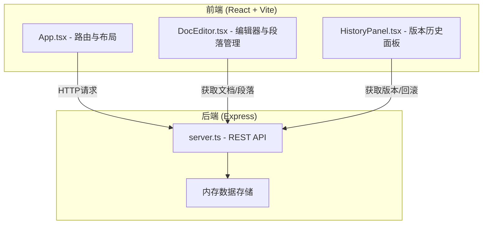
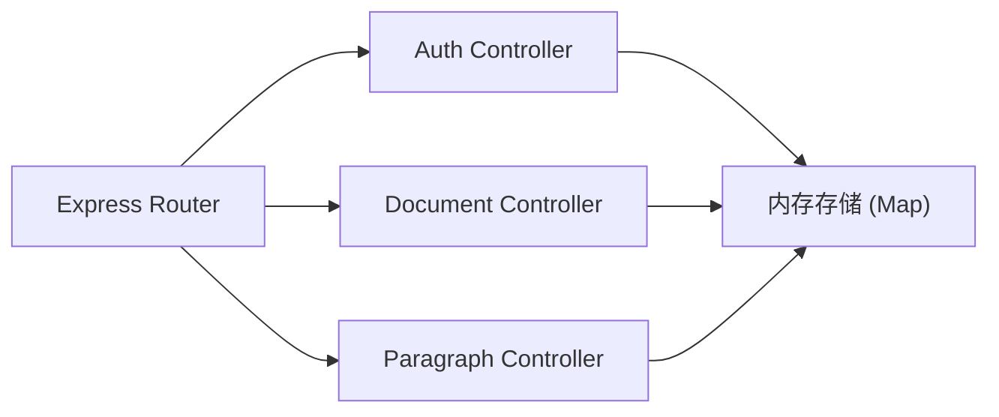
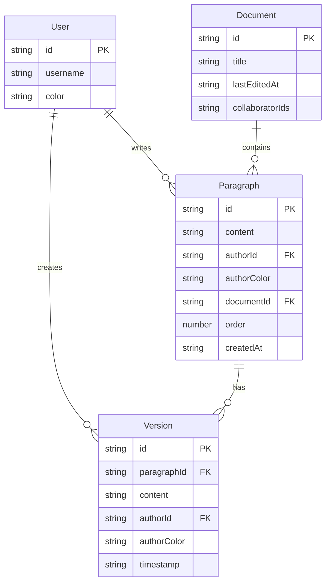

## 1. 架构设计



## 2. 技术说明

- **前端**：React@18 + TypeScript + Vite（端口 3000）
- **样式方案**：CSS Modules / 内联样式（复古图书馆风格定制程度高）
- **状态管理**：Zustand
- **路由**：react-router-dom
- **后端**：Express@4 + TypeScript
- **数据库**：内存存储（Map 结构），服务重启数据重置
- **构建工具**：Vite

## 3. 路由定义

| 路由 | 用途 |
|------|------|
| `/` | 登录/注册页 |
| `/workspace` | 写作工作区（文档列表 + 编辑区 + 版本面板） |

## 4. API 定义

### 4.1 用户相关

```typescript
POST /api/auth/register
Request:  { username: string }
Response: { user: { id: string; username: string; color: string } }

POST /api/auth/login
Request:  { username: string }
Response: { user: { id: string; username: string; color: string } }
```

### 4.2 文档相关

```typescript
GET /api/documents
Response: { documents: Document[] }

POST /api/documents
Request:  { title: string }
Response: { document: Document }

GET /api/documents/:id
Response: { document: DocumentWithParagraphs }
```

### 4.3 段落与版本相关

```typescript
POST /api/documents/:id/paragraphs
Request:  { content: string; authorId: string }
Response: { paragraph: Paragraph }

PUT /api/paragraphs/:id
Request:  { content: string; authorId: string }
Response: { paragraph: Paragraph }

GET /api/paragraphs/:id/versions
Response: { versions: Version[] }

POST /api/paragraphs/:id/rollback
Request:  { versionId: string }
Response: { paragraph: Paragraph }
```

### 4.4 数据类型

```typescript
interface User {
  id: string;
  username: string;
  color: string;
}

interface Document {
  id: string;
  title: string;
  lastEditedAt: string;
  collaboratorIds: string[];
  paragraphIds: string[];
}

interface Paragraph {
  id: string;
  content: string;
  authorId: string;
  authorColor: string;
  documentId: string;
  order: number;
  createdAt: string;
}

interface Version {
  id: string;
  paragraphId: string;
  content: string;
  authorId: string;
  authorColor: string;
  timestamp: string;
}
```

## 5. 服务端架构图



## 6. 数据模型

### 6.1 数据模型定义



### 6.2 初始数据

服务启动时预置：
- 3 个示例用户（分别分配暖杏、薄荷绿、玫瑰粉色）
- 2 个示例文档，每个包含 4-5 个段落
- 每个段落包含 2-3 个历史版本
