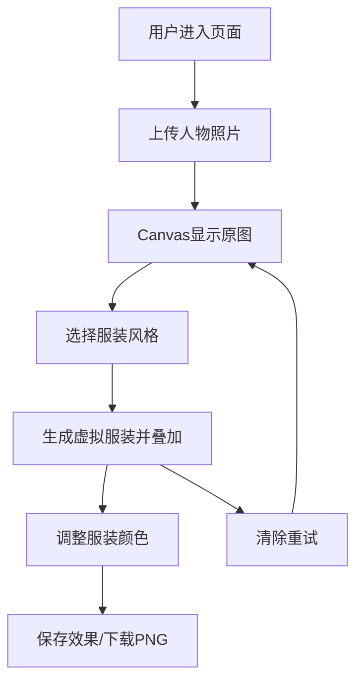

## 1. 产品概述

虚拟试衣Web应用，用户上传人物照片后可自动替换为指定风格的虚拟服装，解决在线购物时无法直观看到不同风格服装上身效果的痛点。

- 主要用途：在线虚拟试衣、服装风格预览
- 目标用户：网购消费者、服装爱好者
- 产品价值：提升购物体验，降低退换货率

## 2. 核心功能

### 2.1 功能模块

1. **试衣主界面**：照片上传区、Canvas试衣区、服装选择面板、结果预览
2. **服装风格系统**：5种预设风格（休闲T恤、商务衬衫、运动夹克、晚宴礼服、古风汉服）
3. **颜色定制**：8种预设颜色选择器，实时切换服装颜色
4. **结果导出**：保存试衣效果为PNG图片
5. **重置功能**：清除当前效果，恢复原始照片

### 2.2 页面详情

| 页面名称 | 模块名称 | 功能描述 |
|---------|---------|---------|
| 试衣主页 | 照片上传模块 | 支持点击/拖拽上传JPG/PNG照片，尺寸建议500x800以上 |
| 试衣主页 | Canvas试衣区 | 600x800像素等比例显示原图，叠加虚拟服装 |
| 试衣主页 | 服装选择面板 | 5种风格卡片，点击切换服装样式，带淡入淡出动画 |
| 试衣主页 | 颜色选择器 | 8个圆形色块，实时改变服装颜色，带平滑过渡 |
| 试衣主页 | 操作按钮区 | 保存效果、清除重试按钮 |

## 3. 核心流程

用户上传照片 → 在Canvas等比例显示 → 选择服装风格 → 系统根据人物身体轮廓生成对应服装多边形并叠加 → 可调整颜色 → 保存为PNG图片或清除重试。

## 4. 用户界面设计

### 4.1 设计风格

- **主色调**：浅灰色背景（#F0F0F0），哑光黑（#2C2C2C）卡片/按钮/边框
- **强调色**：粉色（#FF6B9D）选中边框
- **按钮风格**：圆角8px，哑光黑背景白色文字，悬停深灰（#4A4A4A），点击缩放0.95
- **服装卡片**：悬停上浮4px，阴影加深，选中时2px粉色边框
- **整体风格**：现代时尚杂志风格，简洁高端

### 4.2 页面布局

| 区域 | 模块 | UI元素 |
|-----|------|--------|
| 左栏 | 原图与试衣区 | Canvas画布（600x800），等比例缩放显示 |
| 右栏（320px固定） | 服装选择面板 | 5个风格卡片，图标+文字标签 |
| 右栏 | 颜色选择器 | 8个圆形色块 |
| 右栏 | 操作按钮 | 保存效果、清除重试 |

### 4.3 响应式设计

- 桌面优先设计，适配1920x1080和1366x768分辨率
- 试衣区宽度自适应：最小500px，最大600px
- 右栏面板宽度固定320px
- 左右两栏布局，保持平衡

### 4.4 动效设计

- 服装切换：旧服装0.3秒淡出，新服装淡入
- 颜色变化：0.15秒平滑过渡动画
- 按钮点击：0.1秒按压缩放（scale 0.95）
- 卡片悬停：上浮4px + 阴影加深

## 5. 性能要求

- 照片上传到显示时间 ≤ 500ms
- 风格切换动画帧率 ≥ 40fps
- 颜色变化响应时间 ≤ 100ms
