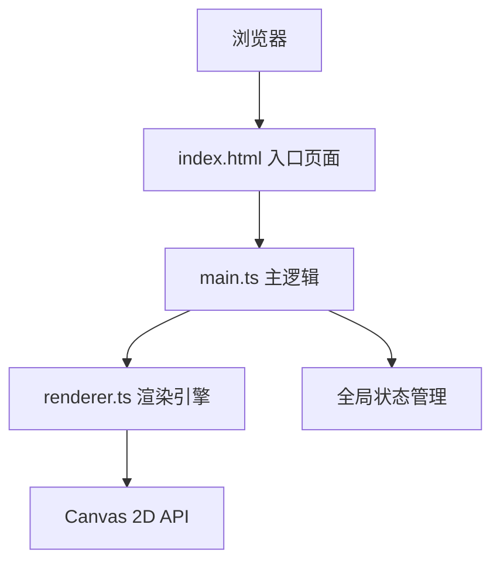

## 1. 架构设计



纯前端应用，采用TypeScript + Vite构建，无后端依赖。

## 2. 技术描述

- **前端框架**：原生JavaScript + TypeScript（不使用框架）
- **构建工具**：Vite 5.x
- **渲染技术**：HTML5 Canvas 2D API
- **开发语言**：TypeScript（严格模式，target ES2020）
- **样式方案**：原生CSS（CSS变量 + 动画）

## 3. 文件结构

```
.
├── package.json          # 项目依赖与脚本
├── index.html            # 入口HTML
├── vite.config.js        # Vite配置
├── tsconfig.json         # TypeScript配置
└── src/
    ├── main.ts           # 主逻辑：页面初始化、事件绑定、流程管理
    └── renderer.ts       # 渲染引擎：Canvas绘制、服装生成、动画处理
```

### 文件职责

- **main.ts**：初始化页面DOM、绑定用户交互事件、管理全局应用状态、协调渲染引擎
- **renderer.ts**：Canvas原图绘制、虚拟服装多边形生成与渲染、颜色/透明度动画处理、图片导出

## 4. 核心模块设计

### 4.1 状态管理（全局状态对象）

```typescript
interface AppState {
  originalImage: HTMLImageElement | null;
  currentStyle: ClothingStyle | null;
  currentColor: string;
  clothingOpacity: number;
  isAnimating: boolean;
}
```

### 4.2 服装风格数据

```typescript
type ClothingStyle = 'tshirt' | 'shirt' | 'jacket' | 'dress' | 'hanfu';

interface StyleConfig {
  id: ClothingStyle;
  name: string;
  icon: string;
  polygonPoints: Point[];
}
```

### 4.3 渲染引擎接口

```typescript
// 绘制原图
function drawOriginalImage(img: HTMLImageElement): void;

// 生成服装多边形（简化匹配算法）
function generateClothingPolygon(style: ClothingStyle): Point[];

// 渲染服装（带颜色和透明度）
function renderClothing(points: Point[], color: string, opacity: number): void;

// 颜色过渡动画
function animateColorChange(fromColor: string, toColor: string, duration: number): void;

// 导出Canvas为PNG
function exportCanvas(): string;
```

## 5. 关键算法

### 5.1 简化多边形匹配算法

- 基于预设的服装轮廓多边形
- 根据人物照片尺寸等比例缩放多边形
- 定位到人物身体区域（居中偏下位置）
- 使用Canvas 2D路径填充渲染

### 5.2 颜色平滑过渡

- RGB颜色空间线性插值
- requestAnimationFrame驱动动画
- 0.15秒过渡时长

### 5.3 服装淡入淡出

- requestAnimationFrame逐帧更新透明度
- 0.3秒过渡时长
- 旧服装淡出与新服装淡入衔接
