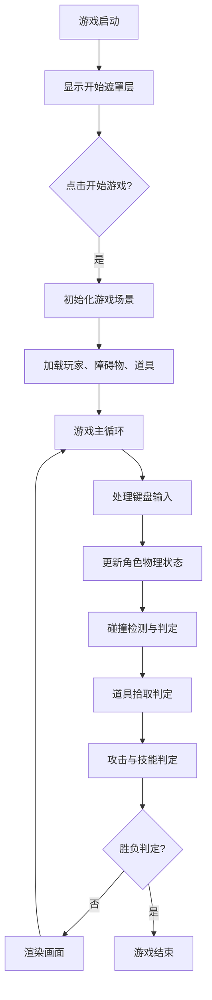

## 1. 产品概述

本产品是一款基于Canvas的2D双人对战野兽格斗游戏，玩家在赛博朋克风格的像素竞技场中操控野兽角色，通过拾取道具和技能卡牌进行对战，争夺"街头野兽之王"的称号。目标用户为街机对战游戏爱好者，主打本地双人同屏竞技体验。

## 2. 核心功能

### 2.1 用户角色
| 角色 | 参与方式 | 核心权限 |
|------|----------|----------|
| 玩家1（1P） | 键盘WASD控制 | 移动、普攻、技能释放 |
| 玩家2（2P） | 键盘方向键控制 | 移动、普攻、技能释放 |

### 2.2 功能模块
1. **主游戏场景**：Canvas渲染的竞技场，包含像素风城市背景、障碍物、角色
2. **对战系统**：双人本地对战，生命值与击飞判定
3. **道具系统**：速度靴、防御罩、伤害强化、技能卡包
4. **技能卡系统**：火焰冲击、冰霜陷阱、治疗波
5. **UI界面**：血条显示、操作提示、开始界面、技能栏

### 2.3 页面详情
| 页面名称 | 模块名称 | 功能描述 |
|----------|----------|----------|
| 开始界面 | 开始按钮 | 半透明遮罩层，点击开始游戏按钮后进入对战场景 |
| 对战场景 | 竞技场 | 900x600 Canvas，绘制背景、角色、道具、障碍物、粒子效果 |
| 对战场景 | 血条 | 角色正上方横向血条，颜色根据生命值渐变 |
| 对战场景 | 操作提示 | 左右下角半透明面板显示1P/2P按键说明 |
| 对战场景 | 技能栏 | 右上角显示持有的技能卡图标 |

## 3. 核心流程

游戏开始后显示开始遮罩层，点击"开始游戏"按钮后进入对战场景。两名玩家通过键盘控制各自角色移动、攻击和释放技能，在场景中拾取道具增强自身或获取技能卡。当其中一方生命值归零或被击飞出Canvas边界时，游戏结束。

## 4. 用户界面设计

### 4.1 设计风格
- 主色调：深紫#0F0C29到霓虹蓝#24243E渐变背景
- 角色风格：像素风野兽
- 按钮：白色20px字体，点击缩放0.95动画
- 字体：操作提示使用12px Courier New
- 配色：血条>60%#00C853，30-60%#FFD600，<30%#FF1744，障碍物#444，操作面板#00000088

### 4.2 页面设计概述
| 页面名称 | 模块名称 | UI元素 |
|----------|----------|--------|
| 开始界面 | 遮罩层 | 半透明黑色遮罩，中央白色"开始游戏"按钮，点击缩放动画 |
| 对战场景 | 背景 | 像素风城市地平线剪影，深紫到霓虹蓝竖向渐变 |
| 对战场景 | 障碍物 | 5块深灰色矩形，尺寸120x40，随机分布 |
| 对战场景 | 角色 | 像素风野兽，头顶血条，头顶道具效果光效 |
| 对战场景 | 道具 | 速度靴=蓝色小三角，防御罩=半透明白色圆，伤害强化=红色闪电，技能卡包=彩色卡牌 |
| 对战场景 | 操作面板 | 左右下角半透明黑色圆角矩形，白色Courier New字体 |
| 对战场景 | 技能栏 | 右上角Canvas绘制的技能卡图标 |

### 4.3 响应式
- 桌面优先，Canvas自适应窗口但保持16:10宽高比
- 四周留空，游戏区居中显示
