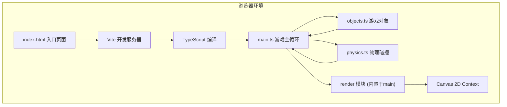

## 1. 架构设计



## 2. 技术说明

- 前端：TypeScript + 原生Canvas 2D API
- 构建工具：Vite@5
- 入口文件：index.html
- 主循环：requestAnimationFrame，目标60FPS
- 无后端，纯前端本地双人游戏

## 3. 文件结构与调用关系

| 文件路径 | 职责 | 调用关系 |
|----------|------|----------|
| `/index.html` | 页面入口，挂载Canvas、开始按钮、操作面板 | 加载main.ts |
| `/vite.config.js` | Vite构建配置，端口3000 | 被Vite读取 |
| `/tsconfig.json` | TS编译配置，严格模式，target ES2020 | 被TSC读取 |
| `/src/objects.ts` | Player类、PowerUp枚举、CardData接口、障碍物、道具、粒子定义 | main.ts导入并创建实例 |
| `/src/physics.ts` | 矩形碰撞检测、道具拾取判定、击飞向量计算 | main.ts每帧调用，返回碰撞结果 |
| `/src/main.ts` | 游戏主循环、Canvas初始化、输入处理、状态管理、渲染绘制 | 调用objects.ts和physics.ts |

**数据流向**：
1. index.html → 加载main.ts
2. main.ts初始化 → 创建Player实例（objects.ts）→ 创建障碍物/道具
3. 每帧：main.ts读取键盘输入 → 更新Player状态 → 调用physics.ts检测碰撞 → 根据碰撞结果更新状态 → 调用render绘制所有元素

## 4. 核心数据模型

### 4.1 枚举与接口（objects.ts）
```typescript
enum PowerUp {
  SpeedBoost = 'speed',      // 速度靴
  Shield = 'shield',          // 防御罩
  DamageUp = 'damage',        // 伤害强化
  SkillCard = 'card'          // 技能卡包
}

enum SkillType {
  FireBlast = 'fire',         // 火焰冲击
  FrostTrap = 'frost',        // 冰霜陷阱
  HealWave = 'heal'           // 治疗波
}

interface CardData {
  type: SkillType;
  name: string;
  icon: string;
}

interface PlayerState {
  x, y: number;               // 位置
  vx, vy: number;             // 速度
  hp: number;                 // 生命值 0-100
  width, height: number;      // 碰撞体尺寸
  speedBoost: number;         // 速度增益剩余时间 ms
  shield: boolean;            // 是否有护盾
  damageUp: number;           // 伤害增益剩余时间 ms
  isKnockback: boolean;       // 是否被击飞
  knockbackTime: number;      // 击飞剩余时间 ms
  facing: 1 | -1;             // 朝向
  cards: CardData[];          // 持有的技能卡（最多2张）
  lastAttack: number;         // 上次普攻时间戳
}
```

### 4.2 障碍物、道具、粒子
```typescript
interface Obstacle { x, y, w, h: number; shakeTime: number; }
interface PowerUpItem { x, y: number; type: PowerUp; collected: boolean; }
interface FrostZone { x, y: number; duration: number; }
interface Particle { x, y: number; vx, vy: number; life: number; color: string; }
```

## 5. 性能约束

- 帧率：requestAnimationFrame驱动，稳定60FPS
- 重绘：每帧Canvas重绘一次（双缓冲通过浏览器实现）
- 运算耗时：道具生成与碰撞检测每帧≤3ms
- 实现方式：避免不必要的GC，对象池管理粒子，简单AABB碰撞
