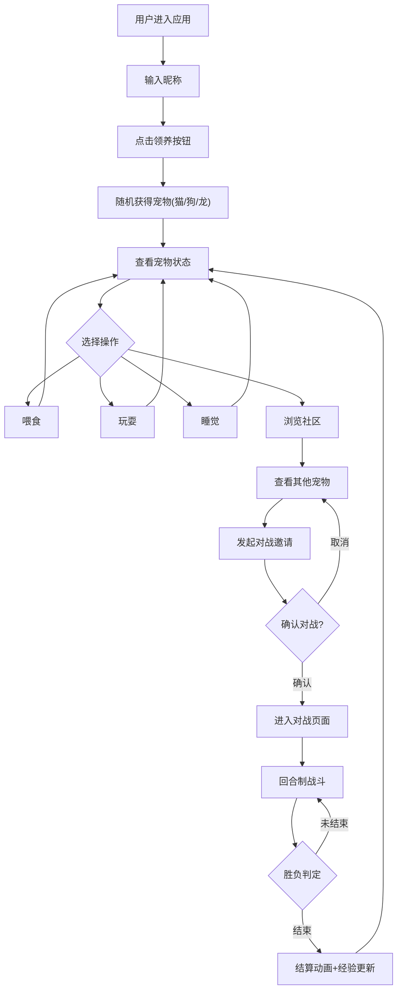

## 1. 产品概述

虚拟宠物托管与社交互动Web应用——用户可以领养、照顾虚拟宠物（猫、狗、龙），并与其他用户的宠物进行玩耍或对战。面向喜爱休闲养成和社交互动的年轻用户群体，提供轻松有趣的虚拟宠物体验。

## 2. 核心功能

### 2.1 用户角色

| 角色 | 注册方式 | 核心权限 |
|------|----------|----------|
| 普通用户 | 输入昵称即可开始 | 领养宠物、照顾宠物、社区浏览、对战互动 |

### 2.2 功能模块

1. **我的宠物页**：宠物领养、宠物状态展示、互动操作（喂食/玩耍/睡觉）
2. **宠物社区页**：在线宠物网格展示、对战邀请、懒加载
3. **排行榜页**：宠物等级排行展示
4. **对战页**：回合制对战、HP血条、攻击动画、胜负判定

### 2.3 页面详情

| 页面名称 | 模块名称 | 功能描述 |
|----------|----------|----------|
| 我的宠物 | 宠物领养 | 输入昵称后随机获得猫/狗/龙宠物，展示宠物信息圆形卡片 |
| 我的宠物 | 宠物状态 | 显示心情值、饱食度进度条和等级，宠物呼吸动画 |
| 我的宠物 | 互动操作 | 喂食(饱食度+15,冷却5s)、玩耍(心情+10,饱食度-5,冷却3s)、睡觉(5s恢复) |
| 宠物社区 | 宠物列表 | 网格3列展示，悬停浮动效果，懒加载每次20个 |
| 宠物社区 | 对战邀请 | 点击宠物弹出模态框，确认/取消发起对战 |
| 对战页 | 回合制战斗 | 双方宠物并排展示，HP血条，自动攻击动画，三局两胜 |
| 对战页 | 结算动画 | 彩色粒子爆发效果2s，经验值更新 |
| 排行榜 | 等级排行 | 按宠物等级降序排列展示 |

## 3. 核心流程

用户进入应用 → 输入昵称 → 点击"领养" → 随机获得宠物 → 查看宠物状态 → 进行互动操作(喂食/玩耍/睡觉) → 浏览宠物社区 → 点击其他宠物发起对战 → 进入回合制战斗 → 三局两胜 → 返回主页

## 4. 用户界面设计

### 4.1 设计风格

- 主色调：米白色#FFFAF0到浅蓝#E3F2FD渐变背景
- 强调色：亮蓝#42A5F5（导航指示线）、橙色#FF7043（喂食）、绿色#66BB6A（玩耍）、紫色#AB47BC（睡觉）
- 按钮样式：圆角矩形12px，宽120px高45px，点击缩放0.9倍
- 字体：系统无衬线字体
- 布局风格：卡片式布局，圆润卡通风格
- 图标/表情：使用lucide-react图标库

### 4.2 页面设计概览

| 页面名称 | 模块名称 | UI元素 |
|----------|----------|--------|
| 我的宠物 | 宠物卡片 | 圆形卡片半径150px，渐变背景#E3F2FD到#E8EAF6，呼吸浮动动画4s周期 |
| 我的宠物 | 互动按钮 | 三个圆角按钮(120x45px)，带冷却倒计时和缩放动画 |
| 宠物社区 | 宠物网格 | 3列网格间距20px，卡片280x240px，圆形缩略图80px，悬停浮动4px+阴影增强 |
| 宠物社区 | 对战模态框 | 半透明背景，居中400x300px，圆角12px白色背景 |
| 对战页 | 战斗区域 | 双宠物并排各50%，红色渐变HP血条，攻击跳跃动画0.6s |
| 对战页 | 结算 | 彩色粒子爆发2s |
| 导航栏 | 顶部/底部 | 50px高深蓝#1A237E背景，当前页亮蓝指示线50x3px，0.3s切换动画 |

### 4.3 响应式设计

- 桌面优先设计，375px宽度以下自动切换为单列布局
- 手机端：卡片宽度100%，底部导航栏替代顶部导航
- 所有卡片和按钮统一12px圆角
- 转场和弹出窗口0.3s淡入淡出过渡

### 4.4 宠物动画

- 呼吸效果：宠物卡片轻微上下浮动3px，周期4s
- 互动光晕：互动时卡片闪烁淡黄色光晕
- 睡觉动画：宠物进入睡眠状态的动画效果
- 对战攻击：宠物向前跳跃并释放光效0.6s
- 对战血条：HP减少时0.5s平滑过渡动画
