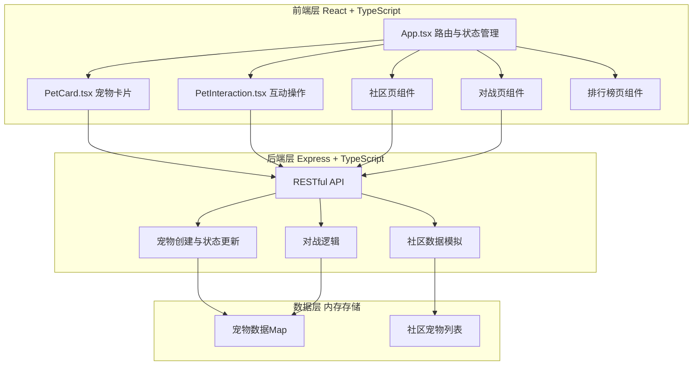
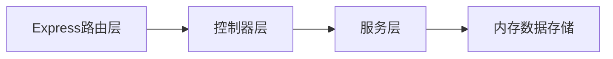
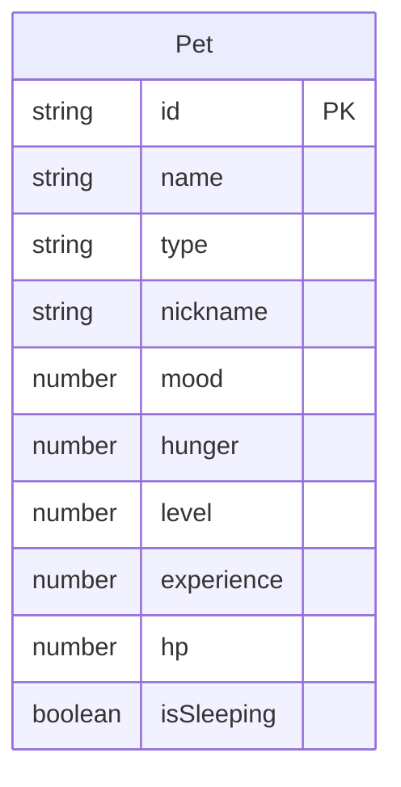

## 1. 架构设计



## 2. 技术说明

- 前端：React@18 + TypeScript + Vite + Tailwind CSS
- 初始化工具：vite-init (react-express-ts模板)
- 后端：Express@4 + TypeScript
- 数据库：无，使用内存Map模拟数据存储
- 状态管理：Zustand
- 路由：react-router-dom
- 图标：lucide-react
- UUID：uuid库生成宠物唯一ID

## 3. 路由定义

| 路由 | 用途 |
|------|------|
| / | 我的宠物主页，宠物领养与状态展示 |
| /community | 宠物社区，浏览其他宠物并发起对战 |
| /battle/:myPetId/:opponentPetId | 对战页面，回合制战斗 |
| /leaderboard | 排行榜，按等级排序 |

## 4. API定义

### 4.1 宠物相关API

```typescript
interface Pet {
  id: string;
  name: string;
  type: "cat" | "dog" | "dragon";
  nickname: string;
  mood: number;
  hunger: number;
  level: number;
  experience: number;
  hp: number;
  isSleeping: boolean;
}

// POST /api/pets/adopt
// 请求体
interface AdoptRequest {
  nickname: string;
}
// 响应体
interface AdoptResponse {
  pet: Pet;
}

// GET /api/pets/:id
// 响应体
interface GetPetResponse {
  pet: Pet;
}

// PUT /api/pets/:id/feed
// 响应体
interface FeedResponse {
  pet: Pet;
}

// PUT /api/pets/:id/play
// 响应体
interface PlayResponse {
  pet: Pet;
}

// PUT /api/pets/:id/sleep
// 响应体
interface SleepResponse {
  pet: Pet;
}

// GET /api/pets/community?page=1&limit=20
// 响应体
interface CommunityResponse {
  pets: Pet[];
  hasMore: boolean;
}

// POST /api/pets/battle
// 请求体
interface BattleRequest {
  pet1Id: string;
  pet2Id: string;
}
// 响应体
interface BattleResponse {
  rounds: BattleRound[];
  winner: string;
  pet1: Pet;
  pet2: Pet;
}

interface BattleRound {
  round: number;
  pet1Damage: number;
  pet2Damage: number;
  pet1Hp: number;
  pet2Hp: number;
}
```

## 5. 服务器架构图



## 6. 数据模型

### 6.1 数据模型定义



### 6.2 数据定义

- 宠物类型及初始属性：
  - 猫(cat)：心情90，饱食度70，基础攻击12
  - 狗(dog)：心情80，饱食度85，基础攻击10
  - 龙(dragon)：心情70，饱食度60，基础攻击15
- 伤害计算公式：基础伤害10 + 等级*1，饱食度<30时伤害减半
- 经验值：每场对战胜者+20经验，败者+5经验；每100经验升1级
