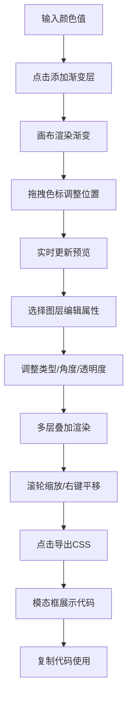

## 1. 产品概述
渐变编辑器是一款面向前端开发者和设计师的交互式CSS渐变创作工具，解决用户在构思网页背景时缺乏直观、可交互的渐变编辑工具、需要反复调整参数和切换预览模式的痛点。
- 支持多图层渐变叠加、实时预览、拖拽交互，最终导出可直接使用的CSS代码和HTML片段。

## 2. 核心功能

### 2.1 用户角色
| 角色 | 注册方式 | 核心权限 |
|------|----------|----------|
| 前端开发者 / 设计师 | 无需注册 | 完整使用所有渐变编辑、预览、导出功能 |

### 2.2 功能模块
1. **主编辑界面**：左侧控制面板、中间预览画布、右侧图层面板
2. **渐变引擎**：色标管理、多层渲染、混合模式计算、Canvas绘制
3. **导出模块**：CSS代码生成、HTML片段生成、模态框展示与复制

### 2.3 页面详情
| 页面名称 | 模块名称 | 功能描述 |
|----------|----------|----------|
| 主编辑页面 | 左侧控制面板 | 颜色输入（HEX/RGB/HSL）、添加色标按钮、渐变类型选择、环形角度滑块、透明度控制、混合模式选择 |
| 主编辑页面 | 中间预览画布 | 800x600预览区域、滚轮缩放（0.5x-3x）、右键拖拽平移、顶部色条与可拖拽色标 |
| 主编辑页面 | 右侧图层面板 | 图层列表（缩略图+标签）、图层激活高亮、悬停删除按钮、添加新渐变层按钮 |
| 主编辑页面 | 导出模态框 | CSS代码高亮显示、HTML片段展示、复制按钮、半透明模糊背景 |

## 3. 核心流程
用户输入颜色值 → 点击添加渐变层 → 画布更新渐变效果 → 拖拽色标调整位置 → 切换图层编辑属性（类型/角度/透明度/混合模式） → 缩放平移预览 → 点击导出CSS → 模态框显示代码 → 复制使用

## 4. 用户界面设计

### 4.1 设计风格
- **主背景色**：#1E1E2E，面板背景#2A2A3C
- **主题色**：#7C3AED（按钮），悬停#8B5CF6
- **圆角**：8px统一使用
- **字体**：JetBrains Mono 等宽字体用于代码，Inter 用于界面文本
- **布局**：三栏式布局，左320px + 中间自适应 + 右280px
- **图标**：简约线性图标，统一20px尺寸

### 4.2 页面设计概述
| 页面名称 | 模块名称 | UI元素 |
|----------|----------|--------|
| 主编辑页面 | 左侧控制面板 | 颜色输入框（聚焦光晕）、取色器弹出层、添加按钮（点击缩放0.97x）、环形滑块（直径80px）、下拉选择器 |
| 主编辑页面 | 中间预览画布 | Canvas画布、顶部色条、圆形色标点（16px）、缩放平移交互、帧率计数器 |
| 主编辑页面 | 右侧图层面板 | 图层卡片（悬停显示删除按钮）、缩略图预览、激活高亮边框、淡出删除动画 |
| 主编辑页面 | 导出模态框 | 半透明模糊背景、代码高亮区域、复制按钮（文字变化动画） |

### 4.3 响应式
- 桌面端优先，三栏固定布局
- 移动端自适应为上下布局，预览区占主视觉
- 触控设备优化拖拽手感

## 5. 性能要求
- 拖拽色标更新延迟 ≤ 50ms
- 缩放平移帧率 ≥ 30fps
- 导出CSS响应时间 ≤ 200ms
