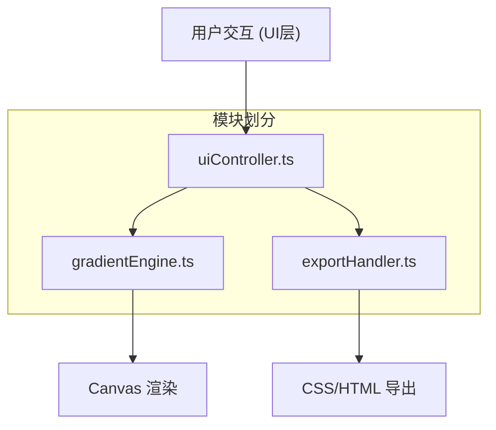

## 1. 架构设计



## 2. 技术描述
- **前端**：TypeScript + 原生JavaScript + Vite
- **构建工具**：Vite 5.x，端口3000
- **语言**：TypeScript 5.x，严格模式，target ES2020，module ESNext
- **无额外框架**：使用原生DOM API和Canvas API
- **CSS**：原生CSS + CSS变量

## 3. 目录结构
```
auto107/
├── package.json
├── index.html
├── vite.config.js
├── tsconfig.json
└── src/
    ├── main.ts              # 应用入口，初始化协调
    ├── gradientEngine.ts    # 核心渲染引擎
    ├── uiController.ts      # UI交互控制
    └── exportHandler.ts     # 代码导出处理
```

## 4. 核心数据结构

```typescript
// 色标
interface ColorStop {
    id: string;
    color: string;
    position: number; // 0-1
}

// 渐变图层
interface GradientLayer {
    id: string;
    type: 'linear' | 'radial' | 'conic';
    stops: ColorStop[];
    angle: number; // 0-360
    opacity: number; // 0-1
    blendMode: 'normal' | 'multiply' | 'screen' | 'overlay';
    zIndex: number;
}

// 应用状态
interface AppState {
    layers: GradientLayer[];
    activeLayerId: string | null;
    zoom: number; // 0.5-3
    panX: number;
    panY: number;
}
```

## 5. 模块职责

### 5.1 gradientEngine.ts
- `addLayer(layer: GradientLayer): void` - 添加图层
- `removeLayer(id: string): void` - 删除图层
- `updateLayer(id: string, updates: Partial<GradientLayer>): void` - 更新图层
- `addColorStop(layerId: string, color: string): void` - 添加色标
- `updateColorStop(layerId: string, stopId: string, updates: Partial<ColorStop>): void` - 更新色标
- `removeColorStop(layerId: string, stopId: string): void` - 删除色标
- `renderPreview(ctx: CanvasRenderingContext2D, width: number, height: number): void` - 渲染预览
- `getCanvasCSS(): string` - 生成CSS背景代码

### 5.2 uiController.ts
- `initUI(container: HTMLElement, callbacks: UICallbacks): void` - 初始化UI
- 处理颜色输入验证与解析
- 环形角度滑块交互
- 色标拖拽交互
- 缩放平移交互
- 图层面板操作

### 5.3 exportHandler.ts
- `generateCSS(layers: GradientLayer[]): string` - 生成完整CSS代码
- `generateHTML(layers: GradientLayer[]): string` - 生成HTML片段
- `showExportModal(css: string, html: string): void` - 显示导出模态框

## 6. 性能优化策略
1. **Canvas分层渲染**：每个渐变层单独计算，使用globalCompositeOperation实现混合模式
2. **requestAnimationFrame**：所有动画和渲染统一走RAF循环
3. **离屏Canvas**：预渲染渐变图案，避免重复计算
4. **防抖节流**：高频操作（如滚轮缩放）节流处理
5. **缓存机制**：图层无变化时复用已有渲染结果
