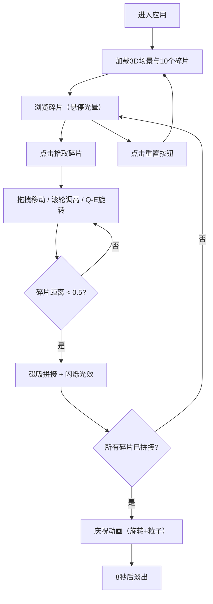

## 1. 产品概述

基于Three.js的交互式3D陶器碎片虚拟拼接与纹饰观察Web应用，面向考古学研究人员和博物馆参观者，提供三维模型观察陶瓷器物纹饰与结构的能力，并模拟"虚拟拼接"流程将散落碎块在3D空间中匹配和粘合。

- 解决考古研究中碎片拼接可视化与交互的痛点，降低实物操作风险
- 为博物馆数字展览提供沉浸式交互体验，提升参观者参与感

## 2. 核心功能

### 2.1 用户角色
| 角色 | 使用方式 | 核心权限 |
|------|----------|----------|
| 研究人员 | 直接访问 | 拖拽拼接碎片、查看纹饰拓印、重置场景 |
| 参观者 | 直接访问 | 观察碎片、尝试拼接、查看纹饰信息 |

### 2.2 功能模块
1. **3D工作台场景**：木色工作台面、网格线、圆形散落区域、10个随机陶器碎片
2. **碎片交互系统**：点击拾取、拖拽移动、滚轮调高、Q/E键旋转、悬停光晕、选中高亮
3. **磁吸拼接系统**：边缘距离检测、自动吸附对齐、淡蓝色闪烁光效、碎片合并
4. **纹饰分析面板**：碎片详细信息、法线贴图增强、拓印图渲染（Canvas 2D）
5. **庆祝动画系统**：全景旋转360度、金色粒子上升特效、自动淡出
6. **重置系统**：一键重置所有碎片至初始散落状态

### 2.3 页面详情
| 页面名称 | 模块名称 | 功能描述 |
|----------|----------|----------|
| 主工作台 | 3D场景视口 | 渲染工作台面、网格线、10个碎片、光照环境 |
| 主工作台 | 碎片交互 | 鼠标点击拾取、XZ平面拖拽、Y轴滚轮调节、Q/E旋转（15度缓动0.3s） |
| 主工作台 | 磁吸拼接 | 距离<0.5单位自动吸附、淡蓝色闪烁1秒、碎片合并 |
| 右侧面板 | 碎片信息卡 | 碎片序号、估算面积、边缘匹配状态、纹饰类型 |
| 右上角窗口 | 纹饰拓印 | 200x200px Canvas 2D黑底白线拓印图、仿古铜色浮雕边框 |
| 左下角 | 重置按钮 | 圆角矩形、深棕色背景、悬停加深、点击缩放0.95 |
| 主工作台 | 庆祝动画 | 完成拼接后360度旋转（5秒/圈）、金色粒子上升（8秒）、淡出 |

## 3. 核心流程

用户进入应用后，看到10个散落在木色工作台上的陶器碎片。通过鼠标悬停查看光晕提示，点击拾取碎片后高亮显示。拖拽碎片在工作台上移动，滚轮调节高度，Q/E键旋转碎片对齐方向。当两个碎片距离小于0.5单位时自动磁吸拼接，边缘显示淡蓝色闪烁光效。右侧面板实时显示选中碎片信息，右上角显示纹饰拓印图。当所有碎片拼接完成时触发庆祝动画。

## 4. 用户界面设计

### 4.1 设计风格
- 主色调：暖棕色系渐变（#4A2F1A至#6B4226），营造博物馆考古工作台氛围
- 辅助色：浅木色工作台面（#D2B48C）、仿古铜色边框（#B87333）、淡黄色高亮（#FFD700）、淡蓝色拼接光效（#66B3FF）
- 按钮：圆角8px，背景#8B4513，文字#FFE4B5，悬停加深至#6B3410，点击缩放0.95倍
- 字体：选用衬线体展示考古学术感
- 布局：全屏3D场景为主，右侧浮层信息面板，右上角拓印窗口，左下角重置按钮
- 信息卡片：半透明白#FFFFFFCC背景，圆角8px，文字深褐色#3B2314
- 过渡动画：统一0.2秒ease-out

### 4.2 页面设计概述
| 页面名称 | 模块名称 | UI元素 |
|----------|----------|--------|
| 主工作台 | 场景背景 | 深赭石渐变#6B4226至#4A2F1A，居中标题"虚拟陶器拼接台" |
| 主工作台 | 工作台面 | 宽20单位浅木色#D2B48C，网格线半透明深棕#3B2314间距1单位 |
| 主工作台 | 碎片 | 10个随机散落球体/柱体组合，凹凸纹理，悬停半透明光晕 |
| 主工作台 | 选中高亮 | 外发光淡黄色#FFD700 |
| 右侧面板 | 碎片信息卡 | 半透明白#FFFFFFCC，圆角8px，深褐色文字#3B2314 |
| 右上角窗口 | 拓印窗口 | 200x200px，仿古铜色#B87333浮雕边框，黑底白线 |
| 左下角 | 重置按钮 | 圆角矩形#8B4513/#FFE4B5，悬停#6B3410，缩放0.95 |

### 4.3 响应式设计
- 桌面优先设计，全屏3D场景+右侧浮层面板
- 屏幕宽度<768px时：右侧信息面板变为底部半透明横向面板（高度自适应，圆角12px），3D场景缩小至60%高度
- 触屏设备支持：触摸拖拽碎片、双指缩放高度、触摸旋转

### 4.4 3D场景指导
- 环境：暖色环境光（模拟室内考古工作台灯光），地面阴影
- 光照：主方向光（暖白色）+ 环境光 + 碎片选中时点光源高亮
- 相机：透视相机，45度俯视角，支持OrbitControls轨道控制
- 焦点元素：工作台面中央的碎片群
- 交互：拖拽移动、滚轮高度、键盘旋转、OrbitControls旋转/缩放
- 动画：碎片拼接吸附动画（缓动）、庆祝旋转、粒子上升
- 性能预算：≥45 FPS，拖拽响应<50ms，拼接计算<100ms
