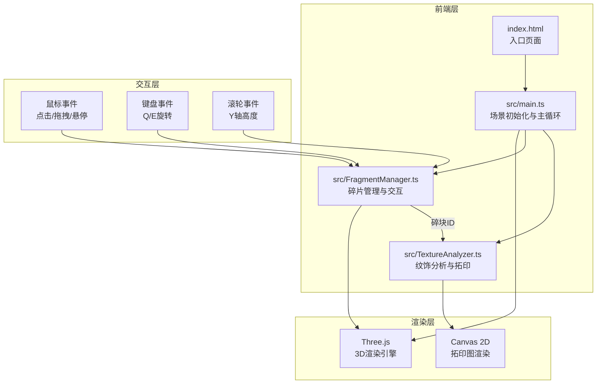

## 1. 架构设计



数据流向：
- 用户点击事件 → main.ts → FragmentManager → 更新碎片Transform → 触发拼接检测
- 碎块选中 → FragmentManager → 发送碎块ID → TextureAnalyzer → 读取材质参数 → 渲染拓印图
- 拼接完成检测 → FragmentManager → 触发庆祝动画 → main.ts控制场景动画

## 2. 技术说明
- 前端框架：无框架，纯TypeScript + Three.js
- 构建工具：Vite（端口3000，入口index.html）
- 3D引擎：Three.js + @types/three
- 调试工具：lil-gui
- 语言：TypeScript（严格模式，target ES2020，moduleResolution bundler）
- 包管理：npm
- 后端：无
- 数据库：无（所有数据为程序生成）

## 3. 路由定义
| 路由 | 用途 |
|------|------|
| / | 单页应用，所有功能在同一页面 |

## 4. 文件结构与调用关系

```
project/
├── package.json          # 依赖管理，启动脚本npm run dev
├── vite.config.js        # Vite构建配置，端口3000
├── tsconfig.json         # TypeScript严格模式配置
├── index.html            # 入口页面，深赭石渐变背景
└── src/
    ├── main.ts           # 初始化场景/相机/光照/轨道控制器
    ├── FragmentManager.ts # 碎片管理、拖拽、磁吸拼接
    └── TextureAnalyzer.ts # 纹饰分析、法线贴图、拓印图
```

调用关系：
- `main.ts` 导入并创建 `FragmentManager` 和 `TextureAnalyzer` 实例
- `main.ts` 注册DOM事件监听器，将事件转发给 `FragmentManager`
- `FragmentManager` 管理碎片Three.js对象，处理拖拽/旋转/拼接逻辑
- `FragmentManager` 在碎块选中时调用 `TextureAnalyzer.generateRubbing(fragmentId)`
- `TextureAnalyzer` 读取碎块材质参数，使用Canvas 2D渲染拓印图并显示在右上角窗口

## 5. 数据模型

### 5.1 核心数据结构

```typescript
interface FragmentData {
  id: number;
  mesh: THREE.Group;
  position: THREE.Vector3;
  rotation: THREE.Euler;
  initialPosition: THREE.Vector3;
  initialRotation: THREE.Euler;
  patternType: '绳纹' | '篮纹' | '刻划纹';
  estimatedArea: number;
  matchStatus: '已匹配' | '待匹配' | '孤立';
  isPicked: boolean;
  isMerged: boolean;
  mergeGroup: number;
}

interface MergeGroup {
  id: number;
  fragmentIds: number[];
  centerPosition: THREE.Vector3;
}
```

### 5.2 初始数据
- 10个碎片，随机分布在半径10单位的圆形区域
- 每个碎片为球体/柱体组合，带ProceduralTexture凹凸纹理
- 纹饰类型随机分配：绳纹、篮纹、刻划纹
- 碎片面积随机：2-8平方单位
