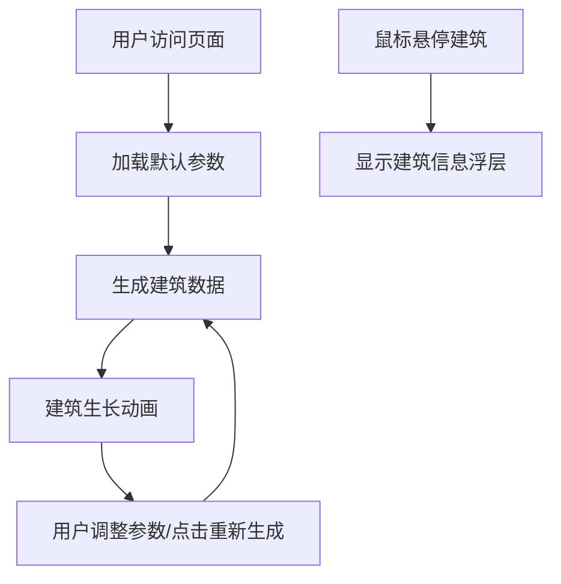

## 1. 产品概述

天际线生长模拟器是一款基于Three.js的3D城市可视化交互工具，让用户通过调整建筑密度、最高楼层数和颜色风格等参数，实时生成赛博朋克风格的动态城市天际线。目标用户为数字艺术爱好者、设计师和对3D可视化感兴趣的开发者。

产品价值在于提供沉浸式的参数化城市生成体验，通过精美的生长动画和呼吸灯光效，展现科技感十足的赛博朋克夜景美学。

## 2. 核心功能

### 2.1 功能模块

1. **3D场景主界面**：城市天际线渲染区，包含建筑生长动画、呼吸灯光效、网格地面
2. **参数控制面板**：密度滑块、最高楼层滑块、颜色风格下拉框
3. **交互系统**：建筑悬停信息展示、重新生成按钮、轨道相机控制

### 2.2 页面详情

| 页面名称 | 模块名称 | 功能描述 |
|-----------|-------------|---------------------|
| 主界面 | 3D场景渲染 | 实时渲染城市天际线，支持建筑生长动画、呼吸灯光效、鼠标悬停交互 |
| 主界面 | 控制面板 | 左侧毛玻璃面板，包含密度(0-100%)、最高楼层(1-120)、颜色风格三种预设 |
| 主界面 | 重新生成按钮 | 右上角悬浮按钮，触发全场景建筑重新生长动画 |

## 3. 核心流程

用户打开页面 → 加载默认参数的城市天际线 → 建筑从地面生长动画 → 用户调整参数或点击重新生成 → 触发新的生长动画 → 鼠标悬停查看建筑详情。

## 4. 用户界面设计

### 4.1 设计风格

- **主色调**：深空蓝黑(#0A0A1A)背景，赛博朋克霓虹配色
- **建筑渐变**：深蓝紫(#1A0A2E)到品红(#FF00AA)
- **楼层线条**：青色(#00FFFF)，透明度0.3
- **顶部呼吸灯**：粉红(#FF0066)到橙黄(#FFAA00)循环
- **按钮样式**：深色半透明(#333背景，#00FF88文字)，圆角设计，hover时背景变亮
- **控制面板**：半透明毛玻璃效果(#1A1A2E背景，alpha 0.85，blur 10px)
- **信息浮层**：圆角8px，#111半透明背景，白色文字

### 4.2 页面设计概述

| 页面名称 | 模块名称 | UI元素 |
|-----------|-------------|-------------|
| 主界面 | 3D场景 | 斜45度俯视视角，深灰(#2A2A2A)网格地面，建筑渐变色，呼吸灯光点，楼层发光线 |
| 主界面 | 控制面板 | 左侧悬浮毛玻璃面板，带实时数值的滑块组件，下拉选择框，流畅过渡动画 |
| 主界面 | 重新生成按钮 | 右上角悬浮，#333背景#00FF88文字，hover状态反馈 |
| 主界面 | 信息浮层 | 悬停时跟随鼠标，显示建筑高度和楼层数 |

### 4.3 响应性

桌面端优先设计，全屏3D画布，左侧固定控制面板(宽度320px)，右上角固定按钮。支持鼠标拖拽旋转视角、滚轮缩放。

### 4.4 3D场景指导

- **环境**：纯黑背景，无HDRI，营造深空夜景氛围
- **光照**：环境光(强度0.3) + 方向光(强度0.5，斜45度) + 建筑自发光材质
- **相机**：PerspectiveCamera，初始位置(200, 200, 200)，看向原点，OrbitControls控制
- **构图**：城市中心布局，建筑向四周高度递减，形成天际线轮廓
- **交互**：建筑生长动画(easeOut缓动，1-3秒随机)，呼吸灯动画(2秒周期)，悬停高亮
- **后处理**：无额外后处理，通过材质emissive和透明度实现霓虹效果
- **性能**：建筑数量≤120栋，FPS≥45，使用InstancedMesh优化渲染

## 5. 非功能需求

- **性能**：生长动画期间FPS≥45，参数调整响应时间<0.5秒
- **兼容性**：支持WebGL 2.0的现代浏览器
- **体验**：动画流畅，交互反馈及时，视觉效果具有科技感和沉浸感
