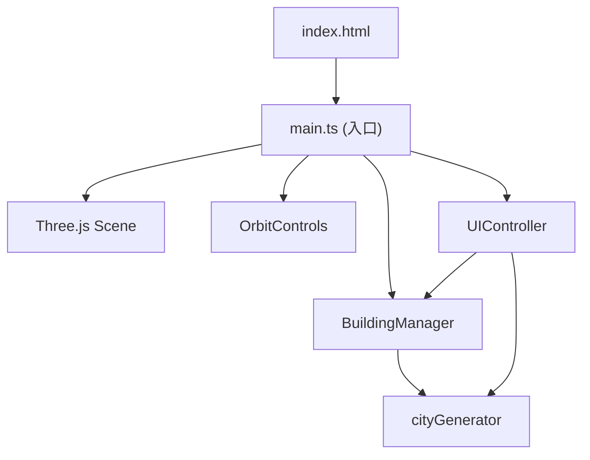

## 1. 架构设计



## 2. 技术描述

- **前端**：TypeScript + Three.js + Vite
- **3D引擎**：three@0.160.x
- **类型定义**：@types/three
- **构建工具**：Vite@5.x
- **开发语言**：TypeScript@5.x (strict模式，target ES2020)
- **无后端**：纯前端3D可视化应用

## 3. 项目结构

| 文件 | 职责 |
|------|------|
| `package.json` | 项目依赖配置，three, typescript, vite, @types/three |
| `index.html` | 应用入口，包含canvas容器和UI结构 |
| `vite.config.js` | Vite配置，端口3000 |
| `tsconfig.json` | TypeScript配置，严格模式，ES2020 |
| `src/main.ts` | 场景初始化、相机设置、OrbitControls、渲染循环 |
| `src/cityGenerator.ts` | 建筑数据生成算法，位置、高度、颜色计算 |
| `src/BuildingManager.ts` | 建筑Mesh创建管理、生长动画、悬停交互 |
| `src/uiController.ts` | UI事件绑定、参数变更处理、场景更新通知 |

## 4. 核心数据结构

### 4.1 BuildingData 接口

```typescript
interface BuildingData {
  id: number;
  x: number;        // X轴位置
  z: number;        // Z轴位置
  width: number;    // 基座宽度(20-50)
  depth: number;    // 基座深度(20-50)
  height: number;   // 总高度(层数 × 3)
  floors: number;   // 楼层数
  baseColor: string; // 底部渐变颜色
  topColor: string;  // 顶部渐变颜色
  lineColor: string; // 楼层线颜色
  lightStartColor: string; // 呼吸灯起始色
  lightEndColor: string;   // 呼吸灯结束色
  growDuration: number;     // 生长动画时长(1-3秒)
  growDelay: number;        // 生长动画延迟(0-0.5秒)
}
```

### 4.2 ColorTheme 接口

```typescript
interface ColorTheme {
  name: string;
  baseGradient: [string, string]; // 建筑渐变色
  lineColor: string;              // 楼层线颜色
  lightGradient: [string, string]; // 呼吸灯渐变色
}
```

预设主题：
- 赛博朋克：base [#1A0A2E, #FF00AA], line #00FFFF, light [#FF0066, #FFAA00]
- 落日余晖：base [#2D1B33, #FF6B35], line #FFD700, light [#FF4500, #FFD700]
- 冰川极光：base [#0A1628, #00BFFF], line #00FFFF, light [#00FFFF, #FFFFFF]

## 5. 生成算法

### 5.1 建筑位置生成
- 城市区域：400×400单位正方形
- 网格划分：根据密度参数划分网格单元
- 随机偏移：每个建筑在网格单元内随机偏移
- 避免重叠：位置碰撞检测

### 5.2 高度计算
- 基础高度 = 最高楼层数 × 3单位/层
- 密度影响：密度越高，高度波动越大(±20%)
- 中心高度加成：距中心越近，高度加成越大

### 5.3 缓动函数
```typescript
// 先慢后快缓出 (easeOutCubic)
function easeOutCubic(t: number): number {
  return 1 - Math.pow(1 - t, 3);
}
```
