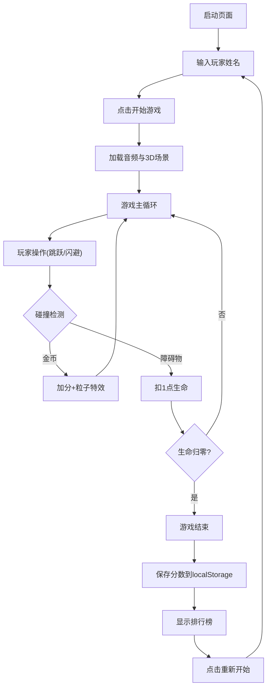

## 1. 产品概述

霓虹赛博朋克风格的3D节奏跑酷游戏，玩家控制角色在音乐驱动的轨道上奔跑，通过跳跃、滑铲和闪避躲避障碍物并收集金币，所有操作与音乐节拍严格同步。

- **核心玩法**：音乐节奏 + 跑酷闪避 + 金币收集
- **目标用户**：喜欢音乐游戏和跑酷游戏的休闲玩家
- **产品价值**：将音乐节奏与3D跑酷结合，提供沉浸式的视听同步体验

## 2. 核心功能

### 2.1 功能模块

1. **启动页面**：玩家姓名输入、动态粒子背景、开始游戏按钮
2. **游戏主场景**：3D轨道跑酷、角色控制、障碍物生成、金币收集
3. **音频系统**：音乐播放、频谱分析、节拍检测、灯光同步
4. **HUD界面**：分数显示、生命值心形图标、节拍强度进度条
5. **游戏结束页面**：最终分数、本地排行榜、重新开始按钮

### 2.2 页面详情

| 页面名称 | 模块名称 | 功能描述 |
|---------|---------|---------|
| 启动页面 | 粒子背景 | 200个动态粒子，霓虹发光效果，随鼠标移动产生交互 |
| 启动页面 | 输入表单 | 玩家姓名输入框，霓虹边框发光效果 |
| 启动页面 | 开始按钮 | 渐变填充按钮，悬停放大1.1倍，0.2秒过渡动画 |
| 游戏场景 | 3D轨道 | 分段生成，每段对应一个音乐小节，含地面和两侧护栏 |
| 游戏场景 | 角色控制 | 空格跳跃、S/A左右闪避，碰撞检测，粒子特效 |
| 游戏场景 | 障碍物 | 跳台(0.5-1.5米)、滑铲栏(0.5米)、旋转金币 |
| 音频系统 | 频谱可视化 | Canvas绘制频谱图，线条颜色随节拍变化 |
| 音频系统 | 节拍检测 | Web Audio API实时分析，延迟50ms以内 |
| HUD | 分数显示 | 每秒+10分，金币+100分，文字发光效果 |
| HUD | 生命值 | 5个心形图标，失去生命时消失动画 |
| HUD | 节拍强度 | 进度条动画，随音乐能量变化 |
| 结束页面 | 最终分数 | 大字体展示，淡入动画0.5秒 |
| 结束页面 | 排行榜 | 本地Top10，交替背景色，淡入动画 |
| 结束页面 | 重玩按钮 | 渐变填充，悬停缩放效果 |

## 3. 核心流程

玩家输入姓名 → 点击开始 → 加载音乐并初始化3D场景 → 角色自动向前奔跑 → 玩家根据节拍操作 → 收集金币得分/碰撞扣血 → 生命归零游戏结束 → 保存分数到排行榜 → 查看排名/重新开始

## 4. 用户界面设计

### 4.1 设计风格

- **主色调**：深紫色背景 `#0a0020`
- **强调色**：亮青色 `#00ffff`、品红色 `#ff00ff`
- **整体风格**：霓虹赛博朋克，发光文字，渐变按钮，科技感线条
- **字体**：无衬线字体，文字边缘发光效果
- **按钮**：渐变填充（青→品红），圆角，悬停放大1.1倍，0.2秒过渡

### 4.2 页面设计概览

| 页面名称 | 模块名称 | UI元素 |
|---------|---------|-------|
| 启动页面 | 粒子背景 | 200个霓虹粒子，缓慢运动，鼠标交互吸引 |
| 启动页面 | 标题 | "节奏跑酷"大标题，青品渐变文字，发光效果 |
| 启动页面 | 输入框 | 霓虹边框，聚焦时发光增强，深紫背景 |
| 启动页面 | 开始按钮 | 渐变填充，圆角，悬停缩放，发光阴影 |
| 游戏HUD | 分数 | 左上角，白色发光文字 |
| 游戏HUD | 生命值 | 右上角，5个心形图标，红色发光 |
| 游戏HUD | 节拍条 | 底部中央，进度条，青品渐变填充 |
| 游戏HUD | 频谱图 | 背景Canvas，半透明，线条随节拍变化 |
| 结束页面 | 结果面板 | 半透明深紫面板，霓虹边框 |
| 结束页面 | 排行榜 | 交替行背景，淡入动画，排名数字发光 |
| 结束页面 | 重玩按钮 | 渐变填充，悬停效果 |

### 4.3 响应式

- 桌面端优先，游戏区域居中
- 3D画布自适应窗口大小
- HUD元素固定定位，不随画布缩放

### 4.4 3D场景指引

- **环境**：深紫黑色背景，雾气效果增强纵深感
- **灯光**：点光源随节拍闪烁（强度0.3-1.5），环境光提供基础照明
- **摄像机**：第三人称视角，角色后方3米、上方1.5米，平滑跟随
- **轨道**：分段生成，每段对应音乐小节，地面+两侧护栏，颜色随音乐能量渐变（低音暖色调，高音冷色调）
- **角色**：简洁几何造型，跳跃时压缩弹起动效，闪避时侧倾
- **特效**：金币收集时30个金色粒子爆炸，持续0.3秒
- **后处理**：轻微泛光效果增强霓虹感
