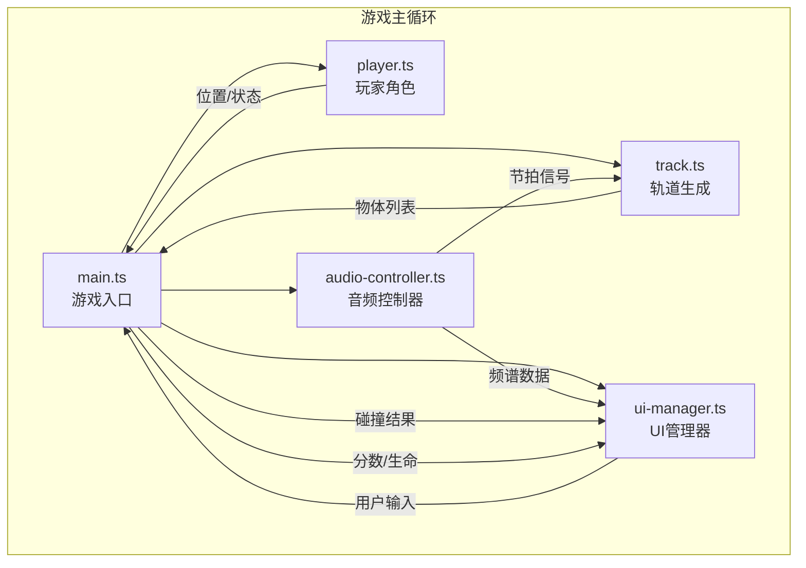

## 1. 架构设计



## 2. 技术选型

- **前端框架**：原生 TypeScript (无React/Vue，按需渲染DOM)
- **3D引擎**：Three.js (r160+)
- **音频处理**：Web Audio API (AnalyserNode)
- **构建工具**：Vite 5.x
- **开发语言**：TypeScript 5.x (严格模式)
- **数据存储**：localStorage (排行榜持久化)

## 3. 文件结构

```
auto11/
├── package.json
├── index.html
├── vite.config.js
├── tsconfig.json
├── src/
│   ├── main.ts           # 主入口，游戏循环，场景协调
│   ├── player.ts         # 玩家角色类
│   ├── track.ts          # 轨道生成与障碍物管理
│   ├── audio-controller.ts  # 音频控制与节拍检测
│   └── ui-manager.ts     # UI管理与DOM操作
└── src/music/
    └── track.wav         # 游戏音乐（占位）
```

## 4. 核心模块说明

### 4.1 main.ts - 游戏主入口

**职责**：
- 初始化Three.js场景、相机、渲染器
- 初始化音频控制器、玩家、轨道生成器、UI管理器
- 运行游戏主循环 (requestAnimationFrame)
- 协调各模块间的数据传递
- 处理键盘输入事件

**核心数据流向**：
```
键盘输入 → Player.update() → 玩家位置/状态
         ↓
AudioController.update() → 节拍/频谱数据
         ↓
Track.update() → 障碍物/金币列表
         ↓
碰撞检测 → 分数/生命变化
         ↓
UIManager.update() → DOM更新
         ↓
渲染器.render() → 画面输出
```

### 4.2 player.ts - 玩家角色类

**属性**：
- `position: Vector3` - 当前位置
- `velocity: Vector3` - 速度
- `isJumping: boolean` - 是否在跳跃中
- `jumpProgress: number` - 跳跃进度(0-1)
- `dodgeDirection: 'left'|'right'|null` - 闪避方向
- `dodgeProgress: number` - 闪避进度(0-1)
- `health: number` - 生命值(0-5)
- `mesh: Group` - Three.js模型组

**方法**：
- `jump()` - 触发跳跃
- `dodgeLeft()` - 向左闪避
- `dodgeRight()` - 向右闪避
- `update(deltaTime)` - 每帧更新位置和状态
- `getBoundingBox()` - 获取包围盒用于碰撞检测
- `takeDamage()` - 扣血

**关键参数**：
- 跳跃高度：1.2米
- 跳跃持续：0.4秒
- 闪避距离：1米
- 闪避持续：0.2秒
- 初始生命：5点

### 4.3 track.ts - 轨道生成器

**属性**：
- `segments: TrackSegment[]` - 轨道段列表
- `obstacles: Obstacle[]` - 障碍物列表
- `coins: Coin[]` - 金币列表
- `segmentLength: number` - 每段长度（对应一个音乐小节）
- `currentBeat: number` - 当前节拍计数

**方法**：
- `generateSegment()` - 生成新轨道段
- `onBeat()` - 节拍触发时生成障碍物
- `update(playerZ)` - 更新物体位置，移除过期物体
- `checkCollisions(playerBox)` - 碰撞检测
- `updateColors(energyLevel)` - 根据音乐能量更新颜色

**障碍物类型**：
- 跳台：高度0.5-1.5米，需跳跃通过
- 滑铲栏：高度0.5米，需滑铲/闪避通过
- 金币：旋转收集物，接触获得分数

### 4.4 audio-controller.ts - 音频控制器

**属性**：
- `audioContext: AudioContext` - 音频上下文
- `analyser: AnalyserNode` - 分析节点
- `source: AudioBufferSourceNode` - 音频源
- `frequencyData: Uint8Array` - 频率数据
- `timeData: Uint8Array` - 时域数据
- `beatDetected: boolean` - 当前帧是否检测到节拍
- `beatIntensity: number` - 节拍强度(0-1)
- `energyLevel: number` - 当前音乐能量(0-1)
- `bpm: number` - 估算BPM

**方法**：
- `loadAudio(url)` - 加载音频文件
- `play()` - 开始播放
- `pause()` - 暂停
- `update()` - 每帧更新频谱和节拍检测
- `getFrequencyData()` - 获取频率数据
- `getBeatIntensity()` - 获取节拍强度

**节拍检测算法**：
- 低频段(20-200Hz)能量阈值检测
- 结合时域峰值检测
- 历史平均对比，避免误检
- 目标延迟：50ms以内

### 4.5 ui-manager.ts - UI管理器

**属性**：
- `startScreen: HTMLElement` - 启动页面
- `gameHUD: HTMLElement` - 游戏HUD
- `endScreen: HTMLElement` - 结束页面
- `scoreElement: HTMLElement` - 分数显示
- `healthContainer: HTMLElement` - 生命容器
- `beatBar: HTMLElement` - 节拍条
- `spectrumCanvas: HTMLCanvasElement` - 频谱画布
- `leaderboardEl: HTMLElement` - 排行榜元素

**方法**：
- `showStartScreen()` - 显示启动页
- `showGameHUD()` - 显示游戏HUD
- `showEndScreen(score)` - 显示结束页
- `updateScore(score)` - 更新分数显示
- `updateHealth(health)` - 更新生命值显示
- `updateBeatIntensity(intensity)` - 更新节拍条
- `drawSpectrum(frequencyData)` - 绘制频谱图
- `saveScore(name, score)` - 保存分数
- `loadLeaderboard()` - 加载排行榜
- `createParticleBackground()` - 创建粒子背景

## 5. 性能指标

| 指标 | 目标值 |
|------|--------|
| 平均帧率 | ≥ 55 FPS |
| 内存占用 | ≤ 200 MB (运行时) |
| 音频延迟 | ≤ 50 ms |
| 碰撞检测频率 | 每帧1次 |
| 轨道物体数量 | 动态管理，保持在合理范围 |

## 6. 数据模型

### 6.1 排行榜数据

```typescript
interface LeaderboardEntry {
  name: string;
  score: number;
  date: string; // ISO date string
}
```

存储键：`rhythm_runner_leaderboard`
数据结构：`LeaderboardEntry[]`（最多10条，按分数降序）

### 6.2 游戏状态

```typescript
interface GameState {
  isPlaying: boolean;
  isPaused: boolean;
  score: number;
  health: number;
  playerName: string;
  currentBeat: number;
}
```
