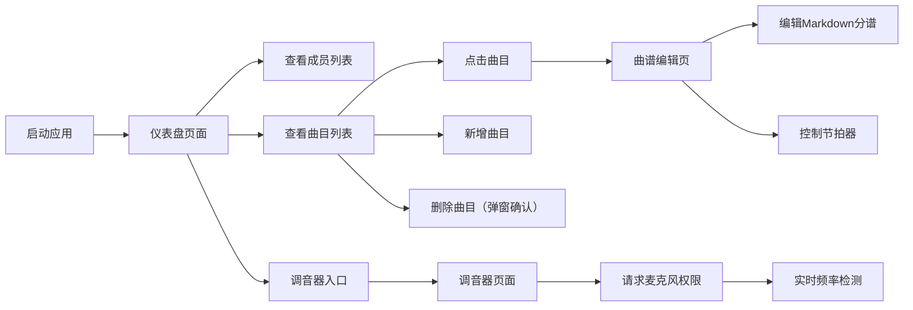

## 1. 产品概述

在线乐队协作曲谱管理与实时调音辅助Web应用，为乐队成员提供乐器分谱管理、实时调音、节拍器等排练辅助工具，提升乐队排练效率与协作体验。

- 核心用户：乐队成员（主唱、吉他手、鼓手等）
- 核心价值：统一管理曲目分谱，提供实时音频工具，简化排练前准备流程

## 2. 核心功能

### 2.1 用户角色
| 角色 | 说明 | 核心权限 |
|------|------|----------|
| 乐队成员 | 硬编码3名成员（主唱、吉他手、鼓手） | 查看曲目、编辑分谱、使用调音器、管理曲目 |

### 2.2 功能模块
1. **仪表盘页面 (Dashboard)**：成员列表展示、曲目列表管理、新增曲目、调音器入口
2. **曲谱编辑页面 (ScoreEditor)**：Markdown格式分谱编辑、BPM设置、节拍器控制
3. **调音器页面 (Tuner)**：麦克风输入检测、频率波形显示、音高偏差提示

### 2.3 页面详情
| 页面名称 | 模块名称 | 功能描述 |
|-----------|-------------|---------------------|
| Dashboard | 成员列表 | 硬编码显示主唱、吉他手、鼓手3名成员 |
| Dashboard | 曲目列表 | 从服务器获取曲目，显示标题、修改时间、删除按钮 |
| Dashboard | 新增曲目表单 | 输入曲目标题，点击确定新增 |
| Dashboard | 删除确认弹窗 | 红色确认按钮(#FF4444)、灰色取消按钮(#888) |
| ScoreEditor | 曲目标题栏 | 显示曲目名称，BPM输入框（默认120） |
| ScoreEditor | 分谱编辑区 | 100%宽400px高文本区，支持Markdown语法 |
| ScoreEditor | 节拍器 | 启动/停止按钮，Web Audio API生成方波（880Hz重拍、440Hz轻拍），指示灯每拍闪烁 |
| Tuner | 波形画布 | 300x150px Canvas，深灰背景(#2A2A2A)，亮绿波形线(#00FF88) |
| Tuner | 音高检测 | 频率检测与目标音高对比，偏差>5Hz红色箭头提示偏高/偏低，<5Hz绿色"校准完成" |

## 3. 核心流程

用户从仪表盘进入应用，可查看乐队成员和曲目列表；点击曲目进入编辑页面，可编辑分谱文本并使用节拍器；点击调音器入口进入调音页面，请求麦克风权限后实时检测音准；可在仪表盘新增或删除曲目。

## 4. 用户界面设计

### 4.1 设计风格
- **主色调**：深邃黑紫(#1A0033)，赛博朋克风格
- **辅助色**：紫色(#6600CC)，亮粉色强调(#FF00AA)
- **字体**：等宽字体 Monaco / Consolas
- **按钮风格**：悬停放大1.05倍 + 投影效果，0.3s ease-in-out过渡
- **布局风格**：左右分栏布局，响应式适配
- **节拍器指示灯**：圆形20px直径，重拍红色闪烁，轻拍蓝色闪烁

### 4.2 页面设计概览
| 页面名称 | 模块名称 | UI元素 |
|-----------|-------------|-------------|
| Dashboard | 成员卡片 | 黑紫背景，亮粉边框，成员名称，图标 |
| Dashboard | 曲目列表项 | 标题、修改时间、删除按钮、悬停动效 |
| Dashboard | 新增表单 | 输入框 + 确定按钮，亮粉强调色 |
| Dashboard | 确认弹窗 | 模态框，红色确认按钮，灰色取消按钮 |
| ScoreEditor | 顶部栏 | 曲目标题、BPM输入、节拍器控制按钮 |
| ScoreEditor | 分谱区 | Markdown文本编辑区，等宽字体 |
| ScoreEditor | 节拍器 | 启动/停止按钮 + 圆形闪烁指示灯 |
| Tuner | 波形画布 | 深灰背景Canvas，亮绿实时波形 |
| Tuner | 偏差提示 | 红色偏高/偏低箭头 或 绿色校准完成文字 |

### 4.3 响应式布局
- **宽屏**：左右两栏布局，左栏显示列表/导航，右栏显示详情/操作区
- **窄屏**：堆叠为单列布局，从上到下依次展示
- 所有过渡动画持续0.3s ease-in-out

### 4.4 性能指标
- 节拍器响应延迟 < 50ms
- 调音器频率检测更新率 ≥ 30fps
- 曲目列表更新时间 < 100ms
