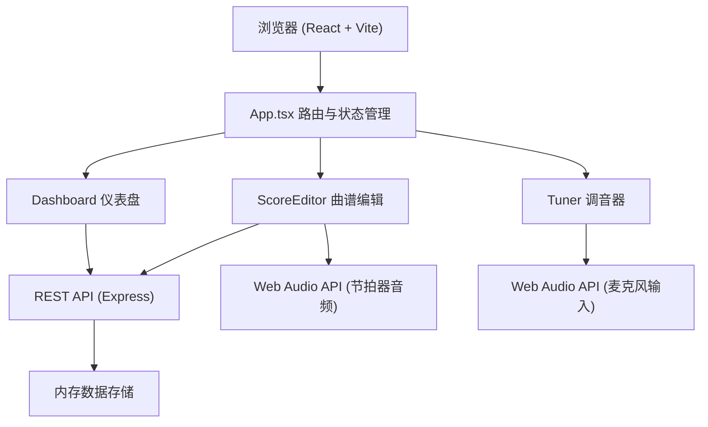
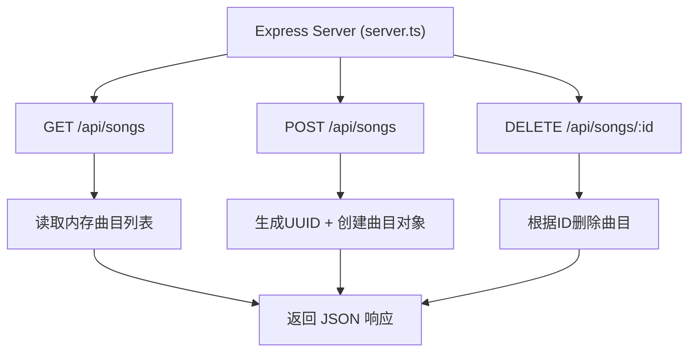
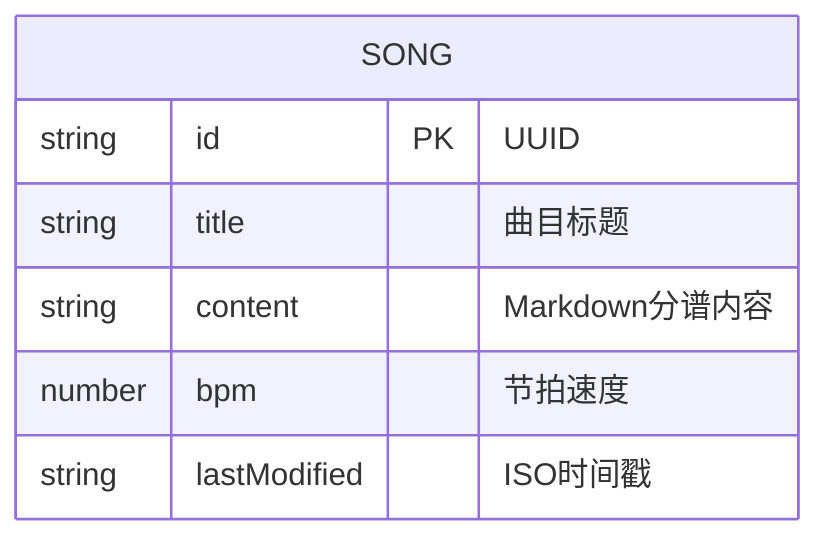

## 1. 架构设计



## 2. 技术说明

- **前端**：React@18 + TypeScript@5 + Vite@5
- **构建工具**：Vite，端口3000，入口index.html
- **后端**：Express@4，提供REST API
- **音频处理**：Web Audio API（AnalyserNode、OscillatorNode）
- **路由**：React客户端内部分发（useState状态切换，无需react-router）
- **数据存储**：服务端内存存储（开发模式），使用uuid生成唯一ID
- **Markdown渲染**：react-markdown

## 3. 路由定义
| 页面标识 | 目的 |
|-------|---------|
| dashboard | 乐队仪表盘，成员列表、曲目管理 |
| score-editor | 曲谱查看编辑，Markdown分谱、节拍器 |
| tuner | 实时调音器，麦克风频率检测 |

## 4. API定义

### 4.1 类型定义
```typescript
interface Song {
  id: string;
  title: string;
  content: string;
  bpm: number;
  lastModified: string;
}
```

### 4.2 接口列表
| 方法 | 路径 | 请求体 | 响应 |
|------|------|--------|------|
| GET | /api/songs | - | Song[] |
| POST | /api/songs | { title: string } | Song |
| DELETE | /api/songs/:id | - | { success: boolean } |

## 5. 服务器架构图



## 6. 数据模型

### 6.1 数据模型定义


### 6.2 初始数据
服务端启动时预置3首示例曲目，便于首次展示。

## 7. 文件结构
```
project/
├── package.json
├── index.html
├── vite.config.js
├── tsconfig.json
└── src/
    ├── App.tsx          # 主应用组件，路由与状态
    ├── server.ts        # Express后端服务
    └── pages/
        ├── Dashboard.tsx      # 仪表盘
        ├── ScoreEditor.tsx    # 曲谱编辑
        └── Tuner.tsx          # 调音器
```
