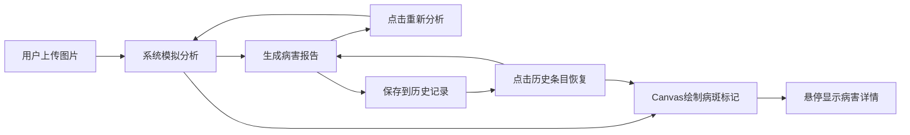

## 1. 产品概述

智能植物病害诊断器是一款基于Web的植物叶片病害自动识别应用，帮助园艺爱好者和种植者快速判断植物病害种类及严重程度，避免错过最佳防治时机。

- 核心价值：通过图像识别技术，在1秒内完成病斑检测、病害分类、等级评估并给出治疗建议
- 目标用户：园艺爱好者、家庭种植者、农业从业者
- 解决痛点：野外或家中无法快速判断病害，延误防治时机

## 2. 核心功能

### 2.1 用户角色
| 角色 | 注册方式 | 核心权限 |
|------|----------|----------|
| 普通用户 | 无需注册 | 上传图片、查看诊断报告、浏览历史记录 |

### 2.2 功能模块
1. **主页**：导航栏、图像上传区、Canvas展示区、报告栏、历史记录栏
2. **图像上传模块**：点击上传、拖拽上传、格式验证
3. **图像分析模块**：病斑检测、病害识别、等级评估、建议生成
4. **Canvas渲染模块**：原图展示、病斑标记、悬停提示
5. **报告生成模块**：病害信息展示、等级标签、治疗建议、重新分析
6. **历史记录模块**：记录存储、缩略图展示、快速恢复

### 2.3 页面详情
| 页面名称 | 模块名称 | 功能描述 |
|---------|---------|---------|
| 主页 | 导航栏 | 顶部固定，显示应用名称 |
| 主页 | 图像上传区 | 支持点击选择和拖拽上传jpg/png图片 |
| 主页 | Canvas展示区 | 600x500px，浅灰网格背景，等比例显示原图，半透明红色圆形标记病斑 |
| 主页 | 病斑悬停提示 | 鼠标悬停显示病害类型，浅黄底圆角提示框 |
| 主页 | 报告栏 | 300px宽，显示病斑数量、病害名称、病情等级标签、治疗建议、重新分析按钮 |
| 主页 | 历史记录栏 | 120px高，水平滚动，显示64x64缩略图、病害名称、等级标签 |

## 3. 核心流程

用户上传植物叶片照片 → 系统自动分析图像 → 在Canvas上标记病斑位置 → 右侧生成病害报告 → 用户可重新分析获得不同结果 → 所有分析结果自动保存到历史记录 → 点击历史条目恢复对应分析

## 4. 用户界面设计

### 4.1 设计风格
- 主色调：自然绿色 #4CAF50，用于按钮和关键高亮
- 辅助色：紫色 #9C27B0（信息图标）、警告红 #F44336（重度标签）
- 背景色：整体浅灰白 #F5F5F5，Canvas背景浅灰网格 #E8E8E8
- 按钮样式：圆角6px，按下缩放0.95，过渡动画0.3s
- 卡片样式：圆角8px，悬停时阴影加深，过渡动画0.3s
- 字体：使用Google Fonts的Lora（标题）和Noto Sans SC（正文），避免通用字体
- 布局：经典上下左中右布局，顶部导航、中部左右分栏、底部历史栏
- 图标风格：使用SVG图标，自然植物主题

### 4.2 页面设计概述
| 页面名称 | 模块名称 | UI元素 |
|---------|---------|---------|
| 主页 | 导航栏 | 深灰#333背景，白色文字居中，高60px，固定顶部 |
| 主页 | 上传区 | 虚线边框，拖拽高亮，上传按钮主色调绿色 |
| 主页 | Canvas区 | 600x500px，浅灰网格背景，病斑半透明红圈标记 |
| 主页 | 报告栏 | 300px宽，#FAFAFA背景，圆角8px，内边距20px |
| 主页 | 等级标签 | 80x24px，圆角4px，白色文字居中，绿色/黄色/红色对应轻度/中度/重度 |
| 主页 | 历史记录栏 | 120px高，水平滚动，#F0F0F0背景，条目1px竖线分隔 |
| 主页 | 重新分析按钮 | 120x40px，#2196F3背景，点击时变深蓝#1A78C2 |

### 4.3 响应式
- 桌面优先设计，屏幕宽度小于768px时，图像区与报告栏从左右排列改为上下堆叠
- Canvas尺寸在移动端自适应缩小
- 历史记录栏保持水平滚动，支持触摸滑动
- 按钮触控区域不小于44x44px

### 4.4 动效设计
- 所有交互元素平滑过渡：transition 0.3s ease
- 按钮按下缩放：transform scale(0.95)
- 卡片悬停阴影加深
- 页面加载时内容渐入动画
- 病斑标记出现时缩放动画
- 历史条目添加时滑入动画
