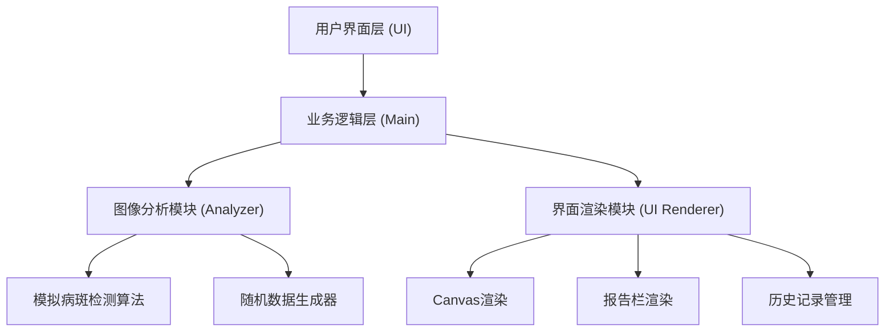

## 1. 架构设计

本应用采用纯前端架构，无需后端服务，所有功能在浏览器端实现。



## 2. 技术描述

- **前端框架**：原生 TypeScript + Vite 构建，无需UI框架，使用原生DOM操作
- **构建工具**：Vite@5
- **编程语言**：TypeScript@5，严格模式，目标ES2020
- **样式方案**：原生CSS，CSS变量管理主题色
- **图像技术**：HTML5 Canvas API 2D
- **数据存储**：浏览器内存存储历史记录
- **字体**：Google Fonts - Lora（标题）+ Noto Sans SC（正文）

## 3. 文件结构

```
auto112/
├── package.json
├── index.html
├── vite.config.js
├── tsconfig.json
└── src/
    ├── main.ts        # 主逻辑，页面布局、事件绑定、初始化
    ├── analyzer.ts    # 图像分析模块，模拟病斑检测
    └── ui.ts        # 界面渲染模块，Canvas绘制、报告生成、历史管理
```

## 4. 数据类型定义

```typescript
// 病斑位置
interface Spot {
  x: number;
  y: number;
  disease: string;
}

// 分析结果
interface AnalyzeResult {
  spots: Spot[];
  diseaseName: string;
  severity: 'mild' | 'moderate' | 'severe';
  suggestions: string[];
  timestamp: number;
  thumbnail: string;
}

// 历史记录
interface HistoryItem extends AnalyzeResult {
  id: string;
}
```

## 5. 核心模块接口

### Analyzer 模块
```typescript
class Analyzer {
  analyze(imageData: ImageData): AnalyzeResult;
  private generateRandomSpots(width: number, height: number): Spot[];
  private getRandomDisease(): string;
  private getRandomSeverity(): 'mild' | 'moderate' | 'severe';
  private getSuggestions(disease: string, severity: string): string[];
}
```

### UI 模块
```typescript
class UI {
  constructor(canvas: HTMLCanvasElement, reportEl: HTMLElement, historyEl: HTMLElement);
  renderImage(img: HTMLImageElement): void;
  renderSpots(spots: Spot[]): void;
  renderReport(result: AnalyzeResult): void;
  addToHistory(item: HistoryItem): void;
  clearCanvas(): void;
  showTooltip(x: number, y: number, disease: string): void;
  hideTooltip(): void;
}
```

### Main 模块
```typescript
// 事件处理：
- handleFileUpload(file: File): void;
- handleReanalyze(): void;
- handleHistoryClick(id: string): void;
- initEventListeners(): void;
```

## 6. 模块职责

- **main.ts**：主控制器，负责协调Analyzer和UI模块的调用，管理全局状态和事件处理
- **analyzer.ts**：图像分析，模拟AI检测算法，生成随机但合理的病斑数据
- **ui.ts**：所有DOM操作、Canvas绘制、报告HTML生成、历史记录管理

## 7. 性能优化策略

1. 图片上传后首屏渲染优化：
   - 使用Image对象预加载
   - Canvas绘制使用requestAnimationFrame
   - 避免重绘时只更新变化区域

2. 历史记录滚动性能：
   - 使用CSS transform开启硬件加速
   - 避免布局抖动
   - 虚拟滚动（如历史记录超过50条以上启用）

3. 响应式优化：
   - 使用CSS媒体查询
   - Canvas尺寸动态调整
   - 触摸事件支持

## 8. 预设病害数据

预设6种病害及对应建议模板：

| 病害名称 | 典型症状 |
|---------|---------|
| 白粉病 | 叶片表面白色粉状斑点 |
| 锈病 | 红褐色锈状斑点 |
| 炭疽病 | 圆形褐色凹陷病斑 |
| 黑斑病 | 黑色不规则病斑 |
| 灰霉病 | 灰色霉层覆盖 |
| 叶斑病 | 黄色或褐色圆形斑点 |
