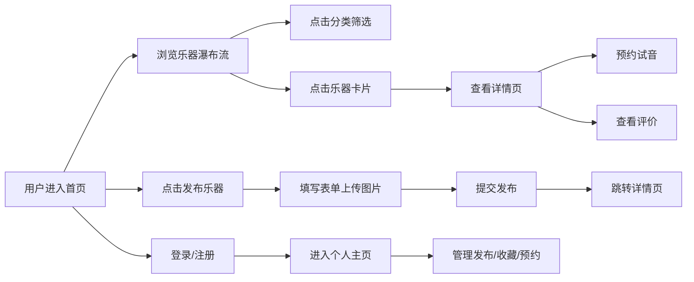

## 1. 产品概述

在线虚拟乐器租赁与二手乐器交易平台，为乐器爱好者提供跳蚤市场式的浏览、发布和交换乐器体验，同时提供预约试音服务和信用评价体系。

- 核心目的：连接乐器持有者与需求者，降低乐器购买/租赁门槛
- 目标用户：乐器爱好者、初学者、专业音乐人
- 市场价值：解决乐器闲置问题，提供低成本试玩和交易渠道

## 2. 核心功能

### 2.1 用户角色

| 角色 | 注册方式 | 核心权限 |
|------|----------|----------|
| 普通用户 | 邮箱注册 | 浏览乐器、发布乐器、预约试音、收藏、评价 |

### 2.2 功能模块

1. **首页**：乐器瀑布流展示、固定导航栏、分类筛选、发布入口
2. **详情页**：乐器大图轮播、信息展示、预约试音、用户评价列表
3. **发布页**：浮动表单、图片拖拽上传、信息填写
4. **登录/注册**：邮箱密码验证、Token存储
5. **个人主页**：我的发布、我的收藏、试音预约管理

### 2.3 页面详情

| 页面名称 | 模块名称 | 功能描述 |
|----------|----------|----------|
| 首页 | 瀑布流展示 | 乐器卡片网格布局，支持懒加载，响应式布局 |
| 首页 | 导航栏 | 固定顶部，发布按钮、分类筛选、用户信息 |
| 首页 | 乐器卡片 | 缩略图展示，悬停旋转动画，点击进入详情 |
| 详情页 | 图片轮播 | 自动播放，底部指示器，高清大图展示 |
| 详情页 | 预约试音 | 日历选择器，未来7天可选时段，发送预约请求 |
| 详情页 | 评价列表 | 头像、星级、评论内容、发布时间 |
| 发布页 | 浮动表单 | 乐器信息填写，拖拽上传图片，预览与删除 |
| 个人主页 | Tab切换 | 我的发布、我的收藏、试音预约三个标签页 |
| 个人主页 | 预约管理 | 查看预约状态，确认/取消操作 |

## 3. 核心流程

## 4. 用户界面设计

### 4.1 设计风格

- **主色调**：木纹渐变背景 `#DEB887` 到 `#D2A679`
- **强调色**：暖橙色按钮 `#FF8C00`
- **文字色**：深褐色 `#5C3317`
- **成功提示**：绿色 `#4CAF50`
- **按钮样式**：圆角设计，0.2s ease-out过渡动画
- **字体**：优雅的衬线字体搭配清晰的无衬线正文字体
- **布局风格**：卡片式布局，实木质感边框，温暖自然的视觉感受
- **图标风格**：简洁线性图标，与木质主题协调

### 4.2 页面设计概述

| 页面名称 | 模块名称 | UI元素 |
|----------|----------|--------|
| 首页 | 瀑布流 | 渐变背景，280x260px圆角卡片，1px实木边框，悬停旋转2度+加深阴影 |
| 首页 | 导航栏 | 固定顶部，左侧发布按钮，右侧分类下拉（木吉他/电钢琴/小提琴/萨克斯/架子鼓） |
| 详情页 | 轮播图 | 自动播放，底部圆点指示器，两栏布局 |
| 详情页 | 信息栏 | 成色标签（全新/微瑕/旧品），租金/天和售价，发布者信息 |
| 详情页 | 预约按钮 | 大号按钮，点击弹出日历选择器 |
| 详情页 | 评价列表 | 星级评分（1-5颗实心/空心星），头像，时间戳 |
| 发布页 | 浮动表单 | 遮罩背景，拖拽上传区域，缩略图预览，删除按钮 |
| 个人主页 | Tab栏 | 三个切换标签，卡片列表，操作按钮 |

### 4.3 响应式设计

- **桌面端**：瀑布流多列布局，完整导航栏
- **移动端**（<768px）：单列布局，汉堡菜单，按钮高度48px适配触屏
- **图片懒加载**：确保滚动流畅，首屏加载<1.5秒

### 4.4 动画效果

- 卡片悬停：向右旋转2度，阴影加深，0.2s ease-out
- 按钮交互：颜色过渡，缩放微动画
- 页面切换：平滑过渡
- 图片加载：渐入效果
