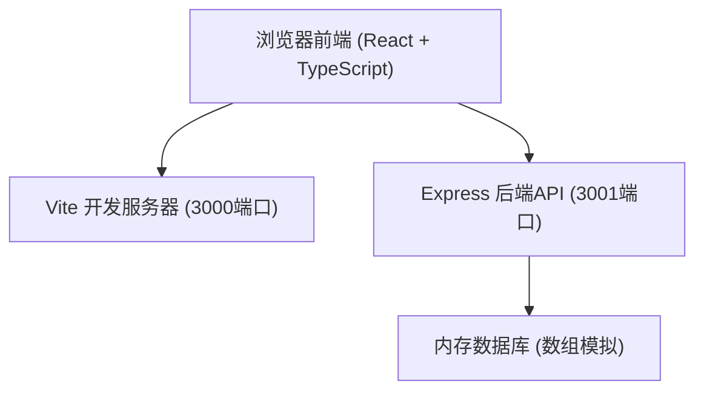
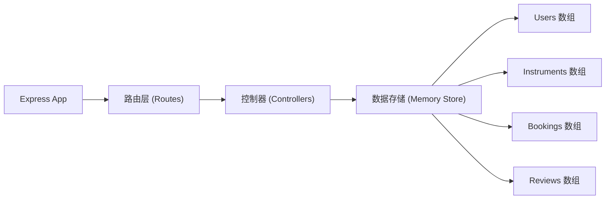
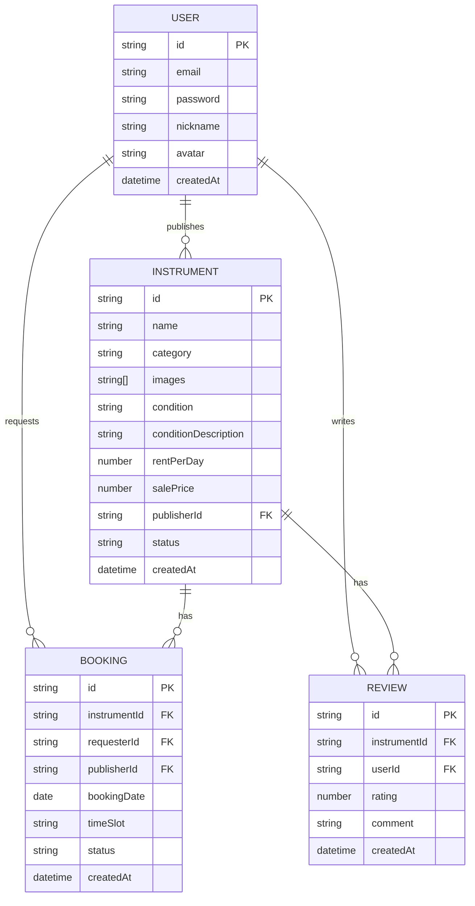

## 1. 架构设计



## 2. 技术描述

- **前端**：React 18 + TypeScript + Vite
- **状态管理**：React Context + localStorage (Token存储)
- **HTTP客户端**：Axios
- **日期处理**：date-fns
- **唯一ID**：uuid
- **后端**：Express 4 + TypeScript
- **数据库**：内存数组模拟（无需持久化）
- **构建工具**：Vite
- **样式**：CSS Modules / 内联样式（用户指定配色方案）

## 3. 路由定义

| 路由路径 | 页面组件 | 用途 |
|----------|----------|------|
| `/` | Home | 首页，乐器瀑布流 |
| `/instrument/:id` | Detail | 乐器详情页 |
| `/profile/:userId` | Profile | 个人主页 |
| `/login` | Login | 登录/注册页 |

## 4. API 定义

### 4.1 类型定义

```typescript
interface User {
  id: string;
  email: string;
  nickname: string;
  avatar?: string;
  createdAt: string;
}

interface Instrument {
  id: string;
  name: string;
  category: 'acoustic-guitar' | 'electric-piano' | 'violin' | 'saxophone' | 'drum-kit';
  images: string[];
  condition: 'new' | 'minor-flaw' | 'used';
  conditionDescription: string;
  rentPerDay: number;
  salePrice: number;
  publisherId: string;
  publisherNickname: string;
  createdAt: string;
  status: 'active' | 'offline';
}

interface Booking {
  id: string;
  instrumentId: string;
  instrumentName: string;
  requesterId: string;
  requesterNickname: string;
  publisherId: string;
  publisherNickname: string;
  bookingDate: string;
  timeSlot: string;
  status: 'pending' | 'confirmed' | 'completed' | 'cancelled';
  createdAt: string;
}

interface Review {
  id: string;
  instrumentId: string;
  userId: string;
  userNickname: string;
  userAvatar?: string;
  rating: 1 | 2 | 3 | 4 | 5;
  comment: string;
  createdAt: string;
}
```

### 4.2 API 端点

| 方法 | 路径 | 描述 | 请求体 | 响应 |
|------|------|------|--------|------|
| POST | `/api/auth/register` | 用户注册 | `{ email, password, nickname }` | `{ token, user }` |
| POST | `/api/auth/login` | 用户登录 | `{ email, password }` | `{ token, user }` |
| GET | `/api/instruments` | 获取乐器列表 | Query: `category?` | `Instrument[]` |
| GET | `/api/instruments/:id` | 获取乐器详情 | - | `Instrument` |
| POST | `/api/instruments` | 发布乐器 | `FormData` | `Instrument` |
| PUT | `/api/instruments/:id` | 更新乐器 | `Partial<Instrument>` | `Instrument` |
| DELETE | `/api/instruments/:id` | 下架乐器 | - | `{ success: true }` |
| GET | `/api/instruments/:id/reviews` | 获取乐器评价 | - | `Review[]` |
| POST | `/api/instruments/:id/reviews` | 发布评价 | `{ rating, comment, userId }` | `Review` |
| GET | `/api/bookings` | 获取预约列表 | Query: `userId` | `Booking[]` |
| POST | `/api/bookings` | 创建预约 | `{ instrumentId, bookingDate, timeSlot, requesterId }` | `Booking` |
| PUT | `/api/bookings/:id/status` | 更新预约状态 | `{ status }` | `Booking` |
| GET | `/api/users/:id/instruments` | 获取用户发布的乐器 | - | `Instrument[]` |

## 5. 服务器架构



## 6. 数据模型

### 6.1 ER图



### 6.2 项目文件结构

```
auto114/
├── package.json
├── index.html
├── vite.config.js
├── tsconfig.json
├── src/
│   ├── client/
│   │   ├── main.tsx
│   │   ├── App.tsx
│   │   ├── Home.tsx
│   │   ├── Detail.tsx
│   │   ├── Profile.tsx
│   │   ├── Login.tsx
│   │   ├── Publish.tsx
│   │   ├── InstrumentCard.tsx
│   │   └── Navbar.tsx
│   └── server/
│       └── server.ts
```

### 6.3 启动脚本

- `npm run dev`：同时启动Vite前端(3000)和Express后端(3001)
