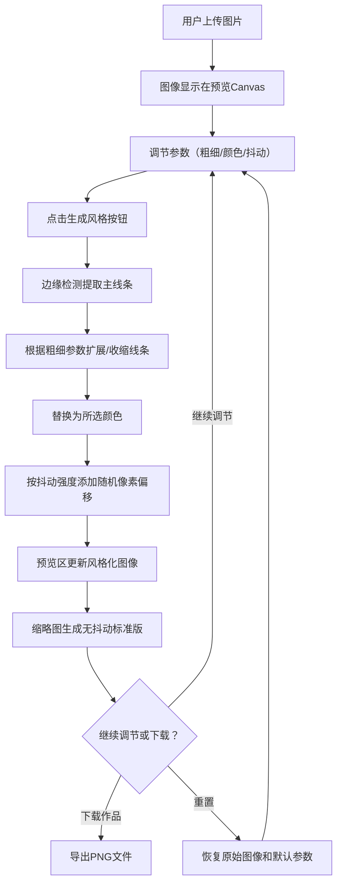

## 1. 产品概述

基于Canvas的交互式线条画风格迁移与增强Web应用，面向独立插画师和设计师，提供将手绘草图/线稿快速转化为线条流畅、带有艺术感的数字线条画的能力。用户可调整线条粗细、颜色和抖动效果，生成极具个人风格的矢量感作品。

- 目标用户：独立插画师、平面设计师、数字艺术创作者
- 核心价值：将手绘线稿在2秒内转化为风格化数字线条画，支持实时参数调节与对比参考

## 2. 核心功能

### 2.1 功能模块

1. **图像上传与预览页**：上传区域、预览Canvas、缩略图对比区
2. **风格化控制面板**：线条粗细滑块、颜色选择器、抖动强度滑块、生成/重置按钮

### 2.2 页面详情

| 页面名称 | 模块名称 | 功能描述 |
|----------|----------|----------|
| 主页面 | 上传区域 | 支持"上传图片"按钮点击和拖拽上传，接受jpg/png格式，建议800x800以内 |
| 主页面 | 预览Canvas | 600x600px，浅色棋盘格背景(#D4C9B8/#C4B9A8交替)，实时显示原始/风格化图像 |
| 主页面 | 缩略图对比区 | 200x200px，处理完成后自动生成无抖动标准版本（粗细2px，纯黑色）作为对比参考 |
| 主页面 | 控制面板 | 线条粗细滑块(0.5-8px)、颜色选择器(6种预设色)、抖动强度滑块(0%-100%) |
| 主页面 | 生成风格按钮 | 暖橙#E67E22背景，白色文字，圆角8px，点击触发处理，处理中显示旋转沙漏动画 |
| 主页面 | 重置按钮 | 深灰#555背景，白色文字，圆角8px，恢复原始图像和默认参数 |
| 主页面 | 下载作品按钮 | 棕色#8B7355背景，白色文字，圆角8px，导出png文件 |

## 3. 核心流程

用户打开应用 → 上传手绘/线稿图片 → 图像显示在预览区 → 调节线条粗细/颜色/抖动参数 → 点击"生成风格" → 处理器执行边缘检测+线条增强+颜色映射+抖动模拟 → 预览区更新为风格化图像 → 缩略图区生成标准对比版本 → 可下载或重置

## 4. 用户界面设计

### 4.1 设计风格

- 主色调：米色和暖棕色系，营造温暖手工质感
- 主色：米白#F5F0E1，面板背景#F9F4E8
- 强调色：暖橙#E67E22（按钮、滑块手柄）
- 文字色：深棕#5A3E32（标题和标签）
- 辅助色：浅棕#D4C9B8（滑块轨道）、#C4B9A8（分隔线）
- 按钮风格：圆角8px，悬停背景变亮10%+1px内阴影，点击缩小至95%
- 字体：使用具有艺术手写感的字体搭配清晰的正文字体
- 布局：左右两栏，左栏65%（预览区），右栏30%（控制面板，最小宽度280px）

### 4.2 页面设计概览

| 页面名称 | 模块名称 | UI要素 |
|----------|----------|--------|
| 主页面 | 预览区 | 600x600 Canvas，棋盘格背景，拖拽上传覆盖层 |
| 主页面 | 缩略图区 | 200x200 Canvas，标准对比版本，标签说明 |
| 主页面 | 控制面板 | 米色#F9F4E8背景，24px内边距，浅棕虚线分隔参数组 |
| 主页面 | 滑块组件 | 轨道#D4C9B8，手柄#E67E22，右侧数值标签（调节时1.2倍放大0.3s过渡） |
| 主页面 | 颜色选择器 | 6个预设色圆形色块，选中状态带边框 |
| 主页面 | 生成按钮 | #E67E22背景，处理中旋转沙漏动画(1.5s周期) |

### 4.3 响应式设计

- 桌面端(≥768px)：左右两栏布局
- 移动端(<768px)：上下结构，预览区在上，控制面板在下，控制面板宽度100%，滑块高度40px便于触摸操作
