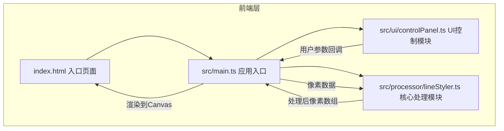

## 1. 架构设计

**数据流向**：用户在控制面板调节参数 → controlPanel.ts通过回调传递参数给main.ts → main.ts将Canvas像素数据与参数传给lineStyler.ts → lineStyler.ts执行边缘检测/粗细调整/颜色映射/抖动模拟 → 返回处理后像素数组 → main.ts渲染回Canvas

## 2. 技术说明

- 前端：TypeScript + 原生JavaScript（无框架），Canvas API进行图像处理
- 构建工具：Vite
- 初始化工具：vite-init（vanilla-ts模板）
- 后端：无
- 数据库：无

## 3. 文件结构与职责

| 文件路径 | 职责 | 调用关系 |
|----------|------|----------|
| package.json | 项目依赖(typescript, vite)和启动脚本(npm run dev) | - |
| vite.config.js | 构建配置，入口index.html，端口3000 | - |
| tsconfig.json | TypeScript严格模式，target ES2020 | - |
| index.html | 入口页面，米白到浅灰渐变背景，居中应用容器 | 被Vite引用 |
| src/main.ts | 应用入口，初始化Canvas、绑定UI事件，传递图像数据给处理模块 | 调用controlPanel.ts和lineStyler.ts |
| src/processor/lineStyler.ts | 核心处理模块：边缘检测、粗细调整、颜色映射、抖动模拟 | 被main.ts调用 |
| src/ui/controlPanel.ts | UI控制模块：生成控制面板，管理滑块/颜色/按钮，回调传参 | 被main.ts调用 |
| src/style.css | 全局样式：布局、配色、动画、响应式 | 被index.html引用 |

## 4. 核心算法设计

### 4.1 边缘检测
- 使用Sobel算子进行简单边缘检测
- 对灰度图像分别在x和y方向求梯度，合并得到边缘强度
- 通过阈值判断提取主线条像素

### 4.2 线条粗细调整
- 根据粗细参数对边缘像素进行形态学膨胀/腐蚀
- 粗细>2px时膨胀，<2px时腐蚀
- 使用圆形结构元素确保线条均匀扩展

### 4.3 颜色映射
- 将线条像素颜色替换为用户选择的预设颜色
- 保留背景像素不变

### 4.4 抖动模拟
- 对线条边缘像素添加随机偏移
- 偏移范围：0到(抖动强度% * 2)像素
- 使用高斯分布生成偏移量，模拟手绘自然抖动

## 5. 性能设计

- 图像处理在主线程使用requestAnimationFrame分片执行，保证UI响应
- 512x512图像处理总耗时不超过2秒
- 参数调节和界面切换保持60FPS
- Canvas使用离屏Canvas进行图像处理，避免闪烁

## 6. 路由定义

单页面应用，无路由。

## 7. API定义

无后端API。
