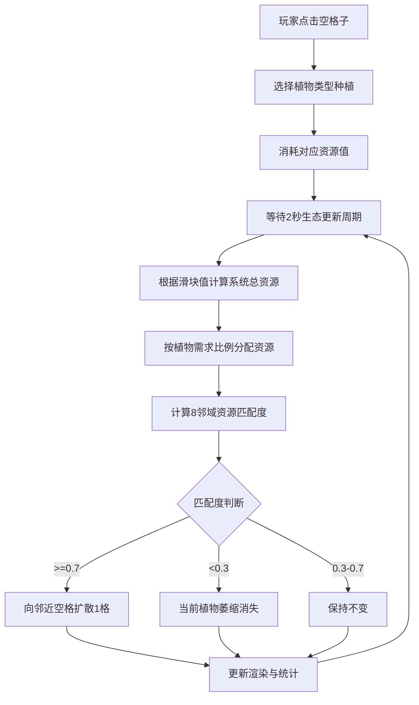

## 1. 产品概述
植物生态博弈模拟器——一个在40×40网格上运行的生态仿真Web应用，玩家通过策略性布局5种不同植物来观察其在竞争阳光与水分资源下的生长、扩散与衰退过程，直观理解自然选择中资源分配与种群动态的关系。

## 2. 核心功能

### 2.1 功能模块
1. **生态区页面**：40×40网格、植物种植/扩散/萎缩、Canvas渲染、缩放平移
2. **资源控制面板**：阳光/水分滑块、实时资源分配
3. **统计面板**：植物总数、Shannon多样性指数、资源利用率进度条
4. **快照管理**：保存/加载生态快照（LocalStorage）
5. **重置功能**：确认弹窗、清场动画

### 2.2 页面详情
| 页面名称 | 模块名称 | 功能描述 |
|----------|----------|----------|
| 生态区 | 40×40网格 | 点击空格种植植物，植物每2秒根据资源匹配度扩散或萎缩 |
| 生态区 | 植物图元 | 5种植物用不同形状色块表示，悬停显示tooltip |
| 资源控制面板 | 滑块控制 | 阳光强度(1-10)和水分供给(1-10)滑块，实时调节系统资源 |
| 统计面板 | 实时统计 | 总植物数、Shannon指数、资源利用率进度条，每2秒刷新 |
| 快照管理 | 保存/加载 | 保存快照到LocalStorage，加载最近10个快照列表 |
| 重置功能 | 确认重置 | 弹窗确认后清空生态区，2秒缩放清场动画 |

## 3. 核心流程

玩家打开页面后，在40×40的生态区网格中点击空格子种植植物（从5种中选择）。系统每2秒执行一次生态更新循环：根据滑块值计算系统总资源→按植物需求比例分配资源→计算每棵植物8邻域资源匹配度→匹配度≥0.7时向邻近空格扩散、<0.3时萎缩消失。玩家通过调节阳光/水分滑块改变环境条件，观察不同策略下植物种群的兴衰演变。

## 4. 用户界面设计

### 4.1 设计风格
- 主背景：暗绿色 #1B3A2D，文字主色 #E8F5E9
- 三栏布局：左栏生态区(860px)、中栏资源控制面板(240px)、右栏统计面板(180px)
- 按钮风格：圆角8px，悬停过渡0.3秒ease-in-out
- 字体：统计数字Courier New 14px，其他UI文字系统字体
- 植物图元：高草(绿色圆点#4CAF50)、灌木(深绿方形#388E3C)、藤蔓(浅绿三角形#81C784)、阔叶树(棕色圆形#795548)、针叶树(深蓝菱形#1565C0)

### 4.2 页面设计概览
| 页面名称 | 模块名称 | UI元素 |
|----------|----------|--------|
| 生态区 | 网格背景 | 深绿到浅绿渐变(#2E7D32→#A5D6A7)，格子线1px #C8E6C9，深绿发光边框 |
| 生态区 | 植物图元 | 格子70%大小，5种形状色块，悬停tooltip白底#FFF文字#333圆角8px |
| 资源控制面板 | 滑块 | 轨道200×6px底色#E0E0E0，按钮18px#FF6F00，拖拽渐变#FFB74D→#FF6F00 |
| 统计面板 | 进度条 | 150×12px底色#E0E0E0，填充色#4CAF50→#FF5722渐变 |
| 快照管理 | 按钮 | 保存按钮120×36px蓝#1976D2，悬停#1565C0，0.2s缩放动画 |
| 重置功能 | 按钮/弹窗 | 红色按钮#D32F2F，遮罩#000000CC，白底弹窗圆角16px |

### 4.3 响应式
- 桌面优先，三栏水平布局
- 屏幕宽度<900px时：三栏变垂直堆叠，生态区占60%高度，控制面板和统计面板并列下方各占50%宽度
- 生态区支持鼠标拖拽平移和滚轮缩放(0.5x-2x)

### 4.4 交互细节
- 生态区：点击空格种植，拖拽平移，滚轮缩放，悬停显示植物信息
- 滑块：拖拽实时更新资源值
- 快照保存：序列化JSON到LocalStorage，键名ecosnap_{时间戳}
- 快照加载：弹出最近10个快照列表，点击恢复
- 重置：确认弹窗，清场2秒缩放动画
