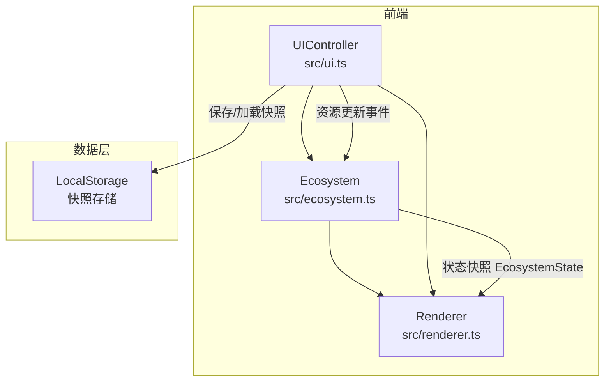

## 1. 架构设计



## 2. 技术说明
- 前端：TypeScript + 原生JavaScript（无框架）
- 构建工具：Vite
- 动画库：GSAP（用于清场动画和UI过渡）
- 初始化工具：Vite vanilla-ts模板
- 后端：无
- 数据库：LocalStorage（快照持久化）

## 3. 文件结构

| 文件 | 职责 |
|------|------|
| package.json | 依赖：typescript, vite, gsap；脚本：npm run dev |
| index.html | 入口页面，暗绿主题DOM结构 |
| vite.config.js | 构建配置，入口index.html，端口3000 |
| tsconfig.json | 严格模式，target ES2020 |
| src/ecosystem.ts | Ecosystem核心类：40×40网格、植物枚举、资源分配、扩散萎缩逻辑 |
| src/renderer.ts | Renderer类：Canvas渲染网格、植物图元、tooltip、缩放平移 |
| src/ui.ts | UIController类：滑块、按钮、统计面板、快照列表DOM事件 |

## 4. 核心数据结构

### 4.1 植物类型枚举
```typescript
enum PlantType {
  TallGrass = 'tall_grass',    // 高草：阳光需求2，水分需求3
  Shrub = 'shrub',             // 灌木：阳光需求3，水分需求2
  Vine = 'vine',               // 藤蔓：阳光需求1，水分需求4
  Broadleaf = 'broadleaf',     // 阔叶树：阳光需求5，水分需求5
  Conifer = 'conifer'          // 针叶树：阳光需求4，水分需求1
}
```

### 4.2 网格格子状态
```typescript
interface Cell {
  plant: PlantType | null;
  sunlightNeed: number;  // 1-5
  waterNeed: number;     // 1-5
  scale: number;         // 动画缩放值 0-1
}
```

### 4.3 生态系统状态快照
```typescript
interface EcosystemState {
  grid: Cell[][];
  sunlightIntensity: number;
  waterSupply: number;
  totalPlants: number;
  shannonIndex: number;
  sunlightUsage: number;
  waterUsage: number;
  sunlightTotal: number;
  waterTotal: number;
}
```

## 5. 核心算法

### 5.1 资源匹配度计算
```
匹配度 = (1 - |植物阳光需求/5 - 当前阳光强度/10|) × 0.5
       + (1 - |植物水分需求/5 - 当前水分供给/10|) × 0.5
```
匹配度范围[0, 1]，值越高表示植物需求与当前环境越匹配。

### 5.2 资源分配
- 系统总阳光 = 阳光强度 × 100 AU
- 系统总水分 = 水分供给 × 100 AU
- 每棵植物分得阳光 = 阳光强度 × 植物阳光需求 × (总阳光 / 总需求)的上限约束
- 每棵植物分得水分 = 水分供给 × 植物水分需求 × (总水分 / 总需求)的上限约束

### 5.3 扩散与萎缩
- 每2秒遍历所有格子
- 匹配度≥0.7：向8邻域中随机一个空格扩散
- 匹配度<0.3：当前植物萎缩消失
- 其他：保持不变

### 5.4 Shannon多样性指数
```
H = -Σ(pᵢ × ln(pᵢ))
```
其中pᵢ为第i种植物占总植物数的比例。

## 6. 性能目标
- 生态区渲染维持30FPS以上
- 每2秒生态更新延迟不超过100ms
- Canvas渲染优化：仅重绘变化区域，使用requestAnimationFrame
