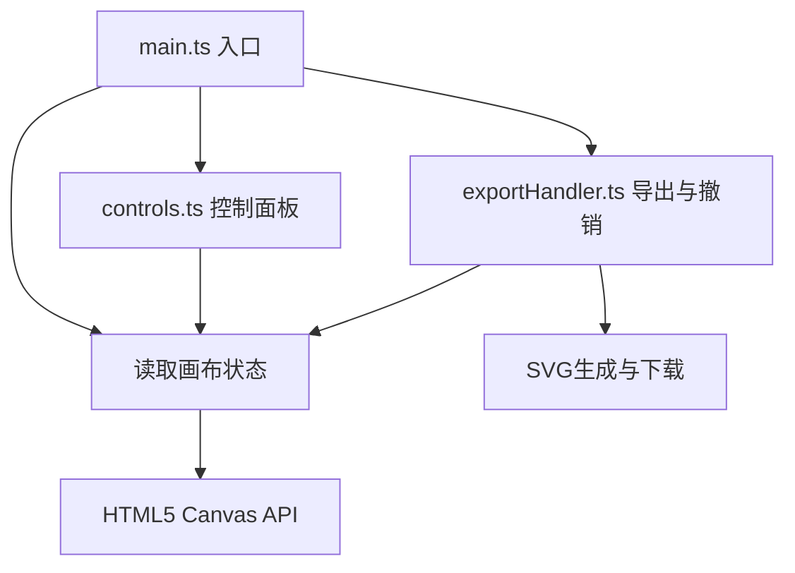

## 1. 架构设计

纯前端单页应用，无后端依赖，采用模块化分层架构。



## 2. 技术描述

- **前端框架**：原生TypeScript + Vite（无UI框架，按用户要求纯Canvas实现）
- **构建工具**：Vite 5.x
- **语言**：TypeScript 5.x，严格模式，target ES2020
- **渲染层**：HTML5 Canvas 2D Context
- **状态管理**：模块内局部状态 + 事件驱动
- **样式**：原生CSS（CSS变量 + 渐变纹理）

## 3. 文件结构

```
auto118/
├── package.json          # 依赖与脚本配置
├── index.html            # 入口HTML
├── vite.config.js        # Vite构建配置（端口3000）
├── tsconfig.json         # TypeScript配置
└── src/
    ├── main.ts           # 应用初始化、事件绑定、模块协调
    ├── canvasEngine.ts   # Canvas渲染引擎（笔迹、田字格、光晕）
    ├── controls.ts       # 控制面板DOM构造与滑块事件
    └── exportHandler.ts  # SVG导出、撤销栈、模态框逻辑
```

## 4. 模块接口定义

### 4.1 CanvasEngine
```typescript
interface StyleParams {
  lineWidth: number;      // 2-20px
  distortion: number;     // 0-15
  jitterFrequency: number; // 1-10
  fadeAmount: number;     // 0-100%
}

interface CanvasEngine {
  constructor(canvas: HTMLCanvasElement): void;
  setStyle(params: Partial<StyleParams>): void;
  drawSegment(from: Point, to: Point): void;
  startStroke(point: Point): void;
  endStroke(): void;
  clear(fade?: boolean): Promise<void>;
  getStrokes(): Stroke[];
  restoreStrokes(strokes: Stroke[]): void;
  toSVG(): string;
  resize(): void;
}
```

### 4.2 Controls
```typescript
interface Controls {
  constructor(container: HTMLElement, onChange: (params: StyleParams) => void): void;
  getParams(): StyleParams;
  setParams(params: Partial<StyleParams>): void;
}
```

### 4.3 ExportHandler
```typescript
interface ExportHandler {
  constructor(canvasEngine: CanvasEngine): void;
  undo(): void;
  canUndo(): boolean;
  clear(): void;
  exportSVG(): void;
  bindToolbar(container: HTMLElement): void;
}
```

## 5. 核心数据模型

```typescript
interface Point {
  x: number;
  y: number;
  timestamp: number;
}

interface Stroke {
  points: Point[];
  style: StyleParams;
}
```

## 6. 性能优化策略

1. **分层Canvas**：静态层（田字格）+ 动态层（笔迹）+ 临时层（当前笔画光晕）
2. **离屏渲染**：已完成笔画缓存到离屏Canvas，避免每帧重绘全部历史
3. **requestAnimationFrame**：统一动画帧调度，确保60fps
4. **节流/防抖**：滑块事件节流（16ms），窗口resize防抖（100ms）
5. **撤销栈限制**：最多10层历史，超出自动丢弃最早记录
