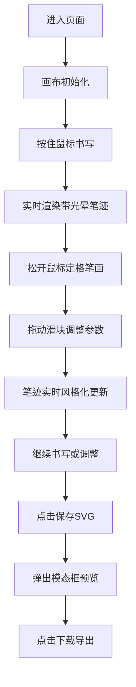

## 1. 产品概述

基于Canvas的交互式手写字体风格化与字形变形实验平台，面向设计师和书法爱好者，提供自由书写、实时风格化调整和SVG导出功能。
- 核心价值：让用户通过直观的滑块调节，实时预览笔迹在粗细、扭曲、抖动和颜色上的变化，探索个性化字体风格
- 目标用户：平面设计师、字体设计师、书法爱好者、创意工作者

## 2. 核心功能

### 2.1 功能模块

1. **书写画布模块**：中央Canvas画布，支持鼠标/触控书写，田字格参考线，笔光晕效果
2. **风格控制面板**：四个参数滑块（粗细、扭曲、抖动频率、色彩褪色），实时响应调整
3. **操作工具栏**：清空画布、撤销上一步、保存为SVG
4. **SVG导出模态框**：预览生成的SVG缩略图，一键下载

### 2.2 页面详情

| 页面名称 | 模块名称 | 功能描述 |
|-----------|-------------|---------------------|
| 主页面 | 书写画布 | 浅米色背景(#F9F6EE)，田字格参考线(#E0D5C1, 0.5px)，深墨色笔迹(#2B1B0E)，圆润端点，4px默认线宽，0.3秒光晕效果 |
| 主页面 | 控制面板 | 四个滑块：粗细(2-20px)、扭曲(0-15)、抖动频率(1-10)、色彩褪色(0-100%)，实时值显示，窄色条状态指示，0.2秒按压动画 |
| 主页面 | 工具栏 | 清空(0.5秒淡出)、撤销(最多10步，无历史置灰)、保存SVG(模态框带0.3秒缩放) |
| 模态框 | SVG导出 | 半透明黑背景，居中缩略图，下载按钮，0.3秒缩放过渡 |

## 3. 核心流程

用户进入页面 → 在中央画布按住鼠标书写 → 松开定格当前笔画 → 拖动右侧滑块实时调整风格 → 重复书写与调整 → 点击保存SVG查看预览 → 点击下载导出文件

## 4. 用户界面设计

### 4.1 设计风格
- **主色调**：浅米色#F9F6EE（纸张底）、深墨色#2B1B0E（笔迹）、暖橙色#E6A04C（交互强调）、灰白色#AAAAAA（褪色目标）
- **参考线**：#E0D5C1，0.5px线宽
- **控件圆角**：8px统一圆角
- **按钮交互**：悬停背景变为暖橙色#E6A04C，上浮3px
- **纸张质感**：左右两侧竖向纸纹纹理（CSS渐变模拟）

### 4.2 页面设计概述

| 页面名称 | 模块名称 | UI元素 |
|-----------|-------------|-------------|
| 主页面 | 整体布局 | 居中画布(左右纸纹)、右侧控制面板、底部工具栏，暖色调纸张美学 |
| 主页面 | 画布区域 | 浅米色背景、淡田字格、圆润笔迹、动态光晕尾迹 |
| 主页面 | 控制面板 | 垂直排列滑块组，每个带数值标签和窄色条指示器，按下下沉效果 |
| 主页面 | 工具栏 | 水平排列按钮，圆角8px，悬停上浮暖橙色，禁用态置灰 |
| 模态框 | SVG预览 | 半透明黑遮罩(0.7)，居中白色卡片，缩略图+下载按钮，缩放入场动画 |

### 4.3 响应性
- 桌面端优先设计，画布最小尺寸800×600px
- 控制面板固定宽度320px
- 画布区域自适应剩余空间，保持正方形比例

### 4.4 性能要求
- 书写帧率：稳定60fps
- 画布缩放重新渲染：≤100ms
- 参数调整响应：实时无延迟
