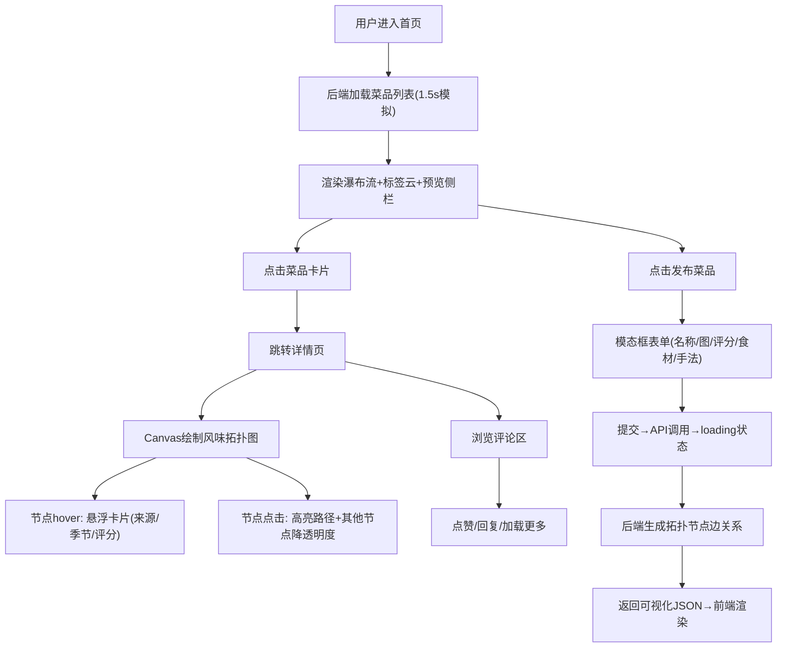

## 1. 产品概述

风味拓扑图可视化与美食分享应用是一款面向美食爱好者的在线社区平台。用户可以发布自制美食、通过交互式Canvas拓扑图直观展示菜品的"风味基因"（食材来源、烹饪手法、口味关联），并与社区成员进行评论互动。

- 核心目标：将抽象的烹饪知识转化为可视化的风味图谱，降低美食学习门槛，增强社区内容的独特性和趣味性
- 目标用户：家庭厨师、美食爱好者、烹饪学习者
- 核心价值：可视化风味表达 + 社区分享 + 知识图谱化的烹饪信息

---

## 2. 核心功能

### 2.1 用户角色
| 角色 | 注册方式 | 核心权限 |
|------|----------|----------|
| 普通用户 | 默认登录（模拟） | 发布菜品、浏览风味图谱、发表评论、管理个人菜品 |

### 2.2 功能模块
1. **首页（HomePage）**：固定导航栏、热门风味标签云、菜品瀑布流、风味拓扑图预览侧栏
2. **菜品详情页（DishDetailPage）**：全屏风味拓扑图、评论区、交互工具栏
3. **个人主页（ProfilePage）**：用户菜品管理、编辑/删除功能
4. **模态框系统**：发布菜品模态框、编辑菜品模态框、删除确认框
5. **拓扑图引擎（TopologyCanvas）**：Canvas节点边渲染、拖拽平移、滚轮缩放、交互高亮
6. **评论系统（CommentPanel）**：评论列表、新增评论、点赞、回复、加载更多

### 2.3 页面详情
| 页面名称 | 模块名称 | 功能描述 |
|----------|----------|----------|
| 首页 | 导航栏 | Logo、搜索栏、发布菜品按钮（hover上移阴影加深） |
| 首页 | 左栏标签云 | 热门风味标签圆角矩形，hover旋转3度放大1.1倍，点击过滤菜品 |
| 首页 | 中栏瀑布流 | 菜品卡片（280×380px）含大图、名称、评分星星、食材摘要、详情按钮 |
| 首页 | 右栏预览 | 固定定位风味拓扑缩略图，点击全屏展开 |
| 详情页 | Canvas拓扑图 | 节点圆形+emoji、贝塞尔曲线边、拖拽平移(阻尼0.85)、滚轮缩放(因子0.1)、hover悬浮卡片、点击高亮路径 |
| 详情页 | 评论区 | 用户头像带在线状态、评论列表淡入动画、爱心点赞弹跳、加载更多+spinner |
| 个人主页 | 菜品管理 | 卡片编辑/删除按钮、编辑模态框预填数据、删除确认框、淡出移除动画 |
| 全站 | 网络状态反馈 | >300ms显示顶部黄色进度条、按钮禁用；失败时右下角toast滑入提示(4s消失) |

---

## 3. 核心流程

主用户流程：用户登录后浏览首页瀑布流 → 点击风味标签过滤菜品 → 点击卡片查看风味图谱详情 → 交互探索拓扑节点和烹饪关系 → 发表评论/点赞 → 点击发布按钮填写表单 → 后端生成拓扑数据 → 返回可视化结果。

---

## 4. 用户界面设计

### 4.1 设计风格
- **主色调**：橙色系（#FF8C00 主橙 / #FFA500 亮橙 / #FFD700 金黄），传达温暖、食欲、活力
- **辅助色**：米色（#FFF8E7 / #FFF5E6 / #FFEBCD）、棕色（#8B4513 / #5C4033）、暖灰
- **中性色**：纯白#FFFFFF、浅灰#F5F5F5、文字#333/#888
- **特色色**：节点重要度1浅绿#90EE90、2橙黄#FFD700、3深橙#FF8C00
- **烹饪手法色**：炒红#FF4500、煎棕#D2691E、炖紫#9370DB、蒸蓝#4682B4、炸金#FFD700
- **按钮风格**：圆角8px，hover阴影加深 + translateY(-2px) 0.2s过渡，渐变橙用于主操作
- **圆角体系**：卡片12px、模态框16px、标签圆角矩形、画布图例12px
- **字体**：系统无衬线字体栈，标题24px/加粗，正文16px行高1.6，小文字12-14px
- **图标/emoji**：食材emoji（🥩🥬🧄🌿🥕🍅🧅🌶️）、工具emoji（🍳🔪）、lucide-react图标库
- **动画体系**：模态框缩放入场(0.8→1, 0.3s ease-out + 淡入)；按钮hover上移；评论淡入(0.3s ease-in)；点赞弹跳(scale 1.2, 0.2s)；卡片淡出移除(0.5s)

### 4.2 页面设计概述
| 页面名称 | 模块名称 | UI 元素 |
|----------|----------|---------|
| 首页 | 导航栏(固定60px) | 半透明白#FFFFFFCC + backdrop-blur(10px)毛玻璃；左Logo"风味图谱🍳"、中圆角20px搜索栏、右渐变橙按钮 |
| 首页 | 三栏布局 | 左250px标签云、中弹性瀑布流、右300px固定拓扑预览、<768px折叠单栏 |
| 首页 | 菜品卡片(280×380px) | 顶部cover图(280×220px)、中部名称18px加粗#5C4033+五星评分#FFD700、底部灰色食材摘要+圆形查看按钮 |
| 详情页 | Canvas画布 | 渐变米色背景、左上白色返回圆按钮(hover变橙)、右上全屏切换、右下半透明黑图例面板 |
| 详情页 | 评论区(#F5F5F5) | "用户评论"24px标题+2px橙色下划线、头像48px圆形+在线绿点、爱心点赞弹跳、加载更多+spinner |
| 全站 | 模态框(#FFF8E7) | 浅米色背景16px圆角、0.3s缩放淡入、表单滑块/食材增删/手法多选、渐变橙提交按钮loading态 |
| 全站 | 反馈层 | 顶部黄色进度条(3px高循环滑入)、右下角黑底白字toast(右滑入4s消失) |

### 4.3 响应式设计
- 设计策略：Desktop-First 桌面端优先
- 断点：768px
- 桌面端(≥768px)：三栏布局(250px | 弹性 | 300px固定)，卡片固定280px宽瀑布流
- 移动端(<768px)：单栏纵向堆叠；左右栏改为可折叠面板(默认收起，点击展开)；卡片宽度100%自适应，图文比例保持
- 触控优化：增大按钮触控区域(≥44px)，拖拽缩放使用原生touch事件

### 4.4 性能指标
- 首屏渲染：≤2秒（含模拟后端1.5s返回）
- Canvas性能：100节点+300边场景下帧率≥30fps
- 交互响应：拖拽/缩放操作延迟≤100ms
