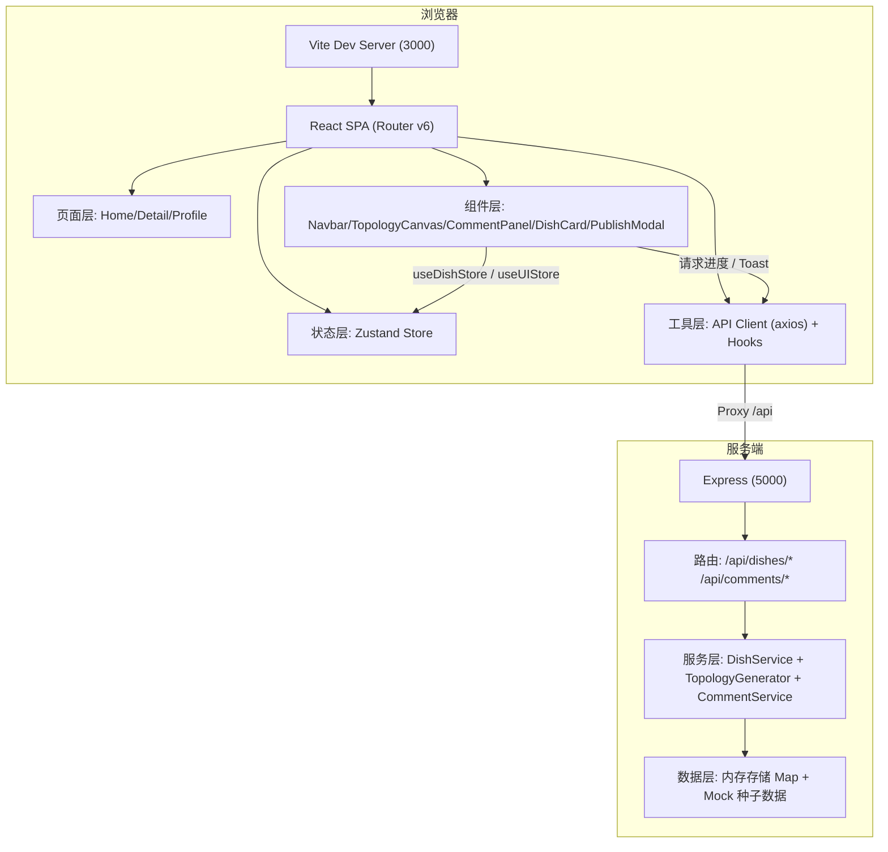
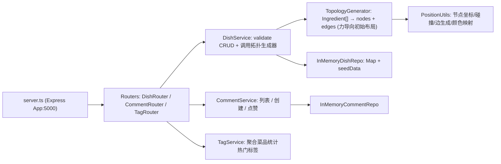
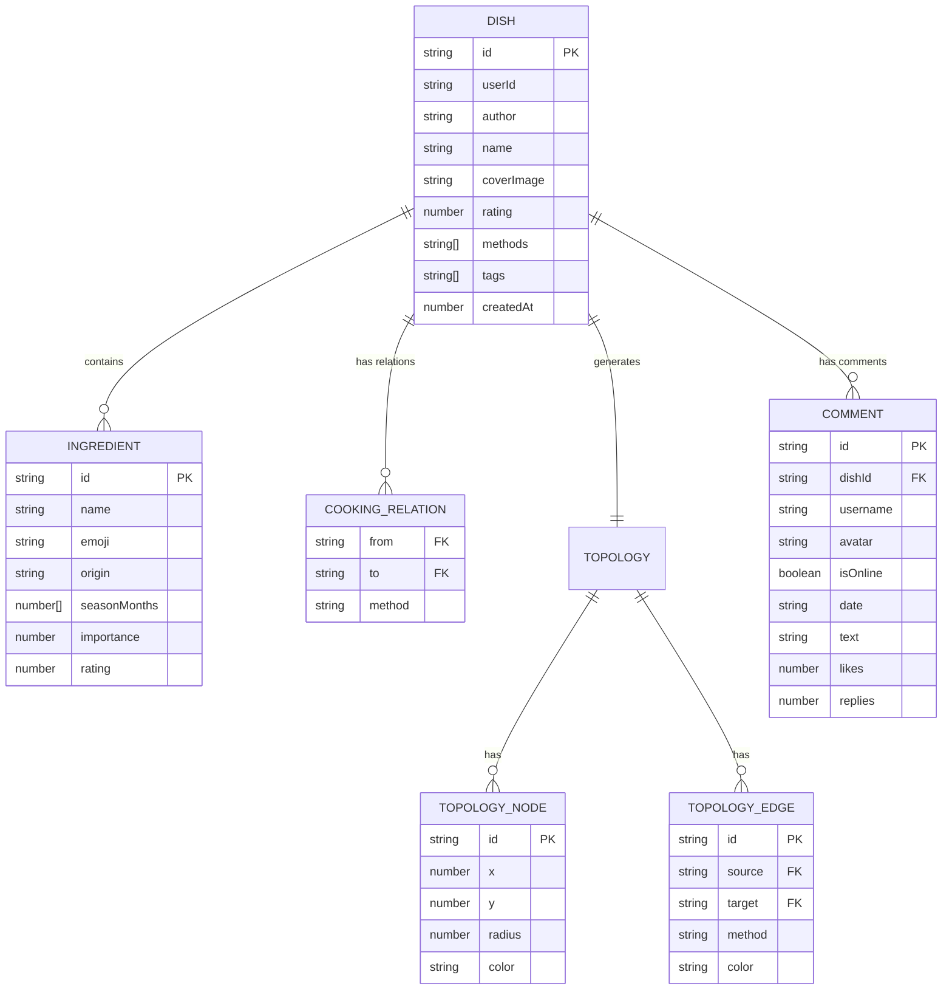

## 1. 架构设计



调用关系 & 数据流向：
- 表单提交（PublishModal） → `useDishStore.createDish()` → axios `POST /api/dishes` → Express DishRouter → DishService.validate → TopologyGenerator 根据食材关联算法生成 nodes/edges → 返回 Dish {..., topology} → store 更新 → TopologyCanvas 接收 nodes/edges 重绘
- 评论提交（CommentPanel） → `POST /api/dishes/:id/comments` → 服务端追加 → 返回新评论列表 → 前端淡入插入

---

## 2. 技术描述

| 层级 | 选型 | 说明 |
|------|------|------|
| 构建工具 | Vite 5 | 按要求 `vite.config.js` 端口3000，proxy 到 5000 |
| 语言 | TypeScript 5 | 严格模式 strict:true，target ES2020 |
| 前端框架 | React 18 | Hooks + Function Component |
| 路由 | react-router-dom 6 | HashRouter，/、/dish/:id、/profile |
| 状态管理 | zustand 4 | DishStore、CommentStore、UIStore（loading/toast） |
| HTTP | axios | 拦截器注入进度条、错误toast、>300ms延迟加载态 |
| 图标 | lucide-react | 铅笔/垃圾桶/爱心/放大镜/全屏/箭头等 |
| UI | 原生 CSS Modules + 全局样式 | 不引入额外 UI 库，保持暖色调主题 |
| Canvas | 原生 HTML5 Canvas 2D | 自研 TopologyCanvas：requestAnimationFrame 循环、Quadtree 碰撞可选 |
| 后端 | Express 4 | ESM + TS，tsx 执行，/api 前缀 |
| 工具库 | uuid | 生成菜品/评论/节点 ID |
| 数据库 | 内存存储 + Mock | Map 存储，启动注入 6 条种子菜品 |

---

## 3. 路由定义

| 路由 (前端) | 页面组件 | 说明 |
|-------------|----------|------|
| `/` | HomePage | 三栏首页：标签云 + 瀑布流 + 拓扑预览 |
| `/dish/:id` | DishDetailPage | 全屏拓扑图 + 评论区 |
| `/profile` | ProfilePage | 用户发布的菜品 + 编辑/删除 |

| 路由 (后端 /api) | 方法 | 说明 |
|------------------|------|------|
| `/dishes` | GET | 查询菜品列表，支持 ?tag= 过滤、?userId= 个人主页过滤 |
| `/dishes/:id` | GET | 获取单菜品详情（含完整 topology） |
| `/dishes` | POST | 创建菜品：表单数据 → 服务端生成拓扑 → 返回完整 Dish |
| `/dishes/:id` | PUT | 更新菜品（编辑） |
| `/dishes/:id` | DELETE | 删除菜品 |
| `/dishes/:id/comments` | GET | 分页 GET 评论 ?page=&size= |
| `/dishes/:id/comments` | POST | 新增评论 |
| `/dishes/:id/comments/:cid/like` | POST | 点赞 +1 |
| `/tags` | GET | 获取热门风味标签 |

---

## 4. API 定义（TypeScript Schema）

```ts
// 共享类型 shared/types.ts
export type Importance = 1 | 2 | 3;
export type CookingMethod = '炒' | '煎' | '炖' | '蒸' | '炸' | '烤' | '焗' | '焖';

export interface Ingredient {
  id: string;
  name: string;
  emoji: string;
  origin: string;         // 来源地
  seasonMonths: number[]; // 季月推荐 1-12
  importance: Importance; // 1-3
  rating: number;         // 平均评分 1-5
}

export interface CookingRelation {
  from: string;  // ingredient id
  to: string;    // ingredient id
  method: CookingMethod;
}

export interface TopologyNode {
  id: string;
  x: number; y: number;     // 初始布局坐标 (服务端生成)
  vx?: number; vy?: number;
  label: string;
  emoji: string;
  origin: string;
  seasonMonths: number[];
  importance: Importance;
  rating: number;
  radius: number;
  color: string;
}

export interface TopologyEdge {
  id: string;
  source: string;
  target: string;
  method: CookingMethod;
  color: string;
}

export interface Topology {
  nodes: TopologyNode[];
  edges: TopologyEdge[];
}

export interface Dish {
  id: string;
  userId: string;
  author: string;
  name: string;
  coverImage: string;      // base64 或占位图 URL
  rating: number;          // 1-5 风味评分
  ingredients: Ingredient[];
  methods: CookingMethod[];
  relations: CookingRelation[];
  topology: Topology;
  tags: string[];
  createdAt: number;
}

export interface Comment {
  id: string;
  dishId: string;
  userId: string;
  username: string;
  avatar: string;          // 占位图 or dataURL
  isOnline: boolean;
  date: string;            // yyyy-MM-dd
  text: string;
  likes: number;
  replies: number;
  liked?: boolean;
}

export interface Paginated<T> {
  data: T[];
  page: number; size: number; total: number;
}

export interface ApiError { code: number; message: string; }
```

请求体 / 响应体：
- `POST /api/dishes` Body: `{ name, coverImage (base64), rating, ingredients:[{name,emoji,origin,seasonMonths,importance}], methods }`，服务端自动生成 `relations` 与 `topology`，返回 `Dish`
- `GET /api/dishes` 返回 `Dish[]`（精简字段，topology 仅 nodes/edges id 用于预览）
- `POST /api/dishes/:id/comments` Body: `{ username, text }`，返回 `Comment`

---

## 5. 服务端架构



服务启动流程：
1. `npm run dev` → 同时 vite(3000) + tsx watch src/server/server.ts(5000)
2. server.ts 注入 6 条 mock Dish（含 topology）
3. TopologyGenerator：根据食材 importance + methods 关系用圆形分层布局 + 微力导向迭代输出坐标

---

## 6. 数据模型

### 6.1 ER 图



### 6.2 种子数据

```ts
// src/server/seed.ts
export const seedDishes: DishSeed[] = [
  {
    name: "红烧牛肉", rating: 5,
    ingredients: [
      { name: "牛肉", emoji: "🥩", origin: "内蒙古", seasonMonths:[9,10,11,12], importance: 3, rating: 4.8 },
      { name: "土豆", emoji: "🥔", origin: "甘肃", seasonMonths:[8,9,10], importance: 2, rating: 4.2 },
      { name: "八角", emoji: "🌿", origin: "广西", seasonMonths:[3,4,10], importance: 1, rating: 4.5 },
      { name: "冰糖", emoji: "🍬", origin: "广东", seasonMonths:[1,2,11,12], importance: 1, rating: 4.0 }
    ],
    methods: ["炖", "炒"],
    tags: ["家常", "下饭菜", "炖菜"]
  },
  // 再加5道: 宫保鸡丁、清蒸鲈鱼、蒜蓉西兰花、糖醋里脊、香辣烤翅
];
```
