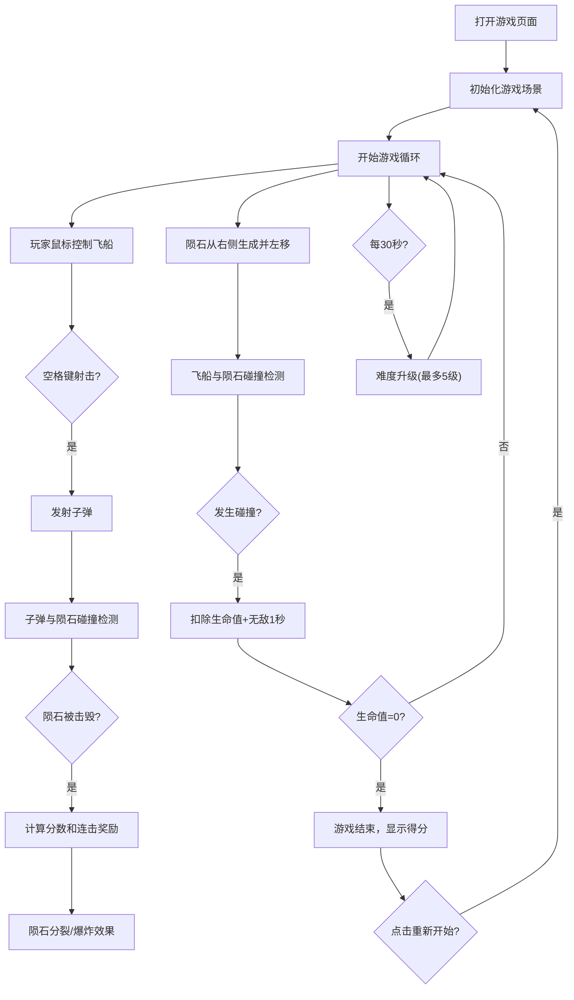

## 1. 产品概述

太空陨石躲避游戏是一款基于Canvas 2D的无尽跑酷类Web游戏。玩家操控太空飞船在随机生成的陨石带中高速飞行，通过灵活操作躲避障碍并射击陨石来提高生存时间和分数，体验紧张刺激的太空冒险沉浸感。

- 核心玩法：俯视视角无尽飞行，鼠标控制飞船移动，空格键射击陨石
- 目标用户：休闲游戏爱好者，喜欢快节奏、高操作感游戏的玩家
- 产品价值：提供碎片化时间的娱乐体验，通过连击系统和难度递增机制保持游戏挑战性

## 2. 核心功能

### 2.1 用户角色
| 角色 | 注册方式 | 核心权限 |
|------|----------|----------|
| 玩家 | 无需注册 | 开始游戏、控制飞船、查看分数、重新开始 |

### 2.2 功能模块
1. **游戏主场景**：俯视视角Canvas渲染，飞船居中，陨石从右向左滚动
2. **飞船控制系统**：鼠标控制上下左右移动，限制在屏幕可见区域内
3. **射击系统**：空格键发射子弹，击中陨石造成伤害
4. **陨石系统**：三种尺寸陨石，击中后分裂，爆炸陨石特殊效果
5. **连击系统**：连续击毁陨石获得额外加分
6. **难度系统**：每30秒难度升级，最多5级
7. **生命值系统**：3条命，碰撞后无敌闪烁，耗尽则游戏结束
8. **HUD界面**：得分、连击数、难度等级、生命值、小地图

### 2.3 页面详情
| 页面名称 | 模块名称 | 功能描述 |
|---------|----------|----------|
| 游戏主页面 | 游戏Canvas | 800x600主游戏区域，渲染飞船、陨石、子弹、粒子效果 |
| 游戏主页面 | HUD左上角 | 实时显示得分、连击数、难度等级、剩余生命（金色五角星） |
| 游戏主页面 | HUD右上角 | 150x100半透明小地图，显示陨石和玩家位置 |
| 游戏主页面 | 游戏结束弹窗 | 半透明遮罩，分数动画，重新开始按钮 |

## 3. 核心流程

玩家打开页面 → 自动开始游戏 → 鼠标控制飞船移动躲避陨石 → 空格键射击陨石 → 击毁陨石获得分数和连击奖励 → 每30秒难度升级 → 碰撞陨石扣除生命值 → 生命值耗尽 → 显示最终得分 → 点击重新开始按钮重新游戏

## 4. 用户界面设计

### 4.1 设计风格
- **设计方向**：科技感深空主题，冷色调为主
- **主色调**：深蓝紫 (#0B0D2E) 到 纯黑 (#000000) 径向渐变背景
- **强调色**：亮蓝 (#00BFFF) - 子弹、UI高亮；金色 (#FFD700) - 生命值五角星；红色 (#FF4500) - 爆炸陨石、按钮
- **中性色**：深灰 (#3A3F47)、暗红 (#8B0000) - 陨石颜色
- **字体**：Orbitron (Google Fonts) - 科技感字体
- **按钮风格**：圆角8px，渐变色 (#FF4500 到 #FF6347)，悬停放大+发光效果
- **特殊效果**：磨砂玻璃边框、光晕粒子、拖尾效果、闪烁无敌状态

### 4.2 页面设计概述
| 页面名称 | 模块名称 | UI元素 |
|---------|----------|--------|
| 游戏主页面 | 背景 | 径向渐变 (深蓝紫到纯黑)，光晕粒子飘落效果 |
| 游戏主页面 | Canvas容器 | 15px半透明白色磨砂边框 (#FFFFFF alpha 0.08) |
| 游戏主页面 | 玩家飞船 | 居中偏左，科技感造型，无敌状态闪烁 |
| 游戏主页面 | 陨石 | 三种尺寸，随机颜色，噪点纹理，移动速度随机 |
| 游戏主页面 | 子弹 | 亮蓝色细长条，尾部拖尾效果 |
| 游戏主页面 | HUD左上 | 半透明深色底板 (#000000 alpha 0.6)，显示得分/连击/难度/生命 |
| 游戏主页面 | HUD右上 | 150x100小地图，半透明黑底，白点陨石，绿点玩家 |
| 游戏主页面 | 游戏结束 | 半透明黑色遮罩 (alpha 0.7)，分数逐位弹出动画，渐变按钮 |

### 4.3 响应式
- 桌面端优先设计，Canvas固定尺寸800x600居中显示
- 小屏幕设备自动缩放适配，保持游戏区域比例
- 鼠标操作优化，支持高DPI屏幕

### 4.4 性能要求
- 全程至少60 FPS流畅帧率
- 陨石数量峰值 ≤ 200个
- 子弹数量峰值 ≤ 50发
- 使用对象池技术管理子弹和陨石，避免频繁GC
