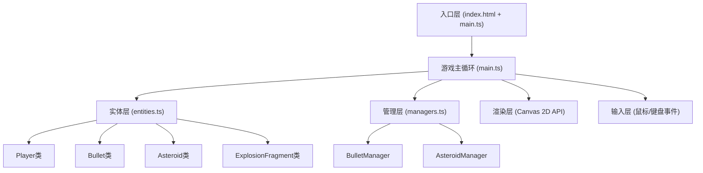

## 1. 架构设计

本项目为纯前端Canvas 2D游戏，采用TypeScript + Vite构建，无后端服务。整体采用分层架构设计：



### 架构说明
- **入口层**：负责页面加载、字体引入、Canvas初始化
- **游戏主循环**：使用requestAnimationFrame驱动，管理游戏状态、难度升级、碰撞检测
- **实体层**：定义游戏中的所有可渲染对象，包含位置、速度、渲染、碰撞方法
- **管理层**：使用对象池模式管理子弹和陨石的生成、更新、回收，处理连击逻辑
- **渲染层**：直接使用Canvas 2D API进行绘制，保证60FPS性能
- **输入层**：监听鼠标移动和键盘事件，实时更新玩家输入状态

## 2. 技术描述

- **开发语言**：TypeScript 5.x (严格模式，target ES2020)
- **构建工具**：Vite 5.x (热更新，快速构建)
- **渲染引擎**：原生Canvas 2D API (无第三方游戏引擎)
- **字体**：Google Fonts - Orbitron (科技感字体)
- **包管理器**：npm
- **开发服务器端口**：3000

### 核心技术选型理由
1. **TypeScript严格模式**：提供类型安全，减少运行时错误，便于维护
2. **Vite**：启动快，热更新即时，适合游戏开发的快速迭代
3. **原生Canvas 2D**：轻量高效，完全掌控渲染流程，满足60FPS性能要求
4. **无第三方游戏引擎**：避免引入不必要的依赖和复杂度，代码精简

## 3. 文件组织结构

```
auto126/
├── package.json          # 项目依赖和脚本
├── index.html            # 入口HTML，加载字体和Canvas
├── vite.config.js        # Vite构建配置
├── tsconfig.json         # TypeScript配置
└── src/
    ├── main.ts           # 游戏主循环，状态管理，难度升级
    ├── entities.ts       # Player, Bullet, Asteroid, ExplosionFragment类
    └── managers.ts       # BulletManager, AsteroidManager类
```

## 4. 核心数据结构与类定义

### 4.1 实体类 (entities.ts)

```typescript
// 玩家飞船
class Player {
  x: number;           // X坐标
  y: number;           // Y坐标
  width: number;       // 宽度
  height: number;      // 高度
  lives: number;       // 剩余生命
  isInvincible: boolean;  // 是否无敌
  invincibleTimer: number; // 无敌计时器
  targetX: number;     // 鼠标目标X
  targetY: number;     // 鼠标目标Y
  
  update(deltaTime: number): void;
  render(ctx: CanvasRenderingContext2D): void;
  hit(): boolean;      // 被击中，返回是否还有生命
  reset(): void;       // 重置状态
}

// 子弹
class Bullet {
  x: number;
  y: number;
  width: number = 4;
  height: number = 12;
  speed: number = 10;
  trail: { x: number; y: number; alpha: number }[]; // 拖尾
  active: boolean;     // 对象池激活状态
  
  update(): void;
  render(ctx: CanvasRenderingContext2D): void;
  init(x: number, y: number): void;  // 对象池初始化
}

// 陨石类型
enum AsteroidSize { LARGE, MEDIUM, SMALL }
enum AsteroidType { NORMAL, EXPLOSIVE }

class Asteroid {
  x: number;
  y: number;
  radius: number;
  size: AsteroidSize;
  type: AsteroidType;
  hp: number;
  maxHp: number;
  vx: number;          // X速度
  vy: number;          // Y速度
  color: string;       // 基础颜色
  noisePattern: number[];  // 噪点纹理数据
  active: boolean;
  scoreValue: number;  // 分值
  
  update(): void;
  render(ctx: CanvasRenderingContext2D): void;
  hit(damage: number): boolean;  // 受击，返回是否被击毁
  init(x: number, y: number, size: AsteroidSize, type?: AsteroidType): void;
}

// 爆炸碎片
class ExplosionFragment {
  x: number;
  y: number;
  radius: number = 5;
  vx: number;
  vy: number;
  speed: number = 3;
  active: boolean;
  life: number;        // 存活帧数
  
  update(): void;
  render(ctx: CanvasRenderingContext2D): void;
  init(x: number, y: number, angle: number): void;
}
```

### 4.2 管理类 (managers.ts)

```typescript
class BulletManager {
  pool: Bullet[];      // 对象池
  maxBullets: number = 50;
  
  fire(x: number, y: number): void;
  update(): void;
  render(ctx: CanvasRenderingContext2D): void;
  getActiveBullets(): Bullet[];
  reset(): void;
}

class AsteroidManager {
  pool: Asteroid[];    // 陨石对象池
  fragmentPool: ExplosionFragment[];  // 碎片对象池
  maxAsteroids: number = 200;
  maxFragments: number = 100;
  
  spawnRate: number;   // 生成速率
  baseSpeed: number;   // 基础速度
  difficultyLevel: number;
  
  lastHitTime: number; // 上次击毁时间
  comboCount: number;  // 连击计数
  
  spawn(): void;       // 生成陨石
  update(): void;
  render(ctx: CanvasRenderingContext2D): void;
  checkBulletCollisions(bullets: Bullet[], onScore: (points: number) => void): void;
  checkPlayerCollision(player: Player): boolean;
  splitAsteroid(asteroid: Asteroid): void;  // 分裂逻辑
  triggerExplosion(x: number, y: number): void;  // 爆炸陨石效果
  calculateComboBonus(): number;  // 计算连击加分
  increaseDifficulty(): void;     // 难度升级
  reset(): void;
}
```

## 5. 性能优化策略

### 5.1 对象池模式
- 子弹和陨石使用预先分配的对象池
- 对象激活/复用而非频繁创建销毁
- 避免GC导致的帧率波动

### 5.2 渲染优化
- 使用离屏Canvas预渲染陨石噪点纹理
- 只更新可见区域内的对象
- 合理使用`requestAnimationFrame`，每帧控制在16ms以内

### 5.3 碰撞检测优化
- 圆形碰撞检测（陨石）vs AABB检测（子弹、飞船）
- 空间分区粗略筛选，减少检测次数

### 5.4 内存管理
- 主动回收离屏对象到对象池
- 限制最大对象数量（陨石≤200，子弹≤50）

## 6. 游戏状态管理

```typescript
enum GameState { MENU, PLAYING, PAUSED, GAME_OVER }

interface GameConfig {
  canvasWidth: number = 800;
  canvasHeight: number = 600;
  initialLives: number = 3;
  difficultyInterval: number = 30000;  // 30秒
  maxDifficultyLevel: number = 5;
  comboTimeWindow: number = 500;  // 500ms连击窗口
}
```

## 7. 构建与运行

### 依赖安装
```bash
npm install
```

### 开发模式
```bash
npm run dev
```
- 启动Vite开发服务器，端口3000
- 支持热更新
- 访问 http://localhost:3000

### 生产构建
```bash
npm run build
```
- 输出到 `dist/` 目录
- TypeScript类型检查
- 代码压缩优化
