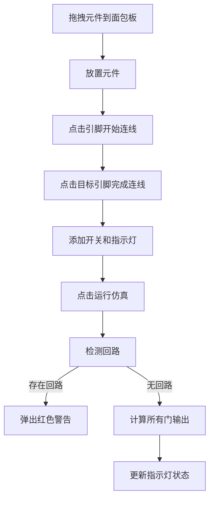
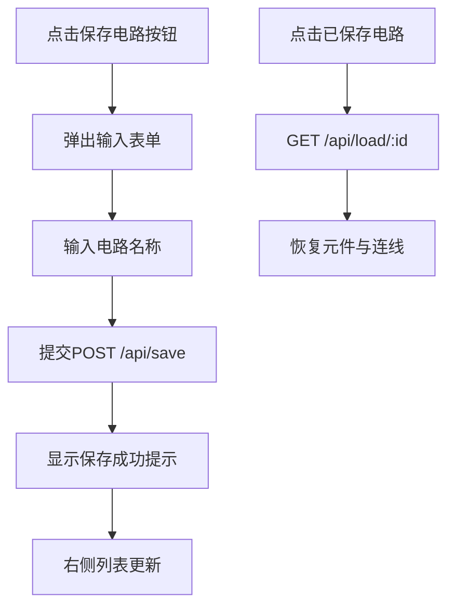

## 1. 产品概述

本产品是一个基于Web的交互式数字逻辑门仿真实验平台，面向在线教育场景，帮助学生通过可视化拖拽方式理解布尔代数与组合逻辑原理。用户可在虚拟面包板上放置、连接各种逻辑门元件，实时观察信号传递与输出结果。

- 核心目标：提供直观、交互式的数字电路学习体验，替代传统实体实验设备
- 目标用户：电子工程、计算机科学专业学生及教师，数字逻辑爱好者
- 市场价值：降低数字电路学习门槛，支持远程教学与自主学习场景

## 2. 核心特性

### 2.1 用户角色
| 角色 | 注册方式 | 核心权限 |
|------|----------|----------|
| 普通用户 | 无需注册 | 拖拽连接元件、运行仿真、使用预设模板、保存/加载电路 |

### 2.2 功能模块
1. **元件面板**：提供6种逻辑门（与门、或门、非门、与非门、或非门、异或门）、输入开关、输出指示灯
2. **面包板工作区**：支持元件拖拽放置、连线创建、右键删除、缩放控制
3. **仿真引擎**：实时计算电路输出，支持多级级联逻辑，检测回路死循环
4. **预设模板**：提供半加器、全加器、RS触发器三种典型电路模板
5. **保存与共享**：支持电路状态保存至后端，加载已保存电路

### 2.3 页面详情
| 页面名称 | 模块名称 | 功能描述 |
|----------|----------|----------|
| 主页面 | 元件面板 | 左侧展示可拖拽元件列表，底部提供预设模板按钮 |
| 主页面 | 面包板工作区 | 中央灰色区域，支持元件放置、连线交互、右键菜单 |
| 主页面 | 工具栏 | 顶部提供"保存电路"、"运行仿真"按钮，底部缩放滑块 |
| 主页面 | 右侧面板 | 展示已保存的电路列表，支持点击加载 |
| 主页面 | 弹出层 | 保存电路表单、回路警告提示、操作成功提示 |

## 3. 核心流程

### 3.1 电路创建与仿真流程
用户从左侧面板拖拽逻辑门元件到面包板 → 点击输入引脚开始连线 → 点击输出引脚完成连线 → 添加输入开关和输出指示灯 → 点击"运行仿真"按钮 → 系统计算所有门电路输出 → 指示灯更新显示状态

### 3.2 保存与加载流程
用户点击"保存电路"按钮 → 弹出表单输入名称 → 提交POST请求到后端 → 显示"已保存"提示 → 右侧面板更新保存列表 → 点击列表项加载电路 → 工作区恢复保存的元件与连线

## 4. 用户界面设计

### 4.1 设计风格
- **主色调**：苹果风格浅灰白体系，#F5F5F7面板色，#E8E8EC工作区色
- **强调色**：清新绿#4CAF50（仿真按钮）、醒目蓝#2196F3（动作元素）、暖橙#FF9800（高亮）
- **元件样式**：圆角矩形，浅绿#C8E6C9到深绿#81C784渐变背景
- **引脚样式**：输入引脚深青#00BCD4，输出引脚橙红#FF5722，圆形半径6px
- **按钮风格**：圆角8px，悬停时颜色加深，平滑过渡0.2s
- **字体**：系统字体栈，优先使用SF Pro、PingFang SC等苹果风格字体
- **布局**：三栏布局（左元件面板、中央工作区、右保存列表），顶部工具栏

### 4.2 页面设计概述
| 页面名称 | 模块名称 | UI元素 |
|----------|----------|--------|
| 主页面 | 元件面板 | 垂直排列元件卡片，拖拽预览，悬停阴影，弹簧动画 |
| 主页面 | 面包板工作区 | 灰色背景，1000×600px，元件放置位置吸附，连线贝塞尔曲线 |
| 主页面 | 工具栏 | 左侧保存按钮，右侧仿真按钮，底部缩放滑块（50%-200%） |
| 主页面 | 右侧面板 | 已保存电路卡片列表，悬停高亮，点击加载动画 |
| 主页面 | 交互反馈 | 元件放置弹簧动画，连线虚线跟随，选中闪烁，回路警告 |

### 4.3 响应式设计
- **桌面端（≥800px）**：三栏布局，元件面板固定宽度240px，右侧面板200px，中间自适应
- **移动端（<800px）**：左侧元件面板折叠为顶部滑动菜单，点击汉堡图标展开
- **触摸优化**：元件可触摸拖拽，引脚点击区域放大，连线操作支持触控
- **缩放适配**：工作区缩放滑块支持触控拖动，平滑过渡0.3s ease

### 4.4 动画与交互细节
- **元件放置**：半透明预览（不透明度0.5）→ 弹簧动画归位（0.3s easing bounce）
- **连线创建**：虚线跟随（间距4px，2px宽，#90CAF9）→ 二次贝塞尔曲线
- **元件选中**：边框高亮#2196F3，阴影扩散
- **回路警告**：元件边框红色闪烁2s，频率0.5s
- **操作提示**：绿色"已保存"提示2s自动消失
- **悬停效果**：按钮颜色加深，连线变蓝加粗，元件阴影增强
