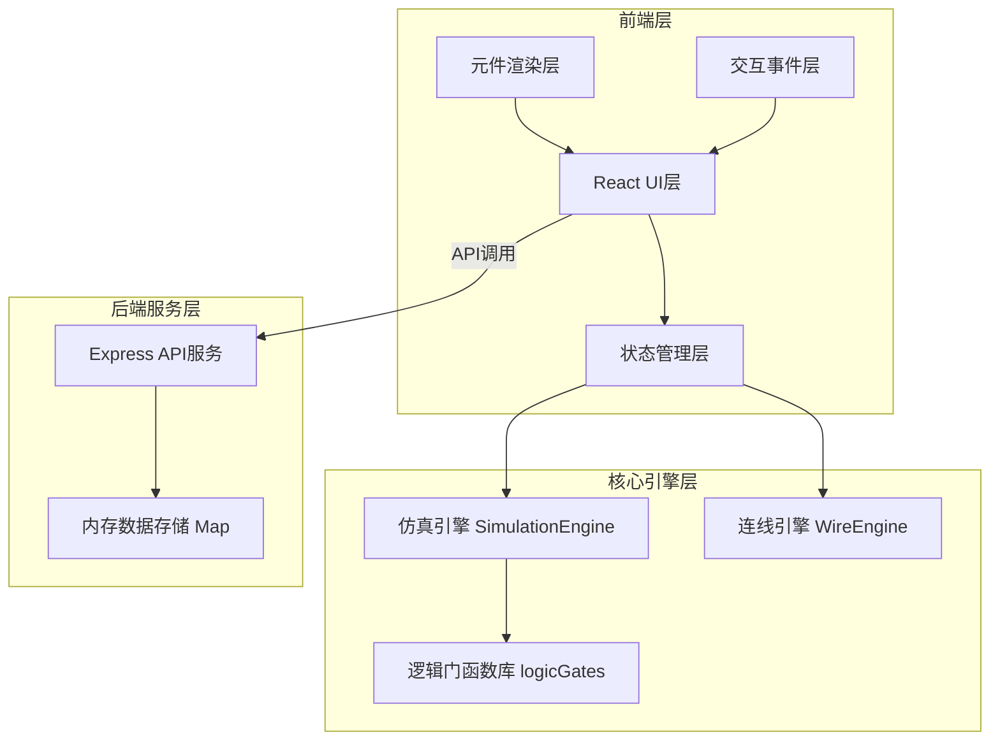

## 1. 架构设计



## 2. 技术描述

- **前端框架**：React 18 + TypeScript 5 + Vite 5
- **状态管理**：React useState/useReducer（轻量级全局状态）
- **后端框架**：Express 4 + TypeScript
- **数据存储**：内存Map（运行时存储，重启后清空）
- **构建工具**：Vite 5（开发服务器+构建）
- **HTTP客户端**：Axios 1.6
- **唯一ID生成**：UUID 9.0
- **类型定义**：@types/react 18, @types/express 4
- **样式方案**：内联样式 + CSS变量（苹果风格扁平设计）
- **动画方案**：CSS transitions + keyframes动画

## 3. 项目结构与调用关系

```
├── package.json              # 项目依赖与脚本
├── vite.config.js            # Vite构建配置（代理/api到4000端口）
├── tsconfig.json             # TypeScript配置（严格模式，ES2020）
├── index.html                # 入口HTML（#F5F5F7背景，居中根节点）
├── src/
│   ├── App.tsx               # 主应用组件（全局状态管理，数据流中枢）
│   │   ├── 接收拖拽事件 → 调用元件工厂创建元件
│   │   ├── 接收连线事件 → 调用WireEngine更新连线
│   │   ├── 触发仿真 → 调用SimulationEngine计算输出
│   │   └── 订阅引擎结果 → 更新UI状态
│   ├── components/
│   │   └── Workbench.tsx     # 面包板工作区组件
│   │       ├── 渲染元件列表（循环遍历）
│   │       ├── 渲染连线SVG（二次贝塞尔曲线）
│   │       ├── 处理鼠标拖拽放置事件
│   │       ├── 处理引脚点击连线事件
│   │       ├── 处理右键删除事件
│   │       └── 处理Delete键删除选中连线
│   ├── engine/
│   │   ├── SimulationEngine.ts  # 仿真引擎
│   │   │   ├── 接收：元件列表 + 连线列表 + 输入状态
│   │   │   ├── 拓扑排序 → 遍历计算所有门输出
│   │   │   ├── 支持多级级联逻辑
│   │   │   └── 返回：每个元件输出端状态Map
│   │   └── WireEngine.ts        # 连线引擎
│   │       ├── 接收：元件列表 + 候选连线
│   │       ├── 验证：输入引脚唯一性检查（仅允许一根连线）
│   │       ├── 检测：有向环检测（防止死循环）
│   │       └── 返回：有效连线列表 + 回路检测结果
│   └── utils/
│       └── logicGates.ts     # 逻辑门纯函数库
│           ├── AND(inputs: boolean[]): boolean
│           ├── OR(inputs: boolean[]): boolean
│           ├── NOT(inputs: boolean[]): boolean
│           ├── NAND(inputs: boolean[]): boolean
│           ├── NOR(inputs: boolean[]): boolean
│           └── XOR(inputs: boolean[]): boolean
└── server/
    └── index.ts              # Express后端服务
        ├── GET /api/templates → 返回预设模板列表
        ├── POST /api/save → 保存电路到内存Map
        └── GET /api/load/:id → 从内存Map加载电路
```

## 4. 核心数据结构

### 4.1 类型定义

```typescript
// 元件类型
type GateType = 'AND' | 'OR' | 'NOT' | 'NAND' | 'NOR' | 'XOR' | 'SWITCH' | 'LAMP';

// 引脚定义
interface Pin {
  id: string;
  type: 'input' | 'output';
  position: { x: number; y: number }; // 相对元件左上角的位置
  value?: boolean; // 仿真计算后的引脚值
}

// 元件定义
interface Component {
  id: string;
  type: GateType;
  x: number; // 面包板上的绝对X坐标
  y: number; // 面包板上的绝对Y坐标
  inputs: Pin[];
  outputs: Pin[];
  switchState?: boolean; // 仅SWITCH类型使用
  lampState?: boolean; // 仅LAMP类型使用（仿真结果）
}

// 连线定义
interface Wire {
  id: string;
  fromComponentId: string;
  fromPinId: string;
  toComponentId: string;
  toPinId: string;
}

// 仿真结果
interface SimulationResult {
  success: boolean;
  hasLoop: boolean;
  loopComponents?: string[]; // 回路上的元件ID列表
  componentOutputs?: Map<string, boolean>; // 元件ID -> 输出值
}

// 电路状态（用于保存/加载）
interface CircuitState {
  id: string;
  name: string;
  components: Component[];
  wires: Wire[];
  createdAt: number;
}

// 预设模板
interface CircuitTemplate {
  id: string;
  name: string;
  components: Component[];
  wires: Wire[];
  description: string;
}
```

### 4.2 数据流方向

```
用户操作 → Workbench.tsx → 事件回调 → App.tsx（更新状态）
    ↓
元件/连线变化 → WireEngine.validate() → 有效性检查
    ↓
点击运行仿真 → SimulationEngine.run() → logicGates.XXX()
    ↓
仿真结果 → App.tsx（更新状态）→ Workbench.tsx（重新渲染）
    ↓
UI更新（元件引脚值、灯泡状态、回路警告）
```

## 5. API 定义

### 5.1 GET /api/templates
- 描述：获取预设逻辑电路模板列表
- 响应：
```typescript
{
  success: boolean;
  data: CircuitTemplate[];
}
```

### 5.2 POST /api/save
- 描述：保存用户当前电路状态
- 请求体：
```typescript
{
  name: string;
  components: Component[];
  wires: Wire[];
}
```
- 响应：
```typescript
{
  success: boolean;
  data: {
    id: string;
    name: string;
    createdAt: number;
  };
}
```

### 5.3 GET /api/load/:id
- 描述：加载指定ID的电路状态
- 路径参数：id - 电路唯一标识
- 响应：
```typescript
{
  success: boolean;
  data: CircuitState;
}
```

### 5.4 GET /api/saved
- 描述：获取所有已保存的电路列表
- 响应：
```typescript
{
  success: boolean;
  data: Array<{
    id: string;
    name: string;
    createdAt: number;
  }>;
}
```

## 6. 服务器架构


### 6.1 模块职责
- **路由层**：定义API端点，参数校验
- **控制器层**：请求处理，响应格式化
- **服务层**：业务逻辑（模板管理、电路保存加载）
- **存储层**：内存Map数据操作

## 7. 性能优化策略

### 7.1 仿真性能
- 采用拓扑排序避免重复计算，时间复杂度O(V+E)
- 最多支持50个元件+100条连线，确保100ms内完成
- 使用Map数据结构快速查找元件和引脚

### 7.2 渲染性能
- 连线使用SVG二次贝塞尔曲线，GPU加速渲染
- 元件变化时仅重渲染受影响的组件（React.memo优化）
- 拖拽操作使用requestAnimationFrame确保60fps

### 7.3 内存管理
- 及时清理事件监听器
- 避免不必要的重渲染
- 大场景下使用虚拟列表（如保存列表很长时）

## 8. 安全考量

- 后端输入校验：防止XSS和注入攻击
- 内存存储容量限制：最多保存100个电路，防止内存溢出
- API限流：防止恶意请求
- 文件名白名单：仅允许保存合法名称的电路
