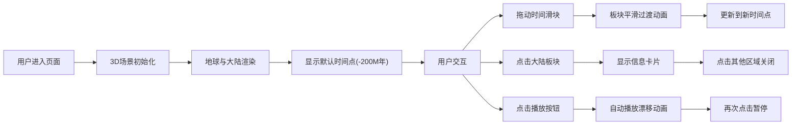

## 1. 产品概述

本项目是一个基于Three.js的交互式地壳板块运动与古大陆重建可视化工具，面向地质爱好者和学生，通过3D交互方式直观展示地球几亿年来泛大陆（Pangaea）分裂、漂移形成现代七大洲的地质演化过程。

- 目标用户：地质爱好者、学生、教育工作者
- 核心价值：将抽象的地质时间尺度转化为直观的视觉体验，帮助理解板块构造理论的学习
- 技术亮点：实时3D渲染、平滑动画过渡、交互式时间控制

## 2. 核心功能

### 2.1 功能模块

1. **3D地球场景：球体渲染、大陆轮廓贴图、边界高亮、星空背景、地球自转

2. **时间控制面板：时间滑块（-300M年 ~ 0年）、地质年代显示、平滑过渡动画

3. **板块交互系统：点击高亮、信息卡片、漂移方向箭头

4. **动画播放系统：自动播放/暂停、视角自动调整、连续动画循环

5. **路径可视化：板块移动轨迹虚线、淡出效果

### 2.2 页面详情

| 页面名称 | 模块名称 | 功能描述 |
|-----------|-------------|---------------------|
| 主页面 | 3D场景模块 | 地球渲染、大陆板块、星空背景、轨道控制 |
| 主页面 | 时间滑块模块 | 时间控制、地质年代显示、过渡动画 |
| 主页面 | 信息卡片模块 | 板块详情展示、漂移方向箭头 |
| 主页面 | 播放控制模块 | 动画播放/暂停按钮 |

## 3. 核心流程

## 4. 用户界面设计

### 4.1 设计风格

- **主色调**：冷色调为主，深蓝(#1A3A5C)、深灰(#2C3E50)、灰绿(#8B9A6E)
- **点缀色**：暖黄色(#F1C40F)、橙色(#F39C12)、红色(#E74C3C)、绿色(#27AE60)
- **背景**：纯黑星空，随机白色星点
- **按钮风格**：圆角12px，悬停变亮，点击按压效果
- **字体**：现代无衬线字体，清晰易读
- **布局**：左侧固定控制面板，右上角播放按钮，地球居中显示

### 4.2 页面设计概览

| 页面名称 | 模块名称 | UI元素 |
|-----------|-------------|-------------|
| 主页面 | 3D场景 | 深蓝球体、灰绿大陆轮廓、亮蓝边界线、星空背景 |
| 主页面 | 左侧面板 | 半透明深灰背景、水平滑块、时间显示、地质年代 |
| 主页面 | 信息卡片 | 白色背景、圆角8px、阴影模糊10px |
| 主页面 | 播放按钮 | 深蓝圆角按钮、悬停变亮 |

### 4.3 响应式设计

- 桌面端（≥1200px）：左侧面板300px宽，地球居中
- 平板端（800-1200px）：左侧面板250px宽，比例缩放
- 最小尺寸800×600px，保持地球居中

### 4.4 3D场景设计

- **环境**：纯黑星空背景，随机分布白色星点（大小1-2px，透明度0.6）
- **光照**：环境光+方向光，模拟太阳光效果
- **相机**：初始位置(0, 0, 20)，透视相机
- **地球**：半径5单位，深蓝海洋，浅灰绿大陆
- **交互**：轨道控制器支持旋转和缩放
- **动画**：地球自转（60秒一周），板块平滑过渡（5秒）
- **后处理**：抗锯齿，大陆边界光晕效果
