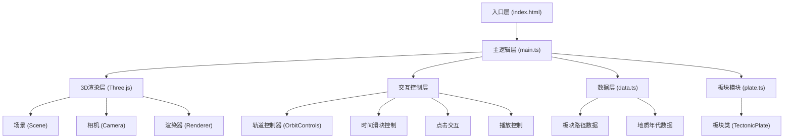

## 1. 架构设计



## 2. 技术栈说明

- **前端框架**：原生TypeScript + Three.js (无React/Vue，用户明确要求)
- **构建工具**：Vite 5.x
- **3D引擎**：Three.js 0.160.x
- **类型定义**：@types/three
- **开发语言**：TypeScript 5.x (严格模式，target ES2020)
- **UI库**：lil-gui (用于调试控制面板)
- **包管理**：npm

## 3. 项目结构

```
auto129/
├── package.json          # 项目依赖和脚本
├── index.html            # 入口HTML页面
├── vite.config.js        # Vite构建配置
├── tsconfig.json         # TypeScript配置
└── src/
    ├── main.ts           # 主逻辑入口
    ├── plate.ts          # 板块类定义
    └── data.ts           # 静态数据模块
```

## 4. 核心模块说明

### 4.1 main.ts - 主逻辑模块
- **职责**：初始化Three.js场景、相机、渲染器、轨道控制器
- **功能**：加载地球和大陆贴图，管理时间滑块和交互，驱动动画循环
- **关键方法**：
  - `initScene()` - 初始化3D场景
  - `createEarth()` - 创建地球球体
  - `createStars()` - 创建星空背景
  - `createPlates()` - 创建所有板块
  - `setupControls()` - 设置轨道控制器
  - `setupUI()` - 设置UI交互
  - `animate()` - 动画循环
  - `onTimeChange()` - 时间变化处理
  - `onPlateClick()` - 板块点击处理
  - `togglePlayback()` - 播放/暂停控制

### 4.2 plate.ts - 板块类模块
- **职责**：定义板块数据结构和行为
- **类定义**：`TectonicPlate`
- **属性**：
  - `name: string` - 板块名称
  - `area: number` - 面积（百万平方公里）
  - `driftSpeed: number` - 漂移速度（厘米/年）
  - `pathPoints: PathPoint[]` - 漂移路径点列表
  - `isHighlighted: boolean` - 高亮状态
  - `mesh: THREE.Mesh` - 3D网格
  - `border: THREE.Line` - 边界线
  - `trailLine: THREE.Line` - 轨迹虚线
- **方法**：
  - `updatePosition(time: number, duration: number)` - 更新位置（线性插值）
  - `toggleHighlight(active: boolean)` - 切换高亮
  - `showInfoCard()` - 显示信息卡片
  - `hideInfoCard()` - 隐藏信息卡片
  - `updateTrailLine()` - 更新轨迹线
  - `pulseGlow(time: number)` - 脉动光晕效果

### 4.3 data.ts - 静态数据模块
- **职责**：存储6个主要板块的初始坐标和漂移路径点，地质年代名称对应列表
- **数据结构**：
  - `plateData: PlateData[]` - 6个板块数据（北美、南美、非洲、欧亚、澳洲、南极）
  - `geologicalPeriods: GeologicalPeriod[]` - 地质年代对应表
  - 每个板块包含5个关键时间点坐标（-300M, -200M, -100M, -50M, 0M年）

## 5. 关键技术实现

### 5.1 地球渲染
- 使用`THREE.SphereGeometry`创建球体，半径5单位
- 深蓝海洋材质：`#1A3A5C`
- 大陆使用`THREE.ShapeGeometry`创建简化轮廓
- 边界线使用`THREE.LineSegments`，线宽自适应

### 5.2 平滑过渡动画
- 时间滑块每变化10百万年触发5秒平滑过渡
- 使用线性插值（lerp）计算中间位置
- 结合`requestAnimationFrame`实现60fps动画
- 过渡期间添加脉动光晕效果（`#F39C12`，周期0.8秒）

### 5.3 交互系统
- 使用`THREE.Raycaster`实现射线检测点击
- 信息卡片使用HTML DOM元素，CSS绝对定位
- 轨迹虚线使用`THREE.LineDashedMaterial`

### 5.4 性能优化
- 复用几何体和材质
- 使用`BufferGeometry`替代`Geometry`
- 限制动画帧率≥50fps
- 合理使用`matrixAutoUpdate`

## 6. 数据模型

### 6.1 路径点数据结构
```typescript
interface PathPoint {
  time: number;           // 时间（百万年，负数表示过去）
  position: [number, number, number];  // 3D位置坐标（球面坐标转换）
  rotation: [number, number, number];  // 欧拉角旋转
}
```

### 6.2 板块数据结构
```typescript
interface PlateData {
  id: string;
  name: string;
  area: number;           // 百万平方公里
  driftSpeed: number;     // 厘米/年
  color: string;
  pathPoints: PathPoint[];
  outlinePoints: [number, number][];  // 简化轮廓经纬度点
}
```

### 6.3 地质年代数据
```typescript
interface GeologicalPeriod {
  name: string;           // 名称（如"侏罗纪"）
  startTime: number;      // 开始时间（百万年）
  endTime: number;        // 结束时间（百万年）
}
```
