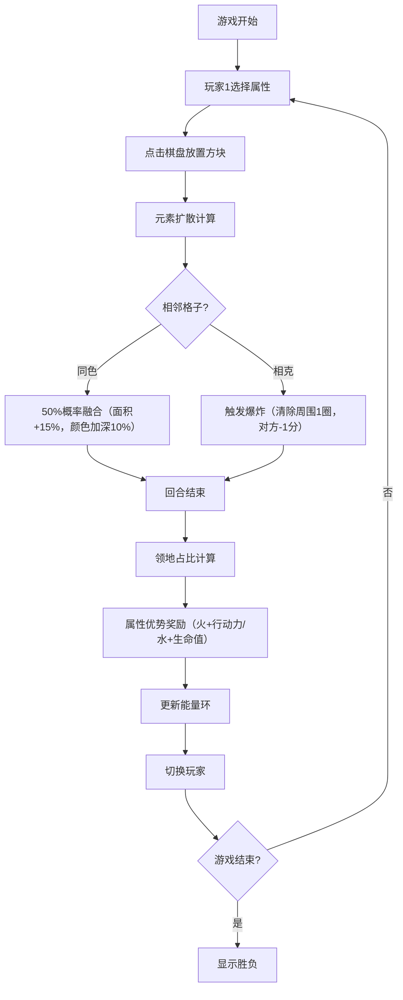

## 1. 产品概述

六边形魔法方块策略游戏是一款基于元素克制与地形争夺的回合制对战游戏，玩家通过在12x12六边形网格上放置不同属性的魔法方块来扩张领地、触发元素连锁反应，体验策略博弈的乐趣。

- **核心目标**：为策略爱好者提供无需面对面互动也能体验的回合制竞技乐趣
- **目标用户**：策略游戏爱好者、桌面游戏玩家
- **核心玩法**：放置方块 → 元素扩散/融合/爆炸 → 领地计算 → 能量恢复

## 2. 核心功能

### 2.1 用户角色
| 角色 | 注册方式 | 核心权限 |
|------|----------|----------|
| 玩家1/玩家2 | 本地双人对战 | 轮流放置方块、查看分数与能量 |

### 2.2 功能模块
1. **游戏主界面**：六边形棋盘、玩家信息面板、属性能量环、回合指示
2. **方块放置系统**：四种属性选择、点击放置、脉冲动画
3. **元素反应系统**：同色融合、相克爆炸、连锁计算
4. **领地与能量系统**：领地占比计算、属性优势奖励、能量环可视化
5. **分数与胜负系统**：爆炸扣分、回合结算、游戏结束判定

### 2.3 页面详情
| 页面名称 | 模块名称 | 功能描述 |
|----------|----------|----------|
| 游戏主界面 | 六边形棋盘 | 12x12网格渲染、点击检测、放置/融合/爆炸动画 |
| 游戏主界面 | 玩家信息面板 | 分数显示、能量条、行动力、生命值 |
| 游戏主界面 | 属性能量环 | 饼图展示四种属性领地占比（半径60px） |
| 游戏主界面 | 回合指示 | 当前玩家回合提示、属性选择 |

## 3. 核心流程

玩家选择属性 → 点击棋盘格子放置方块 → 触发元素扩散（同色融合/相克爆炸） → 回合结束结算 → 领地占比计算 → 能量恢复 → 切换玩家

## 4. 用户界面设计

### 4.1 设计风格
- **整体风格**：深邃神秘的魔法主题，深紫灰渐变背景
- **主色调**：深紫灰渐变（#2C1A4D 到 #1A0D36）
- **属性色**：
  - 火：橙红至亮黄渐变（#FF4500 到 #FFD700）
  - 水：深蓝至天蓝渐变（#0000CD 到 #00BFFF）
  - 土：棕至橄榄绿渐变（#8B4513 到 #6B8E23）
  - 风：银灰至淡青渐变（#C0C0C0 到 #E0F7FA）
- **视觉效果**：毛玻璃面板、晶莹质感方块、粒子光晕、爆炸动画
- **字体**：现代无衬线字体，清晰易读

### 4.2 页面设计概述
| 页面名称 | 模块名称 | UI元素 |
|----------|----------|--------|
| 游戏主界面 | 六边形棋盘 | 深紫灰背景、半透明白边框、晶莹质感内六边形、脉冲/融合/爆炸动画 |
| 游戏主界面 | 玩家信息面板 | 毛玻璃背景（backdrop-filter: blur(10px)）、渐变能量条、分数数字 |
| 游戏主界面 | 属性能量环 | 半径60px饼图、四色渐变展示、中心数值 |
| 游戏主界面 | 布局结构 | 左侧玩家1信息 + 中央棋盘+能量环 + 右侧玩家2信息 |

### 4.3 响应式
- **桌面优先**：适配 1440x900 和 1280x720 两种分辨率
- **布局策略**：使用相对定位与百分比布局，棋盘居中自适应
- **交互优化**：鼠标点击放置，悬停预览

### 4.4 动画与特效
- **放置动画**：0.3秒脉冲膨胀（缩放1.05倍后回弹）
- **融合动画**：粒子光晕（20粒子，随机扩散，1秒消失）
- **爆炸动画**：冲击波效果，被波及格子渐隐
- **能量环**：平滑过渡动画
