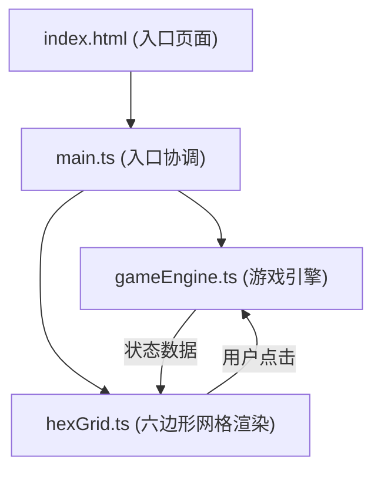

## 1. 架构设计



## 2. 技术描述

- **前端技术栈**：TypeScript + 原生 JavaScript + Canvas API（无框架）
- **构建工具**：Vite
- **开发语言**：TypeScript（严格模式，target ES2020）
- **渲染方式**：HTML5 Canvas 2D
- **项目类型**：纯前端单机游戏

### 技术选型说明
- **无框架**：用户明确要求使用原生JavaScript，避免框架开销
- **Canvas 2D**：六边形网格和粒子动画使用Canvas渲染性能最佳
- **TypeScript**：提供类型安全，提升代码可维护性
- **Vite**：快速的开发服务器和构建工具

## 3. 文件结构

| 文件路径 | 用途 |
|----------|------|
| `package.json` | 项目依赖与脚本配置 |
| `index.html` | 入口页面，全屏深色背景，居中Canvas |
| `vite.config.js` | Vite构建配置，端口3000 |
| `tsconfig.json` | TypeScript配置，严格模式，ES2020 |
| `src/main.ts` | 入口文件，初始化场景、事件绑定、游戏循环 |
| `src/gameEngine.ts` | 游戏引擎：回合逻辑、元素扩散、连锁反应、分数统计 |
| `src/hexGrid.ts` | 六边形网格：坐标生成、格子渲染、点击检测、动画播放 |

## 4. 数据模型

### 4.1 核心类型定义

```typescript
// 元素类型
type ElementType = 'fire' | 'water' | 'earth' | 'wind';

// 玩家ID
type PlayerId = 1 | 2;

// 六边形格子坐标（轴向坐标系）
interface HexCoord {
  q: number;  // 列
  r: number;  // 行
}

// 格子状态
interface HexCell {
  coord: HexCoord;
  owner: PlayerId | null;       // 所属玩家
  element: ElementType | null;  // 元素类型
  level: number;                // 融合等级（影响面积和颜色）
  isExploding: boolean;         // 是否正在爆炸
  explosionTime: number;        // 爆炸动画时间
}

// 玩家状态
interface PlayerState {
  id: PlayerId;
  score: number;       // 分数
  energy: number;      // 能量值
  maxEnergy: number;   // 最大能量
  actionPoints: number; // 行动力
  health: number;      // 生命值
  maxHealth: number;   // 最大生命值
}

// 游戏状态
interface GameState {
  grid: HexCell[][];           // 12x12 网格
  currentPlayer: PlayerId;     // 当前玩家
  selectedElement: ElementType | null; // 当前选中的元素
  players: { [key in PlayerId]: PlayerState };
  turn: number;                // 回合数
  isAnimating: boolean;        // 是否正在播放动画
}

// 粒子效果
interface Particle {
  x: number;
  y: number;
  vx: number;
  vy: number;
  life: number;
  maxLife: number;
  color: string;
  size: number;
}
```

### 4.2 元素克制关系

```
火克风 (Fire > Wind)
风克土 (Wind > Earth)
土克水 (Earth > Water)
水克火 (Water > Fire)
```

## 5. 核心算法

### 5.1 六边形坐标系统
- 使用轴向坐标系 (q, r)
- 12x12 偏移网格（odd-r 或 even-r 偏移）
- 像素坐标转换：pointy-top 六边形

### 5.2 元素扩散算法
1. 放置方块后，检查相邻6个格子
2. 对每个相邻格子：
   - 同色同玩家：50%概率融合，等级+1
   - 相克属性：触发爆炸
   - 其他情况：无反应

### 5.3 爆炸算法
1. 爆炸中心格子被清除
2. 周围1圈（6个相邻格子）被清除
3. 每个被清除的格子扣除对方玩家1分
4. 可能触发连锁爆炸

### 5.4 领地占比计算
1. 统计每个玩家的所有格子数量
2. 按元素类型分类统计
3. 计算各元素占比
4. 火属性占优：每回合恢复1点行动力
5. 水属性占优：每回合恢复1点生命值

## 6. 性能指标

- **每回合计算时间**：≤ 150ms（不含用户操作等待）
- **渲染帧率**：60fps
- **动画流畅度**：放置/融合/爆炸动画平滑无卡顿
- **内存占用**：合理控制粒子数量

## 7. 动画系统

### 7.1 放置动画
- 持续时间：0.3秒
- 效果：脉冲膨胀，缩放1.05倍后回弹
- 缓动函数：ease-out

### 7.2 融合动画
- 粒子数量：20个
- 持续时间：1秒
- 效果：随机向四周扩散，逐渐消失
- 颜色：对应元素的亮色

### 7.3 爆炸动画
- 冲击波效果
- 被波及格子渐隐
- 持续时间：0.5秒

## 8. 构建与运行

### 启动命令
```bash
npm install
npm run dev
```

### 构建命令
```bash
npm run build
```

### 开发端口
- 端口：3000
- 入口：index.html
