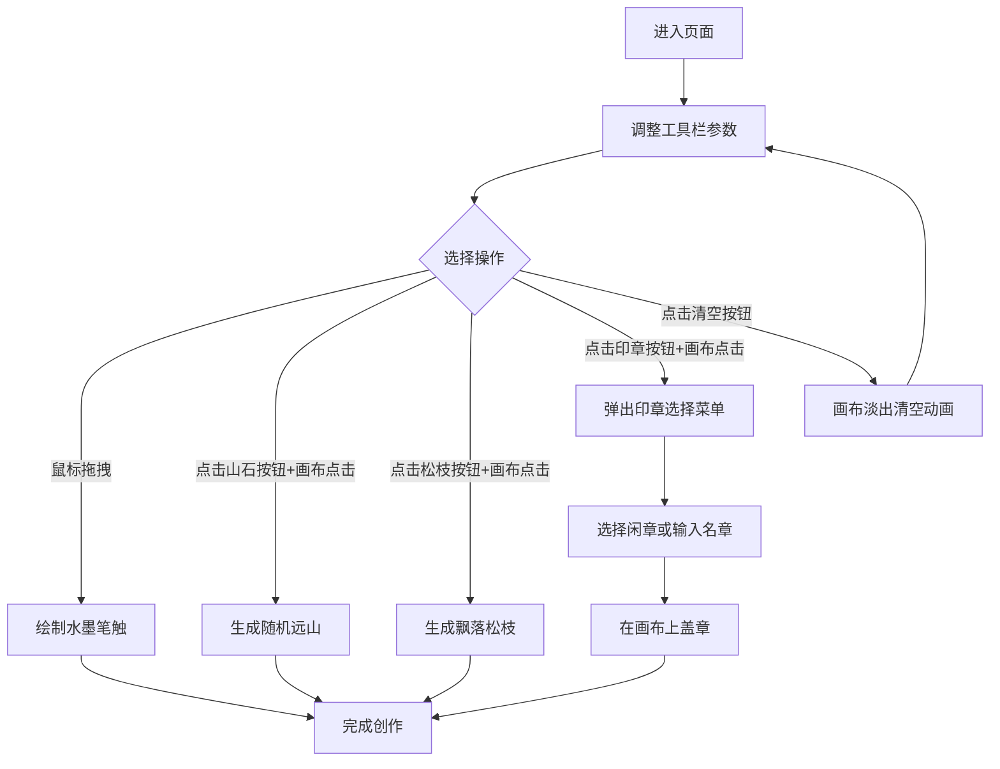

## 1. 产品概述

基于Canvas的交互式中国水墨画风格生成器，让用户通过鼠标拖拽在画布上"泼墨"创作数字水墨画。
- 主要目的：提供沉浸式的数字水墨创作体验，模拟宣纸晕染、笔触变化等传统水墨效果
- 目标用户：艺术爱好者、中国传统文化爱好者、数字绘画创作者
- 产品价值：降低传统水墨画创作门槛，让更多人体验中国传统艺术的魅力

## 2. 核心功能

### 2.1 功能模块
1. **主画布区域**：宣纸质感画布，支持鼠标拖拽绘制水墨笔触
2. **顶部工具栏**：墨色浓淡滑块、笔触大小滑块、山石/松枝/印章工具按钮
3. **清空画布功能**：带动画效果的画布清空
4. **场景元素生成**：远山、松枝、印章的随机生成与渲染

### 2.2 页面详情
| 页面名称 | 模块名称 | 功能描述 |
|-----------|-------------|---------------------|
| 主页面 | 画布区域 | 900x600px宣纸质感画布，米白色#F5F0E1背景带细麻布纹理，支持鼠标拖拽绘制水墨笔触 |
| 主页面 | 顶部工具栏 | 仿古卷轴式设计，墨色浓淡滑块(1-10)、笔触大小滑块(2-20px)、山石/松枝/印章按钮 |
| 主页面 | 清空按钮 | 点击时画布由中心向四周淡出动画变白 |
| 主页面 | 印章弹窗 | 半透明羊皮纸色浮动菜单，支持闲章/名章选择和自定义文本 |

## 3. 核心流程

用户进入页面后看到宣纸画布和工具栏，可通过以下流程创作：
1. 调整墨色浓淡和笔触大小参数
2. 按住鼠标左键在画布上拖拽绘制水墨笔触
3. 点击工具按钮后在画布上点击位置添加山石、松枝或印章
4. 可随时清空画布重新创作

## 4. 用户界面设计

### 4.1 设计风格
- **主色调**：米白色#F5F0E1（宣纸）、深褐色#4A3B32（文字）、正红色#CC0000（印章）、墨色渐变#000000至#3C2415
- **按钮样式**：仿古卷轴式，悬停时背景从#D4C5A9渐变为#C4B593，圆角过渡
- **字体**：毛笔字体风格图标，篆书风格印章文字，深褐色文字
- **布局**：四周3:4比例留白区域，画布居中带1px木质画框边框#8B7355，底部仿古宣纸纹理按钮栏
- **动画风格**：水墨晕染渐变、涟漪扩散、飘落动画，整体追求自然雅致

### 4.2 页面设计概述
| 页面名称 | 模块名称 | UI元素 |
|-----------|-------------|-------------|
| 主页面 | 画布区域 | 米白色宣纸背景、细麻布纹理、木质画框边框、水墨笔触晕染效果 |
| 主页面 | 顶部工具栏 | 仿古卷轴样式、两个滑块控件、三个毛笔字体按钮、悬停渐变效果 |
| 主页面 | 清空按钮 | 右侧独立按钮、淡出动画触发 |
| 主页面 | 印章弹窗 | 半透明羊皮纸色背景#FDF5E6、圆角8px、1px边框#D4C5A9 |

### 4.3 响应式设计
- **桌面端优先**：默认画布900x600px，保持16:10宽高比
- **窗口小于1024px**：画布自动等比缩放，内部笔触和元素按比例缩小
- **最小字号**：印章和按钮文字最小不低于12px
- **触摸优化**：支持鼠标事件（mousedown、mousemove、mouseup、click）

### 4.4 性能要求
- 帧率稳定60FPS，每帧渲染时间不超过16ms
- 持续拖拽绘图无卡顿
- 场景元素渲染总耗时不超过500ms
- 鼠标事件响应无延迟
