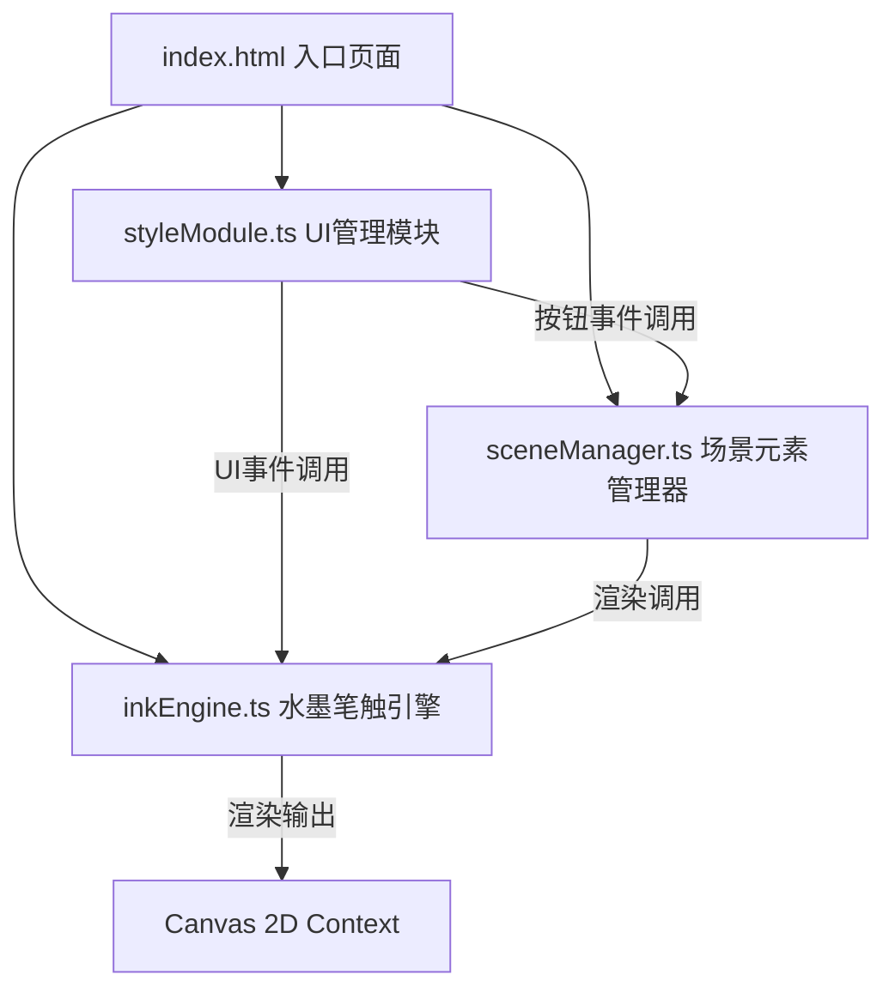

## 1. 架构设计



## 2. 技术描述
- **前端框架**：原生 TypeScript + 原生 JavaScript（无框架依赖，按用户需求）
- **构建工具**：Vite 5.x，端口3000
- **渲染技术**：HTML5 Canvas 2D API
- **字体**：通过@font-face加载篆书字体和毛笔字体
- **样式**：原生CSS实现中国风视觉效果和响应式布局

## 3. 文件结构
| 文件路径 | 用途 |
|----------|------|
| package.json | 项目依赖和启动脚本（typescript, vite） |
| index.html | 入口页面，搭载Canvas和字体引用 |
| vite.config.js | Vite构建配置，端口3000 |
| tsconfig.json | TypeScript配置，严格模式，target ES2020 |
| src/inkEngine.ts | 水墨笔触核心引擎：画布渲染循环、笔触生成、晕染算法 |
| src/sceneManager.ts | 场景元素管理器：山石、松枝、印章的生成与渲染 |
| src/styleModule.ts | 样式与UI管理模块：工具栏、滑块、动画、响应式缩放 |

## 4. 模块数据流定义

### 4.1 inkEngine.ts 接口定义
```typescript
interface InkEngine {
  init(canvas: HTMLCanvasElement): void;
  setInkDensity(level: number): void;      // 1-10
  setBrushSize(size: number): void;         // 2-20px
  startStroke(x: number, y: number, speed: number): void;
  moveStroke(x: number, y: number, speed: number): void;
  endStroke(): void;
  clearWithAnimation(): Promise<void>;
  getContext(): CanvasRenderingContext2D;
  resize(scale: number): void;
}
```

### 4.2 sceneManager.ts 接口定义
```typescript
interface SceneManager {
  init(inkEngine: InkEngine): void;
  createMountain(x: number, y: number): void;   // 随机远山
  createPineBranch(x: number, y: number): void; // 松枝飘落
  openStampMenu(x: number, y: number): void;    // 打开印章菜单
  createStamp(x: number, y: number, text: string, type: 'leisure' | 'name'): void;
}
```

### 4.3 styleModule.ts 接口定义
```typescript
interface StyleModule {
  init(): void;
  onInkDensityChange(callback: (value: number) => void): void;
  onBrushSizeChange(callback: (value: number) => void): void;
  onToolSelect(callback: (tool: 'mountain' | 'pine' | 'stamp' | null) => void): void;
  onClearCanvas(callback: () => void): void;
  showStampMenu(x: number, y: number, onConfirm: (text: string, type: 'leisure' | 'name') => void): void;
  getCanvasScale(): number;
  bindResponsive(): void;
}
```

## 5. 核心算法

### 5.1 水墨笔触算法
- 根据鼠标移动速度动态调整线宽（越快越细越淡）和透明度
- 使用多点随机偏移模拟边缘不规则毛刺效果
- 笔触尾部0.2秒内透明度渐变模拟宣纸吸墨
- 松开鼠标后0.5秒边缘扩散渲染形成水渍涟漪

### 5.2 远山生成算法
- 贝塞尔曲线绘制随机轮廓
- 线性渐变填充#4A6741到#2F4F2F，透明度0.7
- 山体尺寸随机（横向150-300px，纵向80-150px）
- 0.4秒从模糊到清晰淡入动画

### 5.3 松枝生成算法
- 细线绘制枝干（颜色#2B1B0E，线宽1-2px）
- 短线段散点排列针叶（颜色#3A5F0B，透明度0.8）
- 1秒内从上方飘落动画，带水平颤动效果

### 5.4 印章渲染算法
- 正红色#CC0000矩形（宽40-80px，高40-60px，边框1.5px）
- 篆书字体渲染文字
- 0.5秒从中心向外透明度0.4到0的朱砂洇散效果

## 6. 性能优化策略
- 使用requestAnimationFrame实现稳定60FPS渲染循环
- 离屏Canvas预渲染宣纸纹理和静态元素
- 笔触分段渲染，避免每帧全量重绘
- 对象池复用绘制点数据，减少GC压力
- 响应式缩放采用CSS transform配合内部坐标系换算
