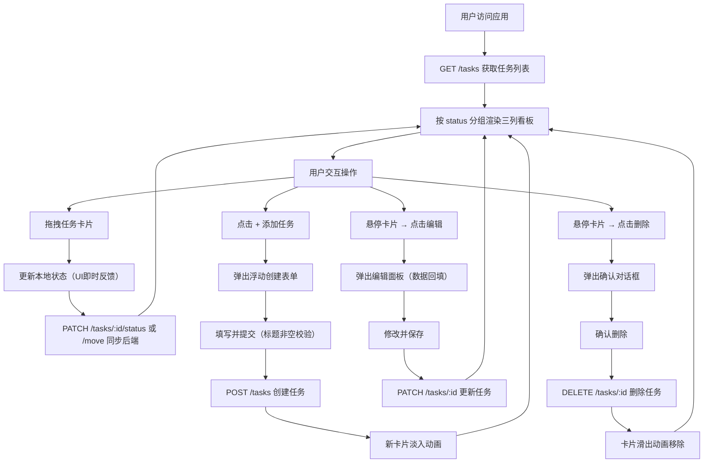

## 1. 产品概述

FlowBoard 是一款面向独立开发者和小团队的轻量级任务看板应用，旨在项目初期快速搭建简洁高效的任务管理环境，避免臃肿功能和复杂配置带来的使用门槛。

- 核心目的：提供直观的三列看板（待办/进行中/完成），通过拖拽交互管理任务状态与优先级
- 目标用户：独立开发者、初创团队、产品经理、设计师等需要快速可视化任务进度的人群
- 产品价值：无需注册配置、零学习成本、开箱即用的任务协作体验

## 2. 核心功能

### 2.1 功能模块

1. **看板主页**：三列看板布局、任务卡片展示、拖拽排序、实时数据同步
2. **任务管理**：创建任务、编辑任务、删除任务、任务详情展开收起
3. **属性管理**：负责人分配、优先级标签、状态变更

### 2.2 页面详情

| 页面名称 | 模块名称 | 功能描述 |
|---------|---------|---------|
| 看板主页 | 顶部导航栏 | 应用Logo标题、快捷新建任务按钮、页面标题展示 |
| 看板主页 | 待办列 | 列标题与任务计数、Droppable拖拽区域、"添加任务"按钮、纵向滚动容器 |
| 看板主页 | 进行中列 | 列标题与任务计数、Droppable拖拽区域、"添加任务"按钮、纵向滚动容器 |
| 看板主页 | 完成列 | 列标题与任务计数、Droppable拖拽区域、"添加任务"按钮、纵向滚动容器 |
| 看板主页 | 任务卡片 | 标题展示、描述截断与展开、负责人标签、优先级标签、悬停编辑/删除按钮 |
| 看板主页 | 创建表单 | 浮动弹窗、标题输入（必填校验）、描述文本域、负责人下拉、优先级下拉、取消/确认按钮 |
| 看板主页 | 编辑面板 | 内联表单、原有数据回填、字段修改保存、取消编辑 |
| 看板主页 | 删除确认 | 确认对话框、任务名称提示、取消/确认操作 |

## 3. 核心流程

### 3.1 主要用户流程描述

用户访问应用后，系统自动从后端加载所有任务数据并按列归属渲染到看板三列中。用户可以：
1. **查看任务**：浏览各列任务卡片，点击卡片右下"展开"查看完整描述
2. **移动任务**：拖拽卡片在列内调整顺序，或跨列变更状态，松开后自动同步后端
3. **创建任务**：点击列底"+ 添加任务"按钮，填写表单后卡片淡入列顶
4. **编辑任务**：悬停卡片出现编辑按钮，点击修改任务属性后保存
5. **删除任务**：悬停卡片出现删除按钮，点击确认后卡片滑出移除

### 3.2 核心流程图

## 4. 用户界面设计

### 4.1 设计风格

- **主色调**：淡蓝色 `#3B82F6`，用于交互元素、拖拽指示器、强调色
- **背景色**：页面背景 `#F0F2F5`，列背景 `#F9FAFB`，卡片/表单背景 `#FFFFFF`
- **辅助色**：
  - 负责人标签 `#E3F2FD`（淡蓝）
  - 高优先级 `#FFCDD2`（淡红）
  - 中优先级 `#C8E6C9`（淡绿）
  - 低优先级 `#FFF9C4`（淡黄）
  - 删除按钮 `#EF4444`，编辑按钮 `#6B7280`
- **边框分隔**：列间分隔线 `#D1D5DB`，1px 实线
- **按钮风格**：圆角矩形，悬停背景色加深，CSS过渡动画
- **字体**：系统无衬线字体栈 `-apple-system, BlinkMacSystemFont, 'Segoe UI', Roboto`
- **布局风格**：卡片式布局，顶部固定导航栏，看板区域居中，三列横向排列
- **图标风格**：Lucide React 线性图标（铅笔、垃圾桶等）

### 4.2 页面设计概览

| 页面名称 | 模块名称 | UI元素设计 |
|---------|---------|---------|
| 看板主页 | 顶部导航栏 | 固定顶部，白色背景，底部阴影，左侧"FlowBoard"标题（蓝色粗体），右侧"+ 新建任务"圆角按钮 |
| 看板主页 | 看板列 | 最小宽度280px自适应，`#F9FAFB`背景，圆角8px，最大高度80vh，内部纵向滚动，列头固定显示标题+任务计数 |
| 看板主页 | 任务卡片 | 圆角8px，白色背景，阴影`0 2px 4px rgba(0,0,0,0.05)`，悬停向右平移2px+阴影加深至`0 4px 12px`，CSS过渡0.2s |
| 看板主页 | 优先级标签 | 圆角矩形，文字小写，色块背景（高/中/低对应红/绿/黄），颜色切换平滑过渡 |
| 看板主页 | 创建表单 | 浮动定位，白色背景，圆角12px，阴影`0 8px 24px`，输入框边框淡灰，聚焦时蓝色边框 |
| 看板主页 | 添加按钮 | 淡蓝色文字`#E0F2FE`，hover变为深蓝`#3B82F6`，下划线动画，位于列底 |
| 看板主页 | 删除确认框 | 居中遮罩弹出，白色背景圆角12px，任务名称加粗显示，取消按钮灰色，确认按钮红色 |

### 4.3 响应式设计

- **桌面端（≥768px）**：三列横向并排布局，列间距16px，看板区域居中
- **移动端（<768px）**：
  - 看板变为垂直堆叠布局
  - 顶部增加列标签切换栏（待办/进行中/完成）
  - 同一时间只显示一列，支持左右滑动或点击标签切换
  - 卡片宽度占满容器，表单宽度自适应屏幕

### 4.4 动画与交互

- **拖拽效果**：拖拽中卡片 opacity 0.7 半透明，蓝色圆形占位指示器（半径4px）跟随
- **创建动画**：新卡片淡入（opacity 0→1，持续0.3秒）
- **删除动画**：卡片向左滑出（translateX(-100px)，opacity 0，持续0.3秒）
- **展开收起**：描述区域高度动画平滑过渡
- **状态过渡**：所有拖拽、悬停、颜色切换使用 `transition: all 0.2s ease`
- **优先级标签**：高/中/低颜色切换采用CSS平滑过渡
