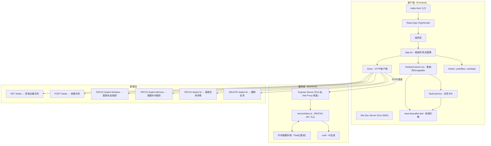
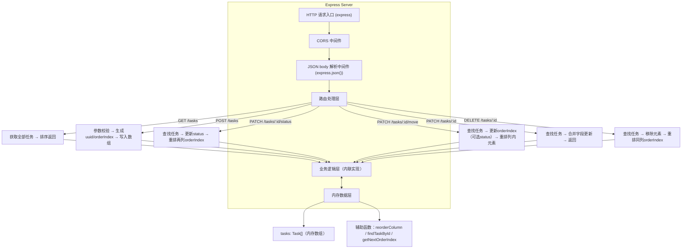
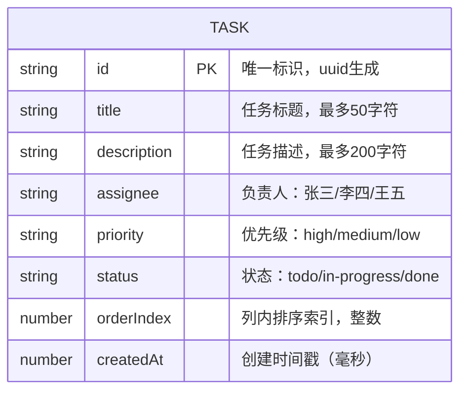

## 1. 架构设计



## 2. 技术栈说明

- **前端构建**：Vite 5.x（热更新、快速构建）
- **前端框架**：React 18 + TypeScript 5.x（严格模式 strict）
- **前端入口**：index.html → client/src/App.tsx
- **后端框架**：Express 4.x + TypeScript
- **后端入口**：server/index.ts
- **状态管理**：React Hooks（useState + useEffect），无需额外状态库
- **拖拽库**：@hello-pangea/dnd（react-beautiful-dnd 的维护分支，React 18 兼容）
- **HTTP客户端**：Axios 1.x
- **ID生成**：uuid 9.x
- **类型定义**：@types/react、@types/react-dom、@types/express、@types/node
- **编译目标**：ES2020，严格类型检查

## 3. 路由定义

| 路由 | 用途 |
|-----|------|
| / | 看板主页（单页应用，唯一页面） |
| GET /tasks | 获取所有任务列表（按列分组） |
| POST /tasks | 创建新任务 |
| PATCH /tasks/:id/status | 更新任务列归属（status）和全局顺序 |
| PATCH /tasks/:id/move | 调整任务在同一列内的顺序（orderIndex） |
| PATCH /tasks/:id | 更新任务详情（标题、描述、负责人、优先级） |
| DELETE /tasks/:id | 删除指定任务 |

## 4. API 接口定义

### 4.1 类型定义

```typescript
// 任务状态枚举
type TaskStatus = 'todo' | 'in-progress' | 'done';

// 优先级枚举
type Priority = 'high' | 'medium' | 'low';

// 任务数据模型
interface Task {
  id: string;
  title: string;           // 最大50字符
  description: string;     // 最大200字符
  assignee: string;        // 负责人：张三/李四/王五
  priority: Priority;
  status: TaskStatus;
  orderIndex: number;      // 列内排序索引
  createdAt: number;       // 时间戳
}

// 创建任务请求体
interface CreateTaskDTO {
  title: string;           // 必填，非空
  description?: string;
  assignee?: string;
  priority?: Priority;
  status: TaskStatus;
}

// 更新任务状态请求体
interface UpdateStatusDTO {
  status: TaskStatus;
  orderIndex: number;
}

// 移动任务顺序请求体
interface MoveTaskDTO {
  orderIndex: number;
  // 可选：如果跨列移动则包含 status
  status?: TaskStatus;
}

// 更新任务详情请求体
interface UpdateTaskDTO {
  title?: string;
  description?: string;
  assignee?: string;
  priority?: Priority;
}

// 通用响应格式
interface ApiResponse<T> {
  success: boolean;
  data: T;
  message?: string;
}
```

### 4.2 API 详细定义

#### GET /tasks
- **响应**：`ApiResponse<Task[]>` - 返回所有任务数组，按 status + orderIndex 预排序
- **示例**：`{ success: true, data: [{ id, title, status, orderIndex, ... }, ...] }`

#### POST /tasks
- **请求体**：`CreateTaskDTO` - title 必填，其余可选
- **响应**：`ApiResponse<Task>` - 返回创建后的完整任务对象（含生成的id和orderIndex）
- **校验**：title.trim() 非空，否则返回 400 错误

#### PATCH /tasks/:id/status
- **路径参数**：id - 任务ID
- **请求体**：`UpdateStatusDTO` - status + orderIndex
- **响应**：`ApiResponse<Task[]>` - 返回更新后的全量任务列表（便于前端重置状态）
- **逻辑**：将任务从原列移到目标列，调整两列其他任务的 orderIndex

#### PATCH /tasks/:id/move
- **路径参数**：id - 任务ID
- **请求体**：`MoveTaskDTO` - orderIndex（可选 status）
- **响应**：`ApiResponse<Task[]>` - 返回全量任务列表
- **逻辑**：同列内重排序，或跨列移动并调整 orderIndex

#### PATCH /tasks/:id
- **路径参数**：id - 任务ID
- **请求体**：`UpdateTaskDTO` - 任意字段组合（title/description/assignee/priority）
- **响应**：`ApiResponse<Task>` - 返回更新后的任务对象
- **校验**：如果提供 title，则必须非空

#### DELETE /tasks/:id
- **路径参数**：id - 任务ID
- **响应**：`ApiResponse<{ deletedId: string }>`
- **逻辑**：从数组中移除任务，调整同列后续任务的 orderIndex

## 5. 服务端架构图



## 6. 数据模型

### 6.1 数据模型定义（ER 图）



### 6.2 初始演示数据

服务端启动时内置以下演示数据，便于即时体验：

```typescript
const initialTasks: Task[] = [
  {
    id: '1', title: '设计登录页面UI原型',
    description: '根据最新的产品需求文档，完成登录页面的高保真设计稿，包含移动端和桌面端两个版本。注意配色方案需与主应用保持一致，遵循设计规范。',
    assignee: '张三', priority: 'high', status: 'todo',
    orderIndex: 0, createdAt: Date.now() - 86400000
  },
  {
    id: '2', title: '编写用户认证模块API文档',
    description: '整理登录、注册、找回密码等接口的详细文档，包含请求参数、响应示例和错误码。',
    assignee: '李四', priority: 'medium', status: 'todo',
    orderIndex: 1, createdAt: Date.now() - 82800000
  },
  {
    id: '3', title: '完成看板拖拽功能开发',
    description: '基于 react-beautiful-dnd 实现任务卡片的列内和列间拖拽排序。',
    assignee: '王五', priority: 'high', status: 'in-progress',
    orderIndex: 0, createdAt: Date.now() - 72000000
  },
  {
    id: '4', title: '项目环境搭建',
    description: '使用 Vite + React + TypeScript 初始化项目结构，配置开发服务器和代码规范工具。',
    assignee: '张三', priority: 'low', status: 'done',
    orderIndex: 0, createdAt: Date.now() - 172800000
  }
];
```

## 7. 文件结构与调用关系

```
auto134/
├── package.json                    # 项目根依赖配置（前端+后端）
├── vite.config.js                  # Vite构建配置，代理 /api 到 Express
├── tsconfig.json                   # TypeScript 配置（strict + ES2020）
├── index.html                      # 前端入口页面
│
├── server/
│   └── index.ts                    # Express服务，提供REST API
│       ▲
│       │ 被 vite.config.js 的 proxy 代理
│
└── client/
    └── src/
        ├── App.tsx                 # 根组件，挂载时 fetch('/tasks')
        │   ├── 使用 useState 管理 tasks: Task[]
        │   ├── useEffect 初始化数据
        │   ├── 定义 handleDragEnd() → 调 PATCH API
        │   ├── 定义 handleCreateTask() → 调 POST API
        │   ├── 定义 handleUpdateTask() → 调 PATCH API
        │   ├── 定义 handleDeleteTask() → 调 DELETE API
        │   │
        │   └── 渲染 <DragDropContext>
        │       └── 渲染 3 × <KanbanColumn>
        │
        ├── components/
        │   ├── KanbanColumn.tsx    # 看板列组件
        │   │   ├── Props: { status, title, tasks, onTaskDrop, onAddTask }
        │   │   ├── 渲染 <Droppable>
        │   │   ├── 列头（标题 + 任务计数badge）
        │   │   ├── 任务卡片列表（纵向滚动区）
        │   │   ├── 列底 "+ 添加任务" 按钮
        │   │   └── 悬停时显示创建表单
        │   │       └── 渲染若干 <TaskCard>
        │   │
        │   └── TaskCard.tsx        # 任务卡片组件
        │       ├── Props: { task, onEdit, onDelete }
        │       ├── 渲染 <Draggable>
        │       ├── 标题（最大50字符截断）
        │       ├── 描述（默认2行截断 + 展开/收起动画）
        │       ├── 负责人标签（#E3F2FD 背景）
        │       ├── 优先级标签（红/绿/黄 色块）
        │       ├── 悬停显示：编辑按钮(铅笔#6B7280) + 删除按钮(垃圾桶#EF4444)
        │       └── 编辑状态：内联表单（标题/描述/负责人/优先级）
        │
        └── types/  (可选，内联也行)
            └── index.ts            # Task、Priority、TaskStatus 类型定义
```

**调用关系与数据流向**：
1. `App.tsx` → `useEffect` → `axios.get('/api/tasks')` → `server/index.ts` GET 路由 → 返回 `Task[]` → `setTasks()`
2. 用户拖拽 → `DragDropContext` `onDragEnd` → `App.tsx handleDragEnd()` → `axios.patch('/api/tasks/:id/move' 或 '/status')` → 后端更新内存数组 → 返回最新全量 `Task[]` → `setTasks()`
3. 点击"+ 添加任务" → `KanbanColumn` 显示创建表单 → 提交 → `App.tsx handleCreateTask()` → `axios.post('/api/tasks')` → 返回新任务 → 更新本地状态
4. 悬停卡片 → 编辑按钮 → `TaskCard` 切换编辑态 → 保存 → `App.tsx handleUpdateTask()` → `axios.patch('/api/tasks/:id')` → 返回更新任务 → 更新本地状态
5. 悬停卡片 → 删除按钮 → 确认对话框 → `App.tsx handleDeleteTask()` → `axios.delete('/api/tasks/:id')` → 播放删除动画 → 从本地状态移除

## 8. 性能优化策略

- **拖拽帧率优化**：使用 `@hello-pangea/dnd`（React 18 兼容的 rbd 分支），内部使用 transform 而非 top/left 定位，开启 GPU 合成层
- **列表渲染性能**：
  - 任务卡片使用 `React.memo` 包裹，避免无关重渲染
  - `Draggable` 使用稳定的 `key={task.id}`（而非索引）
- **API 响应**：内存存储无IO开销，所有CRUD操作 O(n) 复杂度，单请求响应 <20ms
- **动画性能**：全部使用 CSS transition（transform/opacity），不触发重排，保证 55+ FPS
- **滚动性能**：列内使用 `overflow-y: auto` + `will-change: transform`，200张卡片无卡顿
